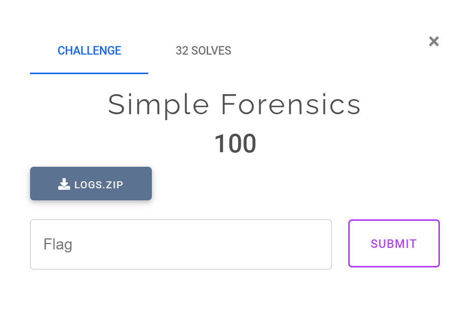
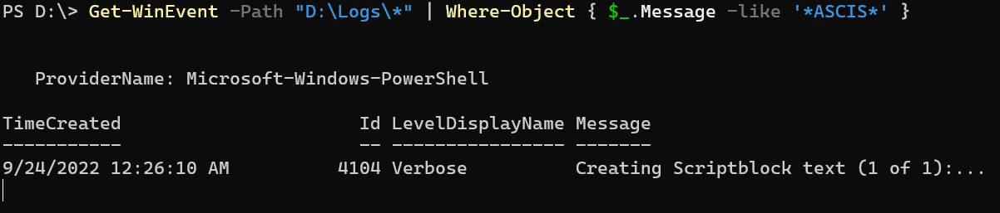
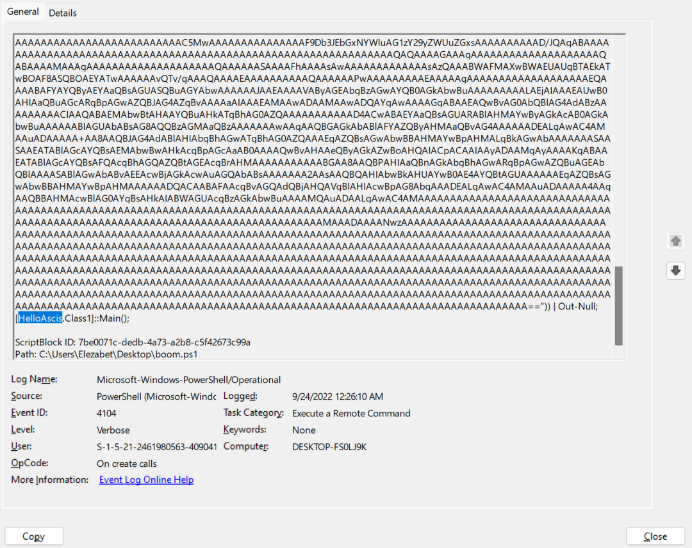
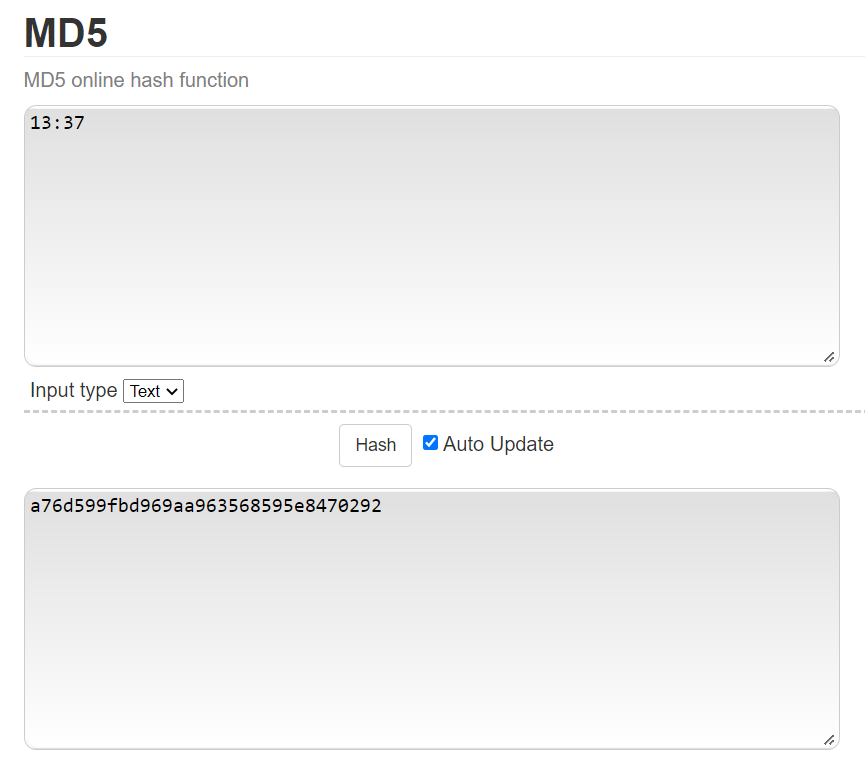

# ASCIS WarmUp 2022 - Simple Forensics



You can download challenge file in my repo: [logs.zip](logs.zip)

# Get started

Extract the zip and we can see a bunch of `MS Windows Vista Event Log`. Logs are just strings for information so let's find some way to print the string and find if string `ascis` is in one of those log or not. After a while searching, I found [this article](https://stackoverflow.com/questions/52325948/search-in-saved-eventlog-file-with-powershell) which help me search for string in a `MS Windows Vista Event Log` file. Let's find string `ascis` now:



One result for file `Microsoft-Windows-PowerShell%4Operational.evtx` (After a few attempts). Let's open that file in `Event Viewer` of windows and check the `Id` `4104` to see what it is:


We can see just 1 log has this bunch of text. At the bottom of text, we can see the string `Ascis`:



And the data in this log should be decode with base 64 as the begining of this data show (the picture above). We can use this python code to decode string:

```python
from base64 import b64decode

c = b'TVqQAAMAAAAEAAAA//8AALgAAAAAAAAAQAAAAAAAAAAAAAAAAAAAAAAAAAAAAAAAAAAAAAAAAAAAAAAAgAAAAA4fug4AtAnNIbgBTM0hVGhpcyBwcm9ncmFtIGNhbm5vdCBiZSBydW4gaW4gRE9TIG1vZGUuDQ0KJAAAAAAAAABQRQAATAEDABOVS60AAAAAAAAAAOAAIiALATAAABQAAAAGAAAAAAAA2jMAAAAgAAAAQAAAAAAAEAAgAAAAAgAABAAAAAAAAAAGAAAAAAAAAACAAAAAAgAAAAAAAAMAYIUAABAAABAAAAAAEAAAEAAAAAAAABAAAAAAAAAAAAAAAIUzAABPAAAAAEAAAIgDAAAAAAAAAAAAAAAAAAAAAAAAAGAAAAwAAADoMgAAOAAAAAAAAAAAAAAAAAAAAAAAAAAAAAAAAAAAAAAAAAAAAAAAAAAAAAAAAAAAIAAACAAAAAAAAAAAAAAACCAAAEgAAAAAAAAAAAAAAC50ZXh0AAAA4BMAAAAgAAAAFAAAAAIAAAAAAAAAAAAAAAAAACAAAGAucnNyYwAAAIgDAAAAQAAAAAQAAAAWAAAAAAAAAAAAAAAAAABAAABALnJlbG9jAAAMAAAAAGAAAAACAAAAGgAAAAAAAAAAAAAAAAAAQAAAQgAAAAAAAAAAAAAAAAAAAAC5MwAAAAAAAEgAAAACAAUAuCIAADAQAAABAAAAAAAAAAAAAAAAAAAAAAAAAAAAAAAAAAAAAAAAAAAAAAAAAAAAAAAAAAAAAAAAAAAAAAAAADIoAwAABigPAAAKJioAAAATMAMARQAAAAEAABECKBAAAAoDbxEAAApvEgAACgpzEwAACgsWDCscBwYIjxoAAAFyAQAAcCgUAAAKbxUAAAomCBdYDAgGjmky3gdvFgAACioAAAATMAMASgAAAAAAAAAoFwAACoAHAAAEIwAAAAAAQI9AcxgAAAqABgAABH4GAAAEFP4GBAAABnMZAAAKbxoAAAp+BgAABBdvGwAACn4GAAAEF28cAAAKKgAAEzADAO4AAAACAAARKB0AAAp+AQAABCgeAAAKfwUAAAQDbx8AAAooIAAACgsSAXIHAABwKCEAAAolKB4AAAp+AgAABH4DAAAEmigiAAAKchUAAHAoIwAACiwVciEAAHAoIgAACgJ1EgAAAW8kAAAKfgMAAAR+BAAABFiAAwAABH4DAAAEGP4BfgMAAAQW/gFgLAt+BAAABGWABAAABANvHwAACgwSAnJ7AABwKCUAAAoKfgcAAAQGKAIAAAZyhwAAcCgjAAAKLDEoJgAACiUGKAIAAAYNKBAAAApyCgEAcCgnAAAKbygAAAoJKAUAAAYoIgAACm8pAAAKKgAAEzAGAD0AAAADAAARAm8qAAAKCgNvKgAACgsGjSAAAAEMFg0rGQgJAglvKwAACgMJB11vKwAACmHRnQkXWA0JBjLjCHMsAAAKKh4CKC0AAAoqAAAAEzAGAFAAAAAAAAAAcmQBAHCAAQAABBmNHAAAASUWcisCAHCiJRdyagMAcKIlGHKpBABwooACAAAEFoADAAAEF4AEAAAEIOYHAAAfDB8fFhYWcy4AAAqABQAABCpCU0pCAQABAAAAAAAMAAAAdjQuMC4zMDMxOQAAAAAFAGwAAACIAwAAI34AAPQDAAB8BAAAI1N0cmluZ3MAAAAAcAgAAOgFAAAjVVMAWA4AABAAAAAjR1VJRAAAAGgOAADIAQAAI0Jsb2IAAAAAAAAAAgAAAVcVAgAJAAAAAPoBMwAWAAABAAAAIAAAAAIAAAAHAAAABwAAAAYAAAAuAAAADgAAAAMAAAABAAAAAgAAAAAAqQIBAAAAAAAGAIsBigMGAPgBigMGAL8AWAMPAKoDAAAGAOcA6QIGAG4B6QIGAE8B6QIGAN8B6QIGAKsB6QIGAMQB6QIGAP4A6QIGANMAawMGALEAawMGADIB6QIGABkBJAIGAAYEuAIGAGgAuAIKAD8D6AMGAAwAUAQGAL8CUAQGABADQAQKAMID6AMGANsCuAIGAGAAuAIGABsCQAQGABYCuAIKACgD6AMGAFsCuAIKABsEkwIGAAgAUAQGADIEuAIGAAsDuAIAAAAAIwAAAAAAAQABAAEAEAABANMDQQABAAEAEQCBArwAEQCKAr8AEQD2A8MAEQD7AsMAEQCAAMYAEQBFA8oAEQATAM4AUCAAAAAAlgDkAmYAAQBgIAAAAACRAG4C0gABALQgAAAAAJEAPANmAAMADCEAAAAAkQAlBNkAAwAIIgAAAACWAB4D4AAFAFEiAAAAAIYYSwMGAAcAXCIAAAAAkRhRA2YABwAAAAEAzQIAAAIAOgQAAAEAWQAAAAIAGQIAAAEALAAAAAIATAQJAEsDAQARAEsDBgAZAEsDCgApAEsDEAAxAEsDEAA5AEsDEABBAEsDEABJAEsDEABRAEsDEABZAEsDEABhAEsDFQBpAEsDEABxAEsDEAB5AEsDEADBAIkAGgDJABoAJgDJALkDKwChAGICMQCpAEsDBgDRAE8COACpAFIAPQCBAE8CQwCZAKQARwCRAEsDTADZAEsDUQCRAEYAVwCRAA0EFQCRADoAFQDBAAUDZgDBAKsAagCxAHEAbwCJAP0DdAC5AE8COADBAJIAagDhAG0EewDpAJwABgCJAE8COADxAKQAgQD5AD4ChgDJAFgCjAChAJwABgDhAHYCmgDhAN4DngDhAEsDowCBAEsDBgCJAEsDqQAuAAsA5gAuABMA7wAuABsADgEuACMAFwEuACsAJwEuADMAJwEuADsAJwEuAEMAFwEuAEsALQEuAFMAJwEuAFsAJwEuAGMARQEuAGsAbwEuAHMAfAEeAF0AkgAEgAAAAQAAAAAAAAAAAAAAAADTAwAABAAAAAAAAAAAAAAAswAxAAAAAAAEAAAAAAAAAAAAAACzALgCAAAAAAAAAENsYXNzMQBNRDUAU0hBMjU2AHNoYTI1NgBnZXRfVVRGOAA8TW9kdWxlPgBkYXRhAG1zY29ybGliAHNldF9FbmFibGVkAGFkZF9FbGFwc2VkAEFwcGVuZABzb3VyY2UAQ29uc29sZQBEYXRlVGltZQBnZXRfU2lnbmFsVGltZQByb290VGltZQBSZWFkTGluZQBXcml0ZUxpbmUARGlzcG9zZQBDcmVhdGUAV3JpdGUAR3VpZEF0dHJpYnV0ZQBEZWJ1Z2dhYmxlQXR0cmlidXRlAENvbVZpc2libGVBdHRyaWJ1dGUAQXNzZW1ibHlUaXRsZUF0dHJpYnV0ZQBBc3NlbWJseVRyYWRlbWFya0F0dHJpYnV0ZQBUYXJnZXRGcmFtZXdvcmtBdHRyaWJ1dGUAQXNzZW1ibHlGaWxlVmVyc2lvbkF0dHJpYnV0ZQBBc3NlbWJseUNvbmZpZ3VyYXRpb25BdHRyaWJ1dGUAQXNzZW1ibHlEZXNjcmlwdGlvbkF0dHJpYnV0ZQBDb21waWxhdGlvblJlbGF4YXRpb25zQXR0cmlidXRlAEFzc2VtYmx5UHJvZHVjdEF0dHJpYnV0ZQBBc3NlbWJseUNvcHlyaWdodEF0dHJpYnV0ZQBBc3NlbWJseUNvbXBhbnlBdHRyaWJ1dGUAUnVudGltZUNvbXBhdGliaWxpdHlBdHRyaWJ1dGUAQnl0ZQBFbmNvZGluZwBTeXN0ZW0uUnVudGltZS5WZXJzaW9uaW5nAEZyb21CYXNlNjRTdHJpbmcAVG9TdHJpbmcAR2V0U3RyaW5nAENvbXB1dGVIYXNoAEdldEhhc2gAZ2V0X0xlbmd0aAB0b3BDbG9jawBib3RDbG9jawBTeXN0ZW0uQ29tcG9uZW50TW9kZWwASGVsbG9Bc2Npcy5kbGwAU3lzdGVtAEhhc2hBbGdvcml0aG0AaGFzaEFsZ29yaXRobQBUaW1lU3BhbgBNYWluAFN5c3RlbS5SZWZsZWN0aW9uAGRpcmVjdGlvbgBDbGVhcgBDaGFyAFN0cmluZ0J1aWxkZXIAWE9SQ2lwaGVyAEVsYXBzZWRFdmVudEhhbmRsZXIAU2V0VGltZXIAdGltZXIALmN0b3IALmNjdG9yAFN5c3RlbS5EaWFnbm9zdGljcwBTeXN0ZW0uUnVudGltZS5JbnRlcm9wU2VydmljZXMAU3lzdGVtLlJ1bnRpbWUuQ29tcGlsZXJTZXJ2aWNlcwBEZWJ1Z2dpbmdNb2RlcwBHZXRCeXRlcwBFbGFwc2VkRXZlbnRBcmdzAEhlbGxvQXNjaXMAZ2V0X0NoYXJzAFN5c3RlbS5UaW1lcnMAc3RhdHVzAFN1YnRyYWN0AE9iamVjdABzZXRfQXV0b1Jlc2V0AENvbXBvbmVudABPblRpbWVkRXZlbnQAQ29udmVydABpbnB1dABTeXN0ZW0uVGV4dABrZXkAU3lzdGVtLlNlY3VyaXR5LkNyeXB0b2dyYXBoeQBvcF9FcXVhbGl0eQAAAAAABXgAMgAADW0AbQBcADoAcwBzAAALMAAwADoAMAAwAABZCgBoAHQAdABwAHMAOgAvAC8AdwB3AHcALgB5AG8AdQB0AHUAYgBlAC4AYwBvAG0ALwB3AGEAdABjAGgAPwB2AD0AZABRAHcANAB3ADkAVwBnAFgAYwBRAAALbQBtADoAcwBzAACAgTAAYwAxAGMANABiADcAZQA4AGUANQAxADMANgA1AGYAMQBiAGUANwA2ADYAZgAzADYAMgA0ADkAZABlAGIANQBmADUAMAA2ADEANwBlAGUAYQA0ADMAZAAxADQAOAA2ADcAZQBlADAANAA5ADIAMgA3ADEAZQAxADUAMQA3AGMAAFlJAEcAUgAxAEwAVwBaAEMAVABWAGMASgBPADAAMQAyAFUAagA0AEYAQwBWAGcASwBhAGwANABJAGEAawBoAEEASgBVAEYAcgBRAFEAQgBjAFgAawA4AD0AAIDFIAAgACAAIAAgACAAIAAgACAAIABfAF8AXwBfAF8AXwBfAF8AXwBfAAoAIAAgACAAIAAgACAAIAAgACAALwBfAF8AXwBfAF8AXwBfAF8AIAAvAHwACgAgACAAIAAgACAAIAAgACAAfAAgACAAIAAgACAAIAAgACAAIAB8ACAAfAAKACAAIAAgACAAIAAgACAAIAB8ACAAIAAgACAAIAAgACAAIAAgAHwAIAB8AAoAIAAgACAAIAAgACAAIAAgAHwAIAAgAACBPSAAIAB8ACAAfAAKACAAIAAgACAAIAAgACAAIAB8ACAAIAAgACAAIAAgACAAIAAgAHwAIAB8AAoAIAAgACAAIAAgACAAIAAgAHwAXwBfAF8AXwBfAF8AXwBfAF8AfAAgAHwACgAgACAAIAAgACAAIAAgACAAfAAgACAAIAAgAC8AIAAgACAAIAB8ACAAfAAKACAAIAAgACAAIAAgACAAIAB8ACAAIAAgAC8AIAAgACAAIAAgAHwAIAB8AAoAIAAgACAAIAAgACAAIAAgAHwAIAAgAC8AIAAgACAAIAAgACAAfAAgAHwACgAgACAAIAAgACAAIAAgACAAfAAoACAAKQAgACAAIAAgACAAIAB8ACAAfAAKACAAIAAgACAAIAAgACAAIAB8AF8AXwBfAF8AXwBfAF8AXwBfAHwALwAAgT0gACAAfAAgAHwACgAgACAAIAAgACAAIAAgACAAfAAgACAAIAAgACAAIAAgACAAIAB8ACAAfAAKACAAIAAgACAAIAAgACAAIAB8AF8AXwBfAF8AXwBfAF8AXwBfAHwAIAB8AAoAIAAgACAAIAAgACAAIAAgAHwAIAAgACAAIAB8ACAAIAAgACAAfAAgAHwACgAgACAAIAAgACAAIAAgACAAfAAgACAAIAAgAHwAIAAgACAAIAB8ACAAfAAKACAAIAAgACAAIAAgACAAIAB8ACAAIAAgACAAfAAgACAAIAAgAHwAIAB8AAoAIAAgACAAIAAgACAAIAAgAHwAIAAgACAAKAAgACkAIAAgACAAfAAgAHwACgAgACAAIAAgACAAIAAgACAAfABfAF8AXwBfAF8AXwBfAF8AXwB8AC8AAIE9IAAgAHwAIAB8AAoAIAAgACAAIAAgACAAIAAgAHwAIAAgACAAIAAgACAAIAAgACAAfAAgAHwACgAgACAAIAAgACAAIAAgACAAfABfAF8AXwBfAF8AXwBfAF8AXwB8ACAAfAAKACAAIAAgACAAIAAgACAAIAB8ACAAIAAgACAAXAAgACAAIAAgAHwAIAB8AAoAIAAgACAAIAAgACAAIAAgAHwAIAAgACAAIAAgAFwAIAAgACAAfAAgAHwACgAgACAAIAAgACAAIAAgACAAfAAgACAAIAAgACAAIABcACAAIAB8ACAAfAAKACAAIAAgACAAIAAgACAAIAB8ACAAIAAgACAAIAAgACgAIAApAHwAIAB8AAoAIAAgACAAIAAgACAAIAAgAHwAXwBfAF8AXwBfAF8AXwBfAF8AfAAvAABEs5BQGs7WTI8Z8egUXY7MAAQgAQEIAyAAAQUgAQEREQQgAQEOBCABAQIDAAAOBwcDHQUSVQgEAAASZQUgAR0FDgYgAR0FHQUEIAEODgUgARJVDgMgAA4EAAASTQQgAQENBSACARwYBSABARJtCAcEDhFdEUUOAwAAAQQAAQEOBCAAEUUGIAERXRFFBQACAg4OBAAAEnkFAAEdBQ4FIAEOHQUHBwQICB0DCAMgAAgEIAEDCAUgAQEdAwkgBgEICAgICAgIt3pcVhk04IkCBg4DBh0OAgYIAwYRRQMGEkkDBhJNBgACDhJRDgYAAgEcElkFAAIODg4IAQAIAAAAAAAeAQABAFQCFldyYXBOb25FeGNlcHRpb25UaHJvd3MBCAEAAgAAAAAADwEACkhlbGxvQXNjaXMAAAUBAAAAABcBABJDb3B5cmlnaHQgwqkgIDIwMjIAACkBACRiYzAxOTIxOS03ZTQyLTQwZGEtOTRlMi1kZDkyMDk0MzNiOWQAAAwBAAcxLjAuMC4wAABJAQAaLk5FVEZyYW1ld29yayxWZXJzaW9uPXY0LjYBAFQOFEZyYW1ld29ya0Rpc3BsYXlOYW1lEi5ORVQgRnJhbWV3b3JrIDQuNgAAAAAAAOMHKpcAAAAAAgAAAGUAAAAgMwAAIBUAAAAAAAAAAAAAAAAAABAAAAAAAAAAAAAAAAAAAABSU0RTTNYgalGzrkOEQHjDiSg0cQEAAABDOlxVc2Vyc1xob2FuZ1xzb3VyY2VccmVwb3NcSGVsbG9Bc2Npc1xIZWxsb0FzY2lzXG9ialxSZWxlYXNlXEhlbGxvQXNjaXMucGRiAK0zAAAAAAAAAAAAAMczAAAAIAAAAAAAAAAAAAAAAAAAAAAAAAAAAAC5MwAAAAAAAAAAAAAAAF9Db3JEbGxNYWluAG1zY29yZWUuZGxsAAAAAAAAAAD/JQAgABAAAAAAAAAAAAAAAAAAAAAAAAAAAAAAAAAAAAAAAAAAAAAAAAAAAAAAAAAAAAAAAQAQAAAAGAAAgAAAAAAAAAAAAAAAAAAAAQABAAAAMAAAgAAAAAAAAAAAAAAAAAAAAQAAAAAASAAAAFhAAAAsAwAAAAAAAAAAAAAsAzQAAABWAFMAXwBWAEUAUgBTAEkATwBOAF8ASQBOAEYATwAAAAAAvQTv/gAAAQAAAAEAAAAAAAAAAQAAAAAAPwAAAAAAAAAEAAAAAgAAAAAAAAAAAAAAAAAAAEQAAAABAFYAYQByAEYAaQBsAGUASQBuAGYAbwAAAAAAJAAEAAAAVAByAGEAbgBzAGwAYQB0AGkAbwBuAAAAAAAAALAEjAIAAAEAUwB0AHIAaQBuAGcARgBpAGwAZQBJAG4AZgBvAAAAaAIAAAEAMAAwADAAMAAwADQAYgAwAAAAGgABAAEAQwBvAG0AbQBlAG4AdABzAAAAAAAAACIAAQABAEMAbwBtAHAAYQBuAHkATgBhAG0AZQAAAAAAAAAAAD4ACwABAEYAaQBsAGUARABlAHMAYwByAGkAcAB0AGkAbwBuAAAAAABIAGUAbABsAG8AQQBzAGMAaQBzAAAAAAAwAAgAAQBGAGkAbABlAFYAZQByAHMAaQBvAG4AAAAAADEALgAwAC4AMAAuADAAAAA+AA8AAQBJAG4AdABlAHIAbgBhAGwATgBhAG0AZQAAAEgAZQBsAGwAbwBBAHMAYwBpAHMALgBkAGwAbAAAAAAASAASAAEATABlAGcAYQBsAEMAbwBwAHkAcgBpAGcAaAB0AAAAQwBvAHAAeQByAGkAZwBoAHQAIACpACAAIAAyADAAMgAyAAAAKgABAAEATABlAGcAYQBsAFQAcgBhAGQAZQBtAGEAcgBrAHMAAAAAAAAAAABGAA8AAQBPAHIAaQBnAGkAbgBhAGwARgBpAGwAZQBuAGEAbQBlAAAASABlAGwAbABvAEEAcwBjAGkAcwAuAGQAbABsAAAAAAA2AAsAAQBQAHIAbwBkAHUAYwB0AE4AYQBtAGUAAAAAAEgAZQBsAGwAbwBBAHMAYwBpAHMAAAAAADQACAABAFAAcgBvAGQAdQBjAHQAVgBlAHIAcwBpAG8AbgAAADEALgAwAC4AMAAuADAAAAA4AAgAAQBBAHMAcwBlAG0AYgBsAHkAIABWAGUAcgBzAGkAbwBuAAAAMQAuADAALgAwAC4AMAAAAAAAAAAAAAAAAAAAAAAAAAAAAAAAAAAAAAAAAAAAAAAAAAAAAAAAAAAAAAAAAAAAAAAAAAAAAAAAAAAAAAAAAAAAAAAAAAAAAAAAAAAAAAAAAAAAAAAAAAAAAAAAAAAAAAAAAAAAAAAAAAAAAAAAAAAAAAAAAAAAAAAAAAAAMAAADAAAANwzAAAAAAAAAAAAAAAAAAAAAAAAAAAAAAAAAAAAAAAAAAAAAAAAAAAAAAAAAAAAAAAAAAAAAAAAAAAAAAAAAAAAAAAAAAAAAAAAAAAAAAAAAAAAAAAAAAAAAAAAAAAAAAAAAAAAAAAAAAAAAAAAAAAAAAAAAAAAAAAAAAAAAAAAAAAAAAAAAAAAAAAAAAAAAAAAAAAAAAAAAAAAAAAAAAAAAAAAAAAAAAAAAAAAAAAAAAAAAAAAAAAAAAAAAAAAAAAAAAAAAAAAAAAAAAAAAAAAAAAAAAAAAAAAAAAAAAAAAAAAAAAAAAAAAAAAAAAAAAAAAAAAAAAAAAAAAAAAAAAAAAAAAAAAAAAAAAAAAAAAAAAAAAAAAAAAAAAAAAAAAAAAAAAAAAAAAAAAAAAAAAAAAAAAAAAAAAAAAAAAAAAAAAAAAAAAAAAAAAAAAAAAAAAAAAAAAAAAAAAAAAAAAAAAAAAAAAAAAAAAAAAAAAAAAAAAAAAAAAAAAAAAAAAAAAAAAAAAAAAAAAAAAAAAAAAAAAAAAAAAAAAAAAAAAAAAAAAAAAAAAAAAAAAAAAAAAAAAAAAAAAAAAAAAAAAAAAAAAAAAAAAAAAAAAAAAAAAAAAAAAAAAAAAAAAAAAAAAAAAAAAAAAAAAAAAAAAAAAAAAAAAAAAAAAA=='
with open('output', 'wb') as f:
	f.write(b64decode(c))
```

After decoding, we get a PE32 file, which is a file of windows. However, we cannot run this file so the only thing we can do is static debug. Let's load this file in IDA to see what it does. In IDA, we can see that Main() will execute SetTimer() and SetTimer() will execute OnTimedEvent(), which is an interesting function:


This code is from function OnTimedEvent(). It takes a string of minute and second in format `mm:ss`, then hash with sha256. After that, this hash is compared with a const hash in `a0c1c4b7e8e5136` whose hash is:

```
0c1c4b7e8e51365f1be766f36249deb5f50617eea43d14867ee0492271e1517c
```

If the comparision is false, it will jump to `loc_1AD` and return. Hence, we need to make the comparision to true. Let's crack the hash above and we can get the correct string of time:


So the initial time is `13:37`. After the comparision, it create a md5 object and get md5 hash of something, maybe it's the initial time we have found. Let's try with [this website](https://emn178.github.io/online-tools/md5.html):



We get 32 byte of hash: `a76d599fbd969aa963568595e8470292`. Keeping debuging, we can see it takes another string from variable `aIgr1lwzctvcjo0`:

```
IGR1LWZCTVcJO012Uj4FCVgKal4IakhAJUFrQQBcXk8=
```

The program decode base64 that string and xor data with key. Seems like that base64 string is data and the hash we have found above is key. The python script to decrypt the flag can be as follows:

```python
from base64 import b64decode

c1 = b'a76d599fbd969aa963568595e8470292'
c2 = b64decode(b'IGR1LWZCTVcJO012Uj4FCVgKal4IakhAJUFrQQBcXk8=')
for i in range(32):
	print(chr(c1[i] ^ c2[i]), end='')
print()
```

And we get the flag:


Flag is `ASCIS{t1k_t@k_d0n9_h0_qu@y_v0ng}`