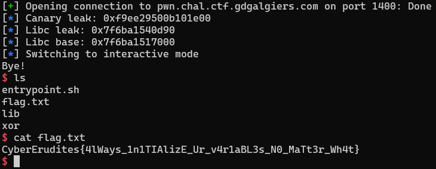

# GDGAlgiers CTF 2022 - XOR

You can download challenge file in my repo: [xor.zip](xor.zip)

There are 5 files in zip:
- xor
- xor.c
- lib/
- lib/ld-linux-x86-64.so.2
- lib/libc.so.6

The binary is patched already so we just need to download, extract and run.

# 1. Find bug

In short, the variable `answer` in function input_size() and variable `size` in menu() were not initialized so if we fill up the buffer `name` in greet_player(), we will change the value of `answer` and `size`.

# 2. Idea

While we enter name, we will set `answer` to `y` and set `size` to our desired value --> **Buffer Overflow**

With a large size, we can leak canary and `__libc_start_main_ret` to get the base address of libc, then we just need to conduct a simple ret2libc to get shell.

# 3. Exploit

Full script: [solve.py](solve.py)

# 4. Get flag

Flag is `CyberErudites{4lWays_1n1TIAlizE_Ur_v4r1aBL3s_N0_MaTt3r_Wh4t}`