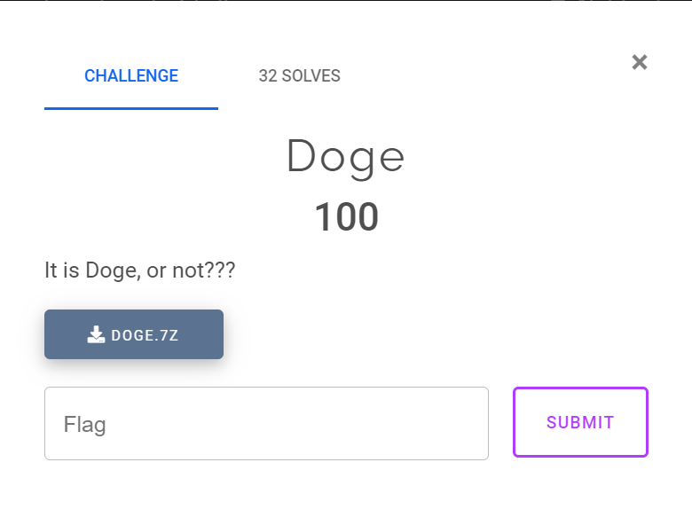
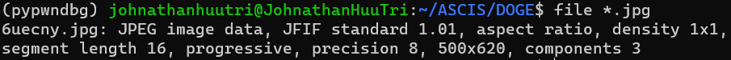
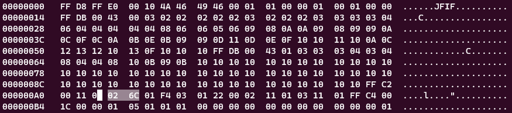
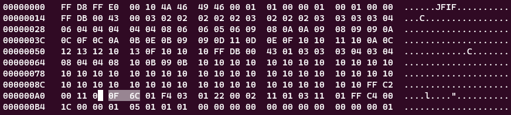
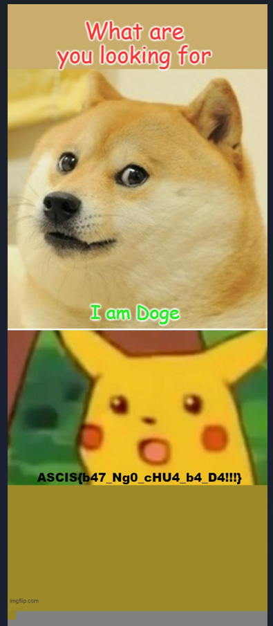

# ASCIS WarmUp 2022 - DOGE

You can download challenge file in my repo: [doge.zip](doge.zip)

# Get started

Extract the zip and we can see just 1 image:

After trying all tools form steghide, stegseek, stegsolve to binwalk, foremost and exiftool, I cannot find anything use full. But there is something can be hidden if the size of image is small, you can check [this article](https://blog.cyberhacktics.com/hiding-information-by-changing-an-images-height/) for this technique.

Let's try to increase the height of that image with `hexedit` from `620`, which hex format is `0x26c` (Press `Ctrl + S` to search for byte):

To larger, maybe `0xf6c`:

After changed, press `f2` to saved. Open the image and we can get the flag:

Flag is `ASCIS{b47_Ng0_cHU4_b4_D4!!!}`