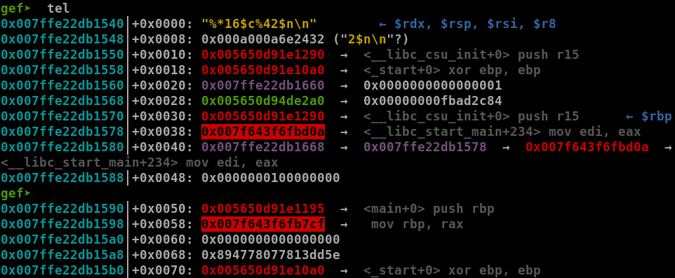

# ångstromCTF 2023 - noleek


You can download challenge files here: [noleek.zip](noleek.zip)

# 1. Find bug

Look at source we can see cleary there are 2 **Format String** bugs:

```c
int main(void) {
    setbuf(stdout, NULL);
    FILE* leeks = fopen("/dev/null", "w");
    if (leeks == NULL) {
        puts("wtf");
        return 1;
    }
    printf("leek? ");
    char inp[LEEK];

    fgets(inp, LEEK, stdin);
    fprintf(leeks, inp);
    
    printf("more leek? ");
    
    fgets(inp, LEEK, stdin);
    fprintf(leeks, inp);

    printf("noleek.\n");
    cleanup(0, 0, 0);
    return 0;
}
```

Checksec shows that just canary is disable, others are not:


# 2. Idea

We know there are 2 **Format String** bugs. The only problem is that fprintf will print format string to `/dev/null`, not stdout so we cannot leak any addresses out.

At first, I tried to change the fd in the FILE structure of `/dev/null` from 3 to 1 (stdout) but that was a tough task. Then I came up with an idea that I will use `%*c` to print and write 4 bytes of an address into another address, that leads to an attack with relative information, which is just offset and offset without knowing any specific addresses.

So we will need `a pointer points to a stack address` so that we can change the value of that pointer to a new stack address, which now points to saved rip. After that, we will use `%*c` again to make it write address of `__libc_start_main_ret` and a number of bytes to change the saved rip of main into one_gadget.

Summary:
- Stage 1: Change value of a pointer to saved rip
- Stage 2: Change saved rip to one_gadget

# 3. Exploit

### Stage 1: Change value of a pointer to saved rip

We will want to write 4 bytes of an stack address to a pointer but we want that address to be smaller than the stack of saved rip. One best candidate is the stack address of rsi when it's going to execute fprintf():


The stack address of saved rip (highlighted) has 2 LSBs are `0x6fd8` and our candidate, rsi, has 2 LSBs are `0x6fa0`, smaller than stack address of saved rip. Hence, we will use `%*c` to make it print `0x50c66fa0` bytes out first and use `%29$hn` to write to the pointer we want:

```python
payload = f'%*c%29$hn'.encode()
```

Here is the pointer when we stop at fprintf():


That means we will change value of that pointer from `0x007fff50c681bb` to `0x007fff50c66fa0` first.

> Here is one note for using wildcard `*`: the wildcard `*` in `%*c` will point to the number with type `int` so if that number is a negative number (`>=0x80000000`), the wildcard will go wrong

So in this case, the number is `0x50c66fa0`, which is a positive number so the write will be successful. But all we did is just change from `0x007fff50c681bb` to `0x007fff50c66fa0`, that's not stack address of saved rip.

To make it become address of saved rip, we just need to print `0x38` bytes and the result is `0x007fff50c66fa0 + 0x38 = 0x007fff50c66fd8`, that's what we need:

```python
payload = f'%*c%{0x38}c%29$hn'.encode()
sl(payload)
```

Here's the result:


That's nice! Keep going!

### Stage 2: Change saved rip to one_gadget

So we have stack address, which point to saved rip, on stack now (new address no):


Now we will use `%*16$c` to make it print `0x2dab47cf`, which is a libc address below the `__libc_start_main_ret`:


The reason why I chose the address different from `__libc_start_main_ret` is because if we both read and write to `__libc_start_main_ret`, it might cause error or misbehavior. So the payload below would work good in changing `__libc_start_main_ret` into the address below of it:

```python
payload = f'%*16$c%42$n'.encode()
```

Here is before `__libc_start_main_ret` was changed:



Here is after it was overwritten:


So now we want to change that to one_gadget, let's find one which suitable for our situation:


The highlighted one_gadget is the best option, the reason is that before function main() return, it jumps to a cleanup() function, which set rdi, rsi and rdx to null for us, hence the constraints are satisfied. The offset from the address we use to change `__libc_start_main_ret` and one_gadget is `0xa5e51` so we will make it print `0xa5e51` bytes more and we can get shell now:

```python
payload = f'%*16$c%{0xa5e51}c%42$n'.encode()
```

Make sure that 4 bytes of libc also make a positive number to make this work. Therefore, we will need to run multiple time to make sure both stack and libc have 4 bytes form a positive number.

Solve script: [solve.py](solve.py)

# 4. Get flag


Flag is `actf{t0_l33k_0r_n0t_t0_l33k_th4t_1s_th3_qu3sti0n}`