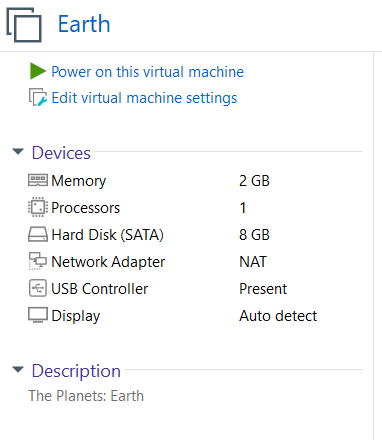
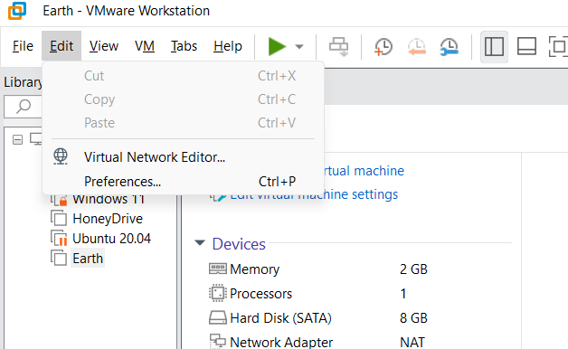
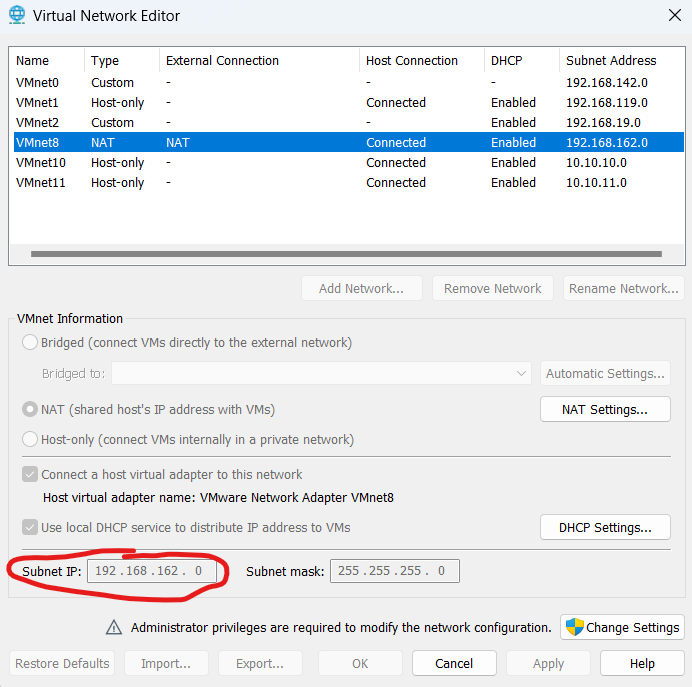
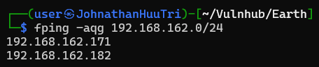

# Vulnhub - The Planets: Earth

Challenge: https://www.vulnhub.com/entry/the-planets-earth,755/

# Setup

First, I download the file `Earth.ova` and then I open it with my VMware. The reason why I choose VMware is because I want to attack from my wsl2, not from a kali virtual machine and VMware does not need to port forwarding with network NAT while Virtualbox does. But you know if Virtualbox need to do port forwarding, we cannot scan all the port on with Virtualbox. That's why I chose VMware instead!

After import into VMware, I changed Network Adapter into NAT:



In VMware, you can see the IP segment of NAT in the `Virtual Network Editor` by clicking `Edit -> Virtual Network Editor...`:



In the popup, click on the NAT card (In my case it is VMnet8), you can see at the `Subnet IP` box is the IP segment when using NAT `192.168.162.0/24`:



We know we can fuzz the IP with this segment to find out the machine IP. Now let's close that popup and fire our machine! When we see the login prompt, we know that it's time to find out the IP. Let's switch to our wsl2 and fuzz the ip with `fping`

```cmd
fping -aqg 192.168.162.0/24
```



There are only 2 ips! In my case, the ip of machine is `192.168.162.182`. So we know exactly the machine's ip address.

# Reconnaissance

Now, the first thing we need to do is scanning for all open ports:

```nmap
nmap -sCV -T5 -p- 192.168.162.182
Starting Nmap 7.94SVN ( https://nmap.org ) at 2023-11-19 15:08 +07
Nmap scan report for earth.local (192.168.162.182)
Host is up (0.0017s latency).
Not shown: 65445 filtered tcp ports (no-response), 87 filtered tcp ports (host-unreach)
PORT    STATE SERVICE  VERSION
22/tcp  open  ssh      OpenSSH 8.6 (protocol 2.0)
| ssh-hostkey:
|   256 5b:2c:3f:dc:8b:76:e9:21:7b:d0:56:24:df:be:e9:a8 (ECDSA)
|_  256 b0:3c:72:3b:72:21:26:ce:3a:84:e8:41:ec:c8:f8:41 (ED25519)
80/tcp  open  http     Apache httpd 2.4.51 ((Fedora) OpenSSL/1.1.1l mod_wsgi/4.7.1 Python/3.9)
|_http-title: Earth Secure Messaging
|_http-server-header: Apache/2.4.51 (Fedora) OpenSSL/1.1.1l mod_wsgi/4.7.1 Python/3.9
443/tcp open  ssl/http Apache httpd 2.4.51 ((Fedora) OpenSSL/1.1.1l mod_wsgi/4.7.1 Python/3.9)
| tls-alpn:
|_  http/1.1
| ssl-cert: Subject: commonName=earth.local/stateOrProvinceName=Space
| Subject Alternative Name: DNS:earth.local, DNS:terratest.earth.local
| Not valid before: 2021-10-12T23:26:31
|_Not valid after:  2031-10-10T23:26:31
|_ssl-date: TLS randomness does not represent time
|_http-server-header: Apache/2.4.51 (Fedora) OpenSSL/1.1.1l mod_wsgi/4.7.1 Python/3.9
|_http-title: Earth Secure Messaging

Service detection performed. Please report any incorrect results at https://nmap.org/submit/ .
Nmap done: 1 IP address (1 host up) scanned in 99.91 seconds
```