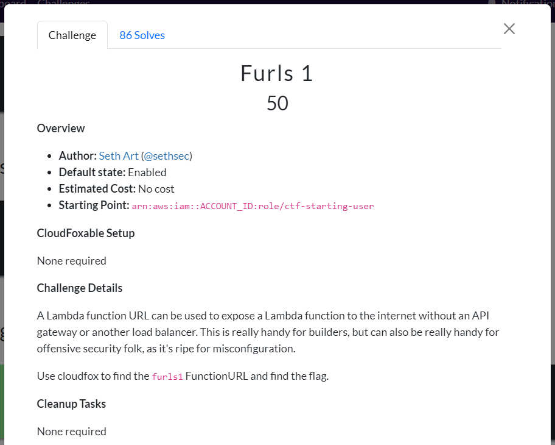
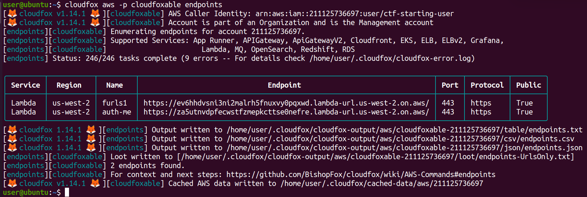
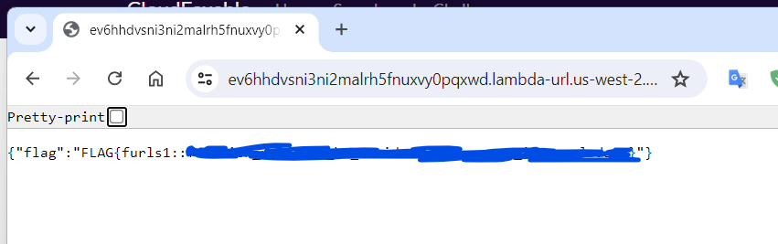
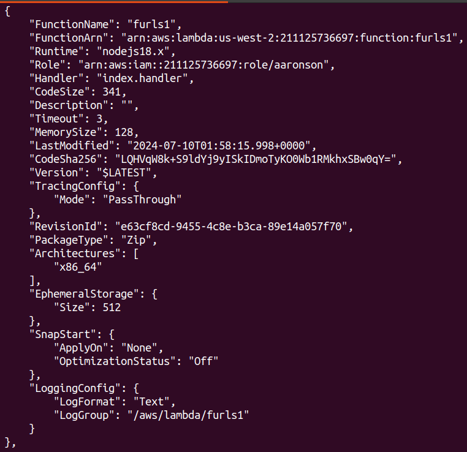
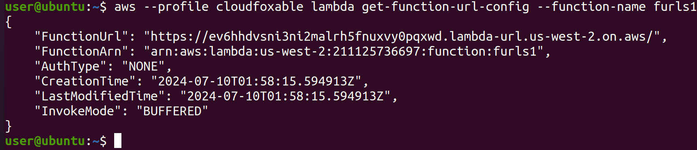

# CloudFoxable - Furls1

Challenge link: https://cloudfoxable.bishopfox.com/challenges#Furls%201-10



## Using cloudfox

Cloudfox support us a command called **`endpoints`**:

```
cloudfox aws -p cloudfoxable endpoints
```



It will find all and give us all endpoints that are available. We can see there is endpoint with name **`furls1`** so let's browser with that url:



## Using aws-cli

The description gives us a hint that we will need to look at lambda function so let's list all function with **`lambda list-functions`**:

```
aws --profile cloudfoxable lambda list-functions
```



We can see there is a function called **`furls1`**. Now we want to get the url for that lambda function, we can run **`lambda get-function-url-config`**:

```
aws --profile cloudfoxable lambda get-function-url-config --function-name furls1
```



Bingo, we got the URL, let's browse that URL to see what we got:


That URL gives us the flag haha!

