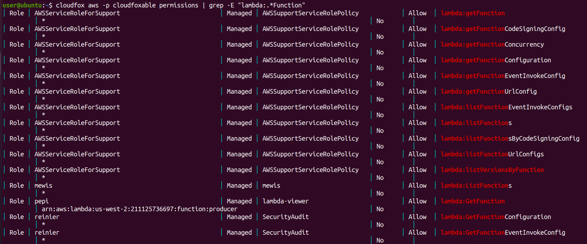

# CloudFoxable - Furls2

Challenge link: https://cloudfoxable.bishopfox.com/challenges#Furls%202-14


From this challenge, I will use both cloudfox and aws-cli for easier attack. Again, as the description said, we will need to list all lambda function which has URL access:

```
cloudfox aws -p cloudfoxable endpoints
```


The endpoint **`auth-me`** is the URL for this challenge. Access the page and it asks us for username and password:


So we need to find the credential to login. Let's check if user `ctf-starting-user` has some policy on interact with lambda or not:

```
cloudfox aws -p cloudfoxable permissions --principal ctf-starting-user | grep lambda
```


So it has **`lambda:ListFunctions`** and **`lambda:GetFunctionConfiguration`** policy, which will help us inspect the lambda function. At first, I tried to find if there are any roles has **`lambda:GetFunction`** so that we can download the code for function **`auth-me`** but that seems useless because no role has that policy. So the only way is to inspect the function:

```
aws --profile cloudfoxable lambda get-function-configuration --function-name auth-me
```


Oh waiiiit, can you see that? What are **`lambda_http_user`** and **`lambda_http_password`**??? Let's try with those credential to see if it's valid:


Ahha we are now loginned! After reading the text, we know that there is one more important thing to do is to find if there is another role that shouldn't have access but still can access to the environment variables. The permissions gave access to environment are 2 policies above: **`lambda:ListFunctions`** and **`lambda:GetFunctionConfiguration`**. Now let's find all permission and grep for `Function` to see what that rule is:

```
cloudfox aws -p cloudfoxable permissions | grep -E "lambda:.*Function"
```



Those are several roles different from `ctf-starting-user`. The first role **`AWSServiceRoleForSupport`** is role of service so we can skip that, the 2nd role is **`mewis`** which has **`lambda:ListFunctions`** (danger), the 3rd role is **`pepi`** which has **`lambda:GetFunction`** (pepi run that service so we can skip this too), and the last role is **`reinier`** (danger). So we can narrow down on 2 roles are **`mewis`** and **`reinier`** which can be dangerous. But if we think a bit, role **`reinier`** cannot be dangerous because seems like that role is created to config lambda function, while **`mewis`** is not, it just list all lambda function AND environment!

So 'PLACEHOLDER' will be replaced with **`mewis`** and we got flag!
