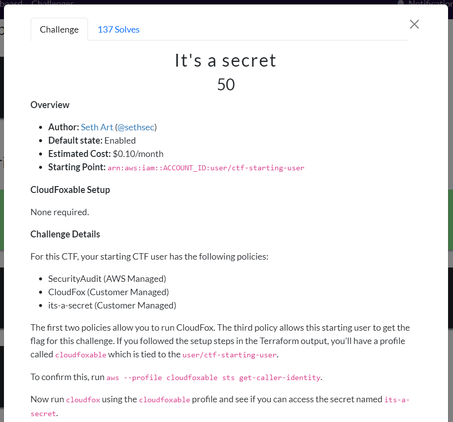
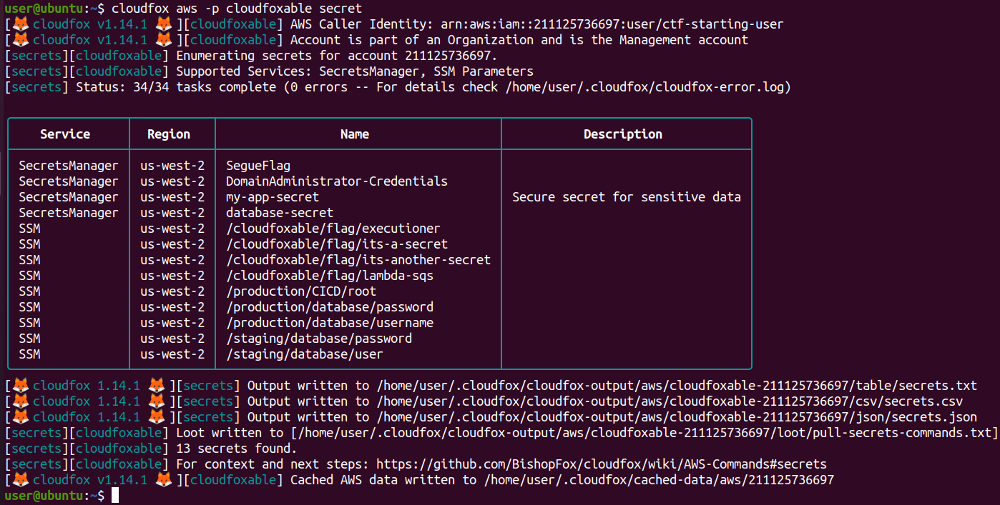
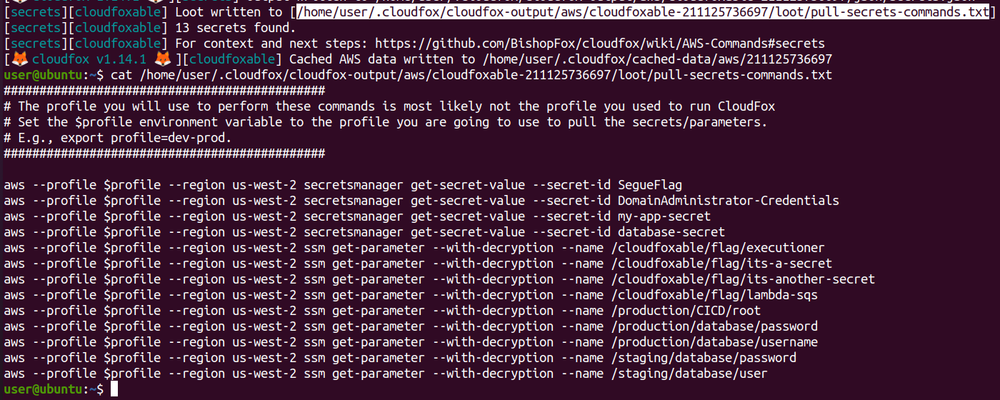
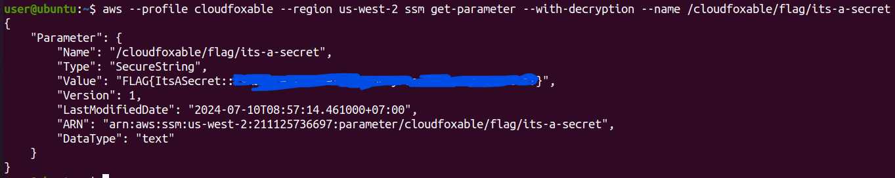
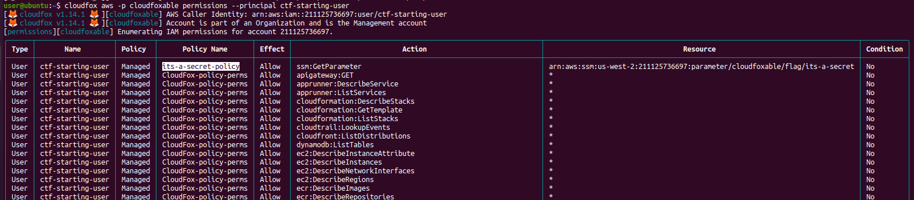
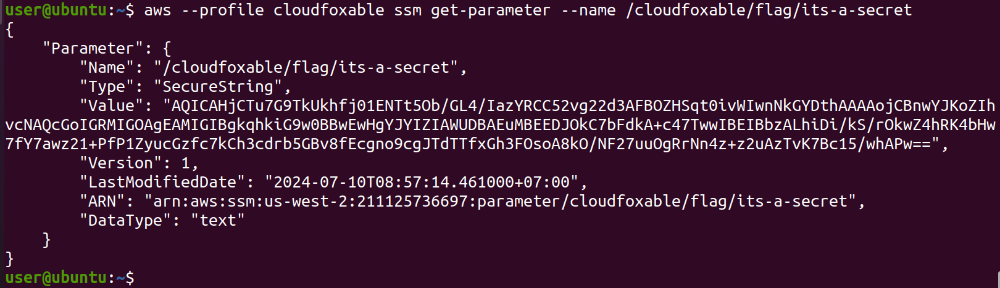
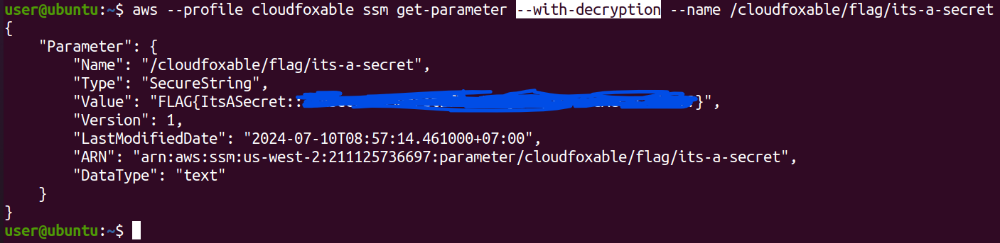

# CloudFoxable - It's a secret

Challenge link: https://cloudfoxable.bishopfox.com/challenges#It's%20a%20secret-7



## Using cloudfox

Description wants us to read a secret called `its-a-secret` so we will list all secrets first:

```
cloudfox aws -p cloudfoxable secret
```



It will list all secrets can be found. The only thing we want is the loot file (`pull-secrets-commands.txt`), which contains command to read those secrets:



We need to read secret `its-a-secret` so let's run the command to read that secret with profile **`cloudfoxable`**:

```
aws --profile cloudfoxable --region us-west-2 ssm get-parameter --with-decryption --name /cloudfoxable/flag/its-a-secret
```



Bingo, we got the flag! But how?

The reason why we can read that secret is because we have a policy allowed doing that. Let's check what policy we have:

```
cloudfox aws -p cloudfoxable permissions --principal ctf-starting-user
```



As you can see, we have a policy called **`its-a-secret-policy`** and action is **`ssm:GetParameter`** which allows us to execute **`get-parameter`** in ssm (AWS System Manager). You can see the command we execute to get the flag is **`ssm get-parameter`** and that's command is allowed.

## Using aws-cli

With aws-cli, we don't have `secret` command so the only thing we can try is list all policy of user `ctf-starting-user` with this command:

```
aws --profile <profile> iam list-attached-user-policies --user-name <username>
```

We have already known `<profile>` is **`cloudfoxable`** and username is **`ctf-starting-user`** so let's execute that command:

```
$ aws --profile cloudfoxable iam list-attached-user-policies --user-name ctf-starting-user
{
    "AttachedPolicies": [
        {
            "PolicyName": "its-a-secret-policy",
            "PolicyArn": "arn:aws:iam::211125736697:policy/its-a-secret-policy"
        },
        {
            "PolicyName": "CloudFox-policy-perms",
            "PolicyArn": "arn:aws:iam::211125736697:policy/CloudFox-policy-perms"
        },
        {
            "PolicyName": "SecurityAudit",
            "PolicyArn": "arn:aws:iam::aws:policy/SecurityAudit"
        }
    ]
}
```

We tried to execute **`iam`** command and we are successful, which means our user has to have policy **`SecurityAudit`** and vice versa, our user has policy `SecurityAudit` so we can execute **`iam`** command. With ability to read **`iam`** policy, we now want to enumerate on policy **`its-a-secret-policy`**. The command we want to execute is **`iam get-policy-version`** as following:

```
aws --profile <profile> iam get-policy-version --policy-arn <policy-arn> --version-id <version-id>
```

We have already known `<profile>` is **`cloudfoxable`** and `<policy-arn>` is **`arn:aws:iam::211125736697:policy/its-a-secret-policy`**, the only thing left is `<version-id>`, which can be retrieved by execute **`iam get-policy`**:

```
$ aws --profile cloudfoxable iam get-policy --policy-arn arn:aws:iam::211125736697:policy/its-a-secret-policy
{
    "Policy": {
        "PolicyName": "its-a-secret-policy",
        "PolicyId": "ANPATCKATCT45MR5OAATW",
        "Arn": "arn:aws:iam::211125736697:policy/its-a-secret-policy",
        "Path": "/",
        "DefaultVersionId": "v1",
        "AttachmentCount": 1,
        "PermissionsBoundaryUsageCount": 0,
        "IsAttachable": true,
        "Description": "policy that only allows access to the its-a-secret flag",
        "CreateDate": "2024-07-10T01:57:38+00:00",
        "UpdateDate": "2024-07-10T01:57:38+00:00",
        "Tags": []
    }
}
```

Now we know `<version-id>` is **`v1`**, let's execute **`iam get-policy-version`** again to get more details on policy **`its-a-secret-policy`**:

```
$ aws --profile cloudfoxable iam get-policy-version --policy-arn arn:aws:iam::211125736697:policy/its-a-secret-policy --version-id v1
{
    "PolicyVersion": {
        "Document": {
            "Statement": [
                {
                    "Action": [
                        "ssm:GetParameter"
                    ],
                    "Effect": "Allow",
                    "Resource": [
                        "arn:aws:ssm:us-west-2:211125736697:parameter/cloudfoxable/flag/its-a-secret"
                    ]
                }
            ],
            "Version": "2012-10-17"
        },
        "VersionId": "v1",
        "IsDefaultVersion": true,
        "CreateDate": "2024-07-10T01:57:38+00:00"
    }
}
```

Read the `Resource` tag, we know that flag is at `/cloudfoxable/flag/its-a-secret` and allowed action is **`ssm:GetParameter`**, which means we can read the parameter `its-a-secret` with **`cloudfoxable`** user:

```
aws --profile cloudfoxable ssm get-parameter --name /cloudfoxable/flag/its-a-secret
```



Opps! The flag is encrypted, we will need to add `--with-decryption` to make the value decrypt for us:



# Reference

https://medium.com/@cybersecshashi/cloudfoxable-its-a-secret-63a72cbe83f9
