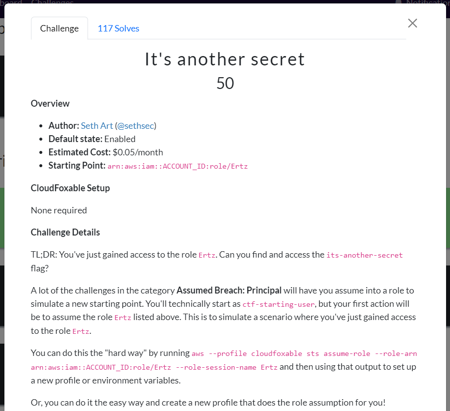
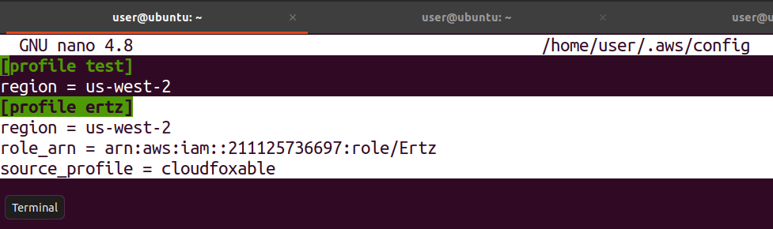
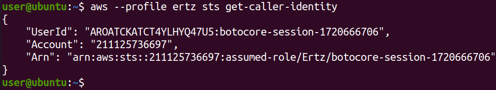
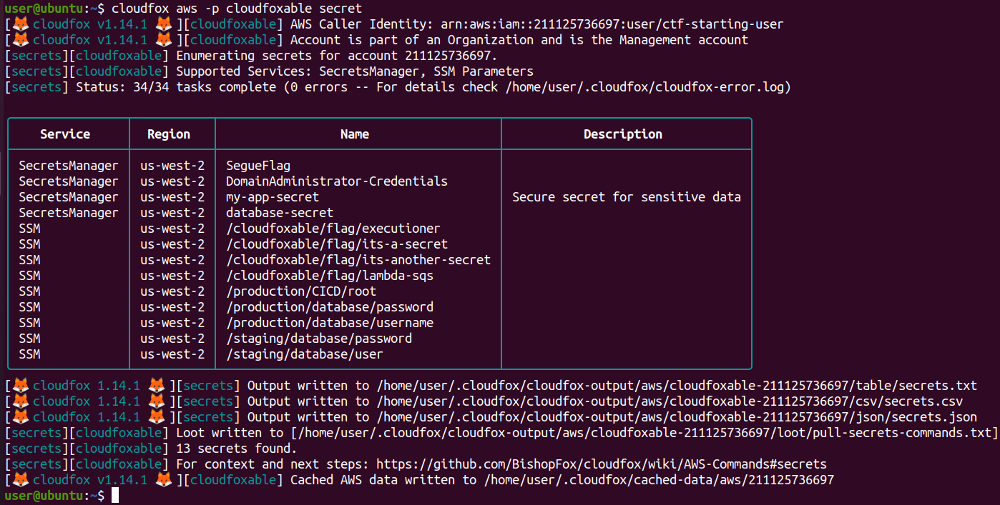
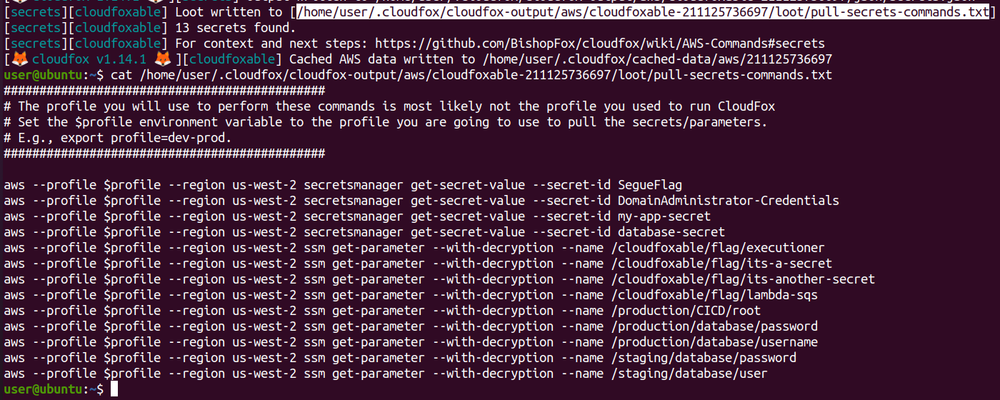
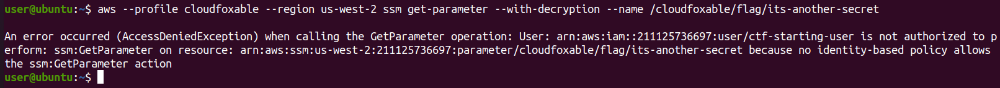
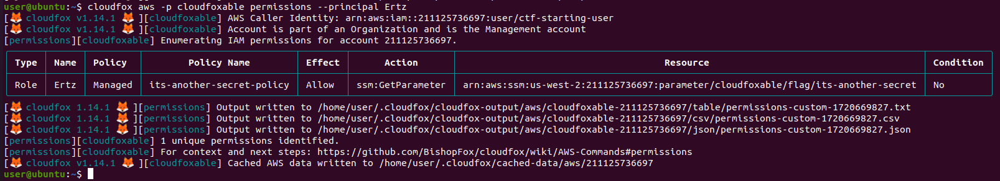
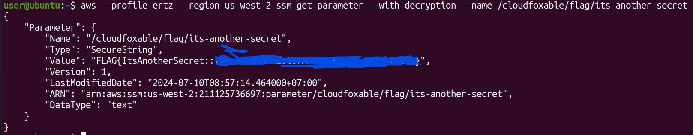
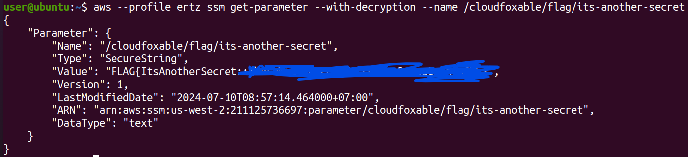

# CloudFoxable - It's a secret

Challenge link: https://cloudfoxable.bishopfox.com/challenges#It's%20another%20secret-8



Description show us that we will need to assume that we have another role to attack this challenge so let's add these data to file `~/.aws/config`:

```
[profile ertz]
region = us-west-2
role_arn = arn:aws:iam::<ACCOUNT_ID>:role/Ertz
source_profile = cloudfoxable
```

We can get the `<ACCOUNT_ID>` by running the following command:

```
$ aws --profile cloudfoxable sts get-caller-identity
{
    "UserId": "AIDATCKATCT4TWZ46F3FJ",
    "Account": "211125736697",
    "Arn": "arn:aws:iam::211125736697:user/ctf-starting-user"
}
```

So `<ACCOUNT_ID>` is `211125736697`, let's add new profile to config:



We can verify new profile to make sure it works:



Remember that it's just role, not user so we cannot list any policy from that. Now we can start hacking!

## Using cloudfox

Description wants us to read a secret called `its-another-secret` so we will list all secrets first:

```
cloudfox aws -p cloudfoxable secret
```



It will list all secrets can be found. The only thing we want is the loot file (`pull-secrets-commands.txt`), which contains command to read those secrets:



We need to read secret `its-another-secret` so let's run the command to read that secret with profile **`cloudfoxable`**:

```
aws --profile cloudfoxable --region us-west-2 ssm get-parameter --with-decryption --name /cloudfoxable/flag/its-another-secret
```



Opps! Profile **`cloudfoxable`** doesn't have enough permission to read that. Why?

The reason is profile `cloudfoxable` is being executed as user `ctf-starting-user`. You can run the following command to verify that `ctf-starting-user` doesn't have any role to read `its-another-secret` (just `its-a-secret`):

```
cloudfox aws -p cloudfoxable permissions --principal ctf-starting-user
```

But if we check with role `Ertz`, we got something new:



Ah ha this role allow us to get param `its-another-secret` of AWS System Manaer (SSM) so let's get that flag with profile **`ertz`**:

```
aws --profile ertz --region us-west-2 ssm get-parameter --with-decryption --name /cloudfoxable/flag/its-another-secret
```



Bingo! We got the flag.

## Using aws-cli

Again, because aws-cli doesn't have command `secret` as cloudfox does so the basic thing we need to do is to list all policy that profile `ertz` has:

```
$ aws --profile cloudfoxable iam list-attached-role-policies --role-name Ertz
{
    "AttachedPolicies": [
        {
            "PolicyName": "its-another-secret-policy",
            "PolicyArn": "arn:aws:iam::211125736697:policy/its-another-secret-policy"
        }
    ]
}
```

Wow! We got 1 new policy. Let's check what resource this policy interact with. First we need to get version id of this policy:

```
$ aws --profile cloudfoxable iam get-policy --policy-arn arn:aws:iam::211125736697:policy/its-another-secret-policy
{
    "Policy": {
        "PolicyName": "its-another-secret-policy",
        "PolicyId": "ANPATCKATCT44IEAFMNNE",
        "Arn": "arn:aws:iam::211125736697:policy/its-another-secret-policy",
        "Path": "/",
        "DefaultVersionId": "v1",
        "AttachmentCount": 1,
        "PermissionsBoundaryUsageCount": 0,
        "IsAttachable": true,
        "Description": "policy that only allows access to the its-another-secret flag",
        "CreateDate": "2024-07-10T01:57:38+00:00",
        "UpdateDate": "2024-07-10T01:57:38+00:00",
        "Tags": []
    }
}
```

So version id is **`v1`**, let's get the resource:

```
$ aws --profile cloudfoxable iam get-policy-version --policy-arn arn:aws:iam::211125736697:policy/its-another-secret-policy --version-id v1
{
    "PolicyVersion": {
        "Document": {
            "Statement": [
                {
                    "Action": [
                        "ssm:GetParameter"
                    ],
                    "Effect": "Allow",
                    "Resource": [
                        "arn:aws:ssm:us-west-2:211125736697:parameter/cloudfoxable/flag/its-another-secret"
                    ]
                }
            ],
            "Version": "2012-10-17"
        },
        "VersionId": "v1",
        "IsDefaultVersion": true,
        "CreateDate": "2024-07-10T01:57:38+00:00"
    }
}
```

So its action is **`ssm:GetParameter`** with resource path is **`/cloudfoxable/flag/its-another-secret`**. It's time to get flag with profile **`ertz`** (Because only profile `ertz` has access to `its-another-secret` while profile `cloudfoxable` don't):

```
aws --profile ertz ssm get-parameter --with-decryption --name /cloudfoxable/flag/its-another-secret
```



# Reference

https://medium.com/@cybersecshashi/cloudfoxable-its-another-secret-6bb2d9a6e7f3