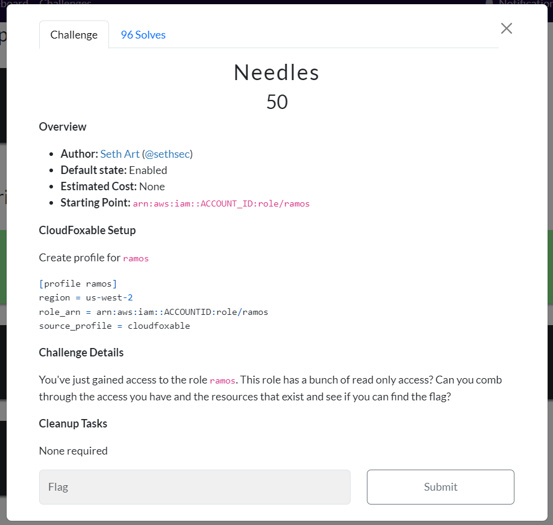
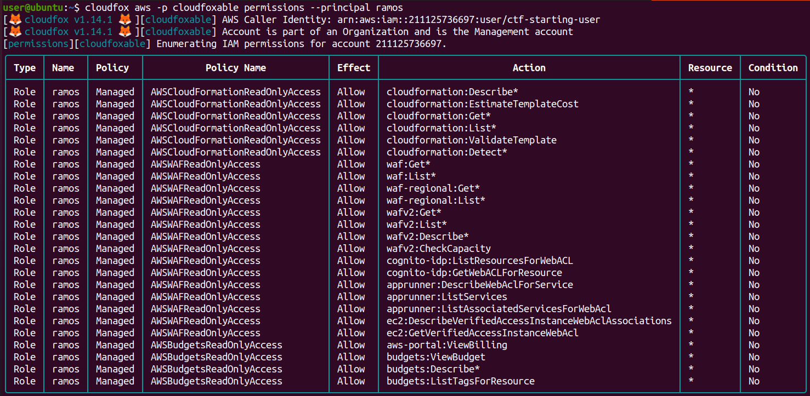
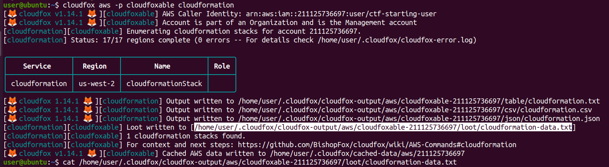
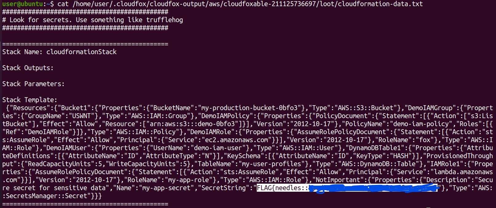
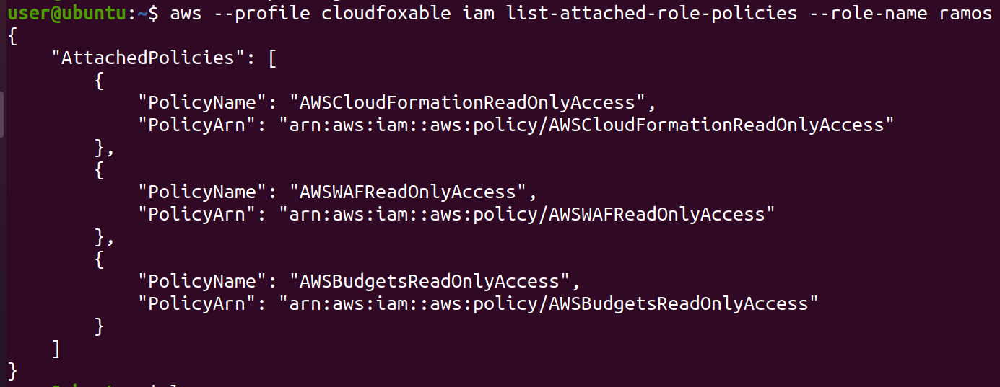
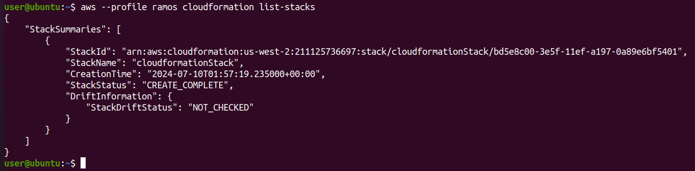
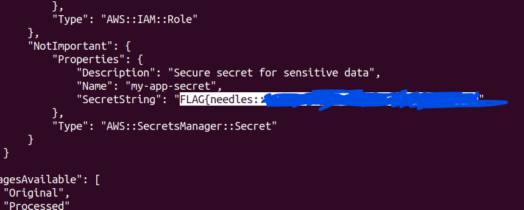

# CloudFoxable - Needles

Challenge link: https://cloudfoxable.bishopfox.com/challenges#Needles-20



Let's create new profile for **`ramos`**:

```
[profile ramos]
region = us-west-2
role_arn = arn:aws:iam::<ACCOUNTID>:role/ramos
source_profile = cloudfoxable
```

## Using cloudfox

Just simply scan all permission of `ramos`:

```
cloudfox aws -p cloudfoxable permissions --principal ramos
```



We can see a lot of policies but I see the `cloudformation` has more policies then other so let's just scan for `cloudformation`:

```
cloudfox aws -p cloudfoxable cloudformation
```



I can see there is only one stack `cloudformationStack` but the main thing I want to focus is the loot, let's read that file:



And we get the flag!

## Using aws-cli

Same as using cloudfox, we will need to check what policy do we have on `ramos`:

```
aws --profile cloudfoxable iam list-attached-role-policies --role-name ramos
```



Let's check each policy top down. First is CloudFormation, let's try to list-stacks to see if there are somethings interesting:

```
aws --profile ramos cloudformation list-stacks
```



There is 1 stack only, let's check its template:

```
aws --profile ramos cloudformation get-template --stack-name cloudformationStack
```



Bingo!
